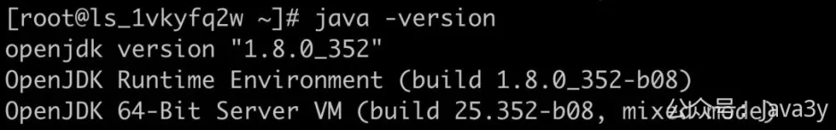
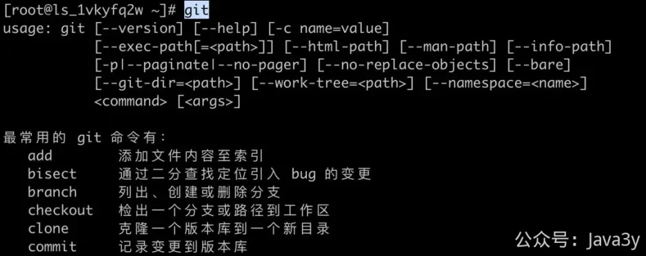
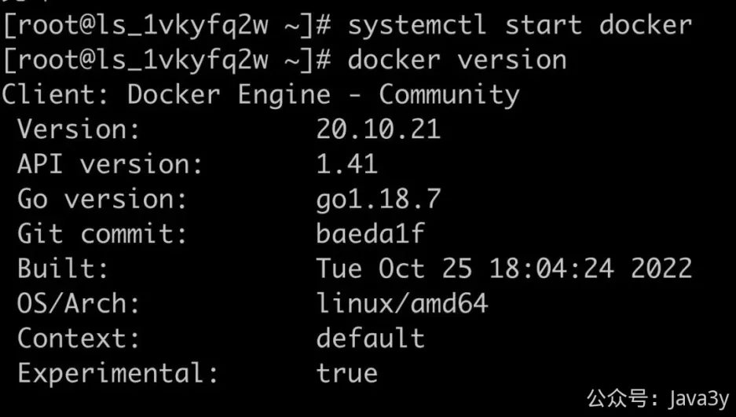
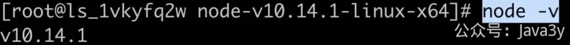
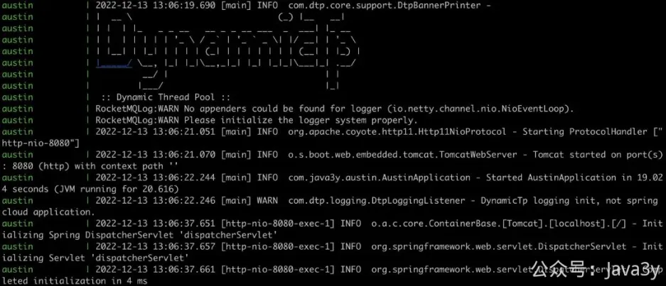
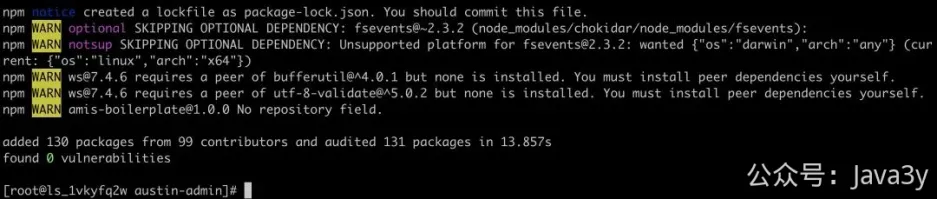
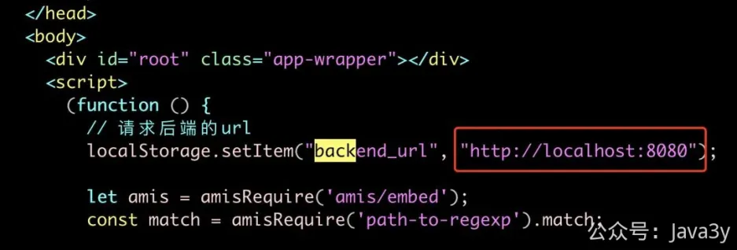
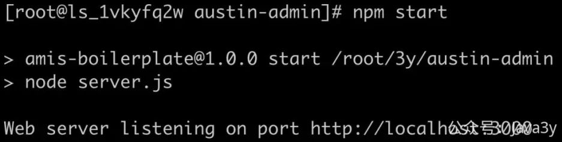
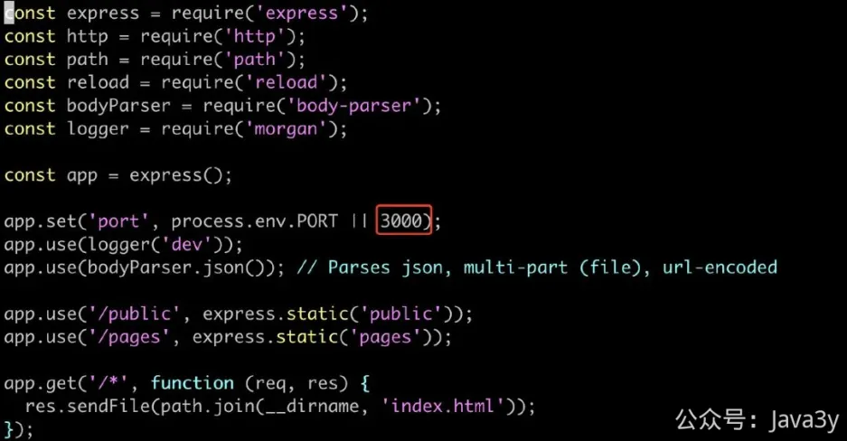

# 3.45 使用docker-compose部署项目

**前言**
部署austin只是一行简单的docker-compose命令，要实现这个玩意依赖的就俩个文件：docker-compose.yml和Dockerfile
完全不懂docker和docker-compose 应该也能看个大概：
1、docker-compose先打包austin项目的镜像
2、austin强依赖MySQL和Redis，于是去创建出MySQL和Redis的镜像。
3、通过已经预设好的application-test.properties文件的配置，打包出来的austin镜像能连上刚创建出来的MySQL和Redis镜像。

感兴趣的可以尝试跟着我的文档来调试调试，我是重装了系统之后对各种软件进行安装的，应该一路复制粘贴就成功了（可能要改下对应的安装路径）
**所需的必要依赖**
基于系统：Centos 7.6 x86_64
1、**JDK 1.8**
2、**Maven**
3、**Git**
4、**docker**
5、**docker-compose**
6、**npm**（前端依赖）
这些必要的依赖，一般开发机器上都会有的把？什么？还没有？那我只能把服务器给重装一遍，**手把手**带着大家来一遍吧。
**JDK8 安装**
查看可以装的JDK版本：
下载JDK 1.8
(安装目录在：/usr/lib/jvm/java-1.8.0-openjdk-1.8.0.352.b08-2.el7_9.x86_64)
(默认只有JRE)
为了后续安装Maven，所以要把JDK也安装上：
设置环境变量
查看是否安装成功：

**安装Git**
直接使用yum安装：
查看是否成功：

**安装Maven**
直接使用wget安装：
解压安装得到的maven
配置环境变量：
(我的安装目录就在/root/apache-maven-3.6.3)
查看是否安装成功：

顺带把maven的镜像也改掉吧，不然官方默认的下载很慢：
(我的安装目录就在/root/apache-maven-3.6.3)
加入镜像配置：
**安装Docker**
首先我们需要安装GCC相关的环境：
安装Docker需要的依赖软件包：
设置国内的镜像（提高速度）
更新yum软件包索引：
安装DOCKER CE(注意：Docker分为CE版和EE版，一般我们用CE版就够用了.)
启动Docker：
下载回来的Docker版本：:

运行以下命令以下载 Docker Compose 的当前稳定版本：
将可执行权限应用于二进制文件：
创建软链：
测试是否安装成功：

**安装npm**
下载npm包：
解压：
添加环境变量：
（我的安装目录在：/root/node-v10.14.1-linux-x64）
可以设置镜像（不然太慢了）
看看安装成功了没有：

下载pm2来启动前端项目：
**docker-compose 启动austin**
先新建一个文件夹存放austin的项目吧：
进入到文件夹中：
克隆austin后端的代码：
克隆austin前端的代码：
进入到austin后端的项目里：
用mvn命令打包
经过一顿的包依赖下载之后，我们就能看到打包已经成功了

到这，我们就可以使用docker-compose来启动Austin：

注：本地启动默认读取是dev环境配置文件。**如果使用docker部署，默认使用的是test环境。test环境有登录验证的拦截功能，按需给屏蔽掉**。
**启动前端austin-admin**
去到austin-admin的目录下
安装必要的依赖：

把后端的请求链接改为自己的地址：

Plain Text复制代码
1
vim index.html

改完之后，直接启动：

Plain Text复制代码
1
pm2 start server.js

（如果端口3000已经存在了，可以修改 server.js的配置）

1 人点赞

- 

1

 

> 原文: <https://www.yuque.com/u37247843/dg9569/xpi7r3gt72uh4rdp>