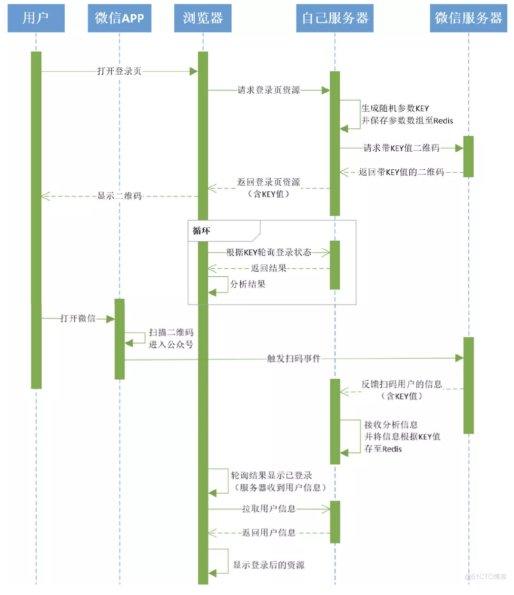
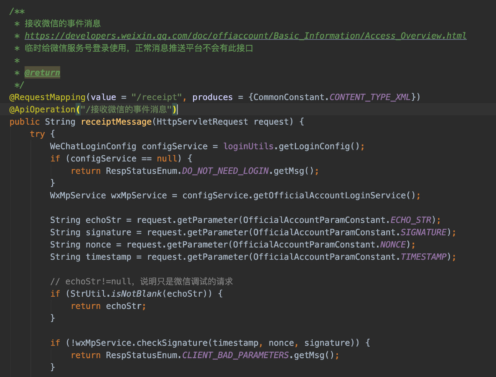
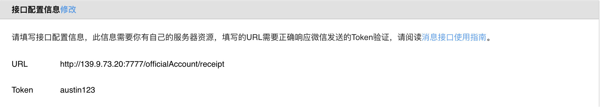
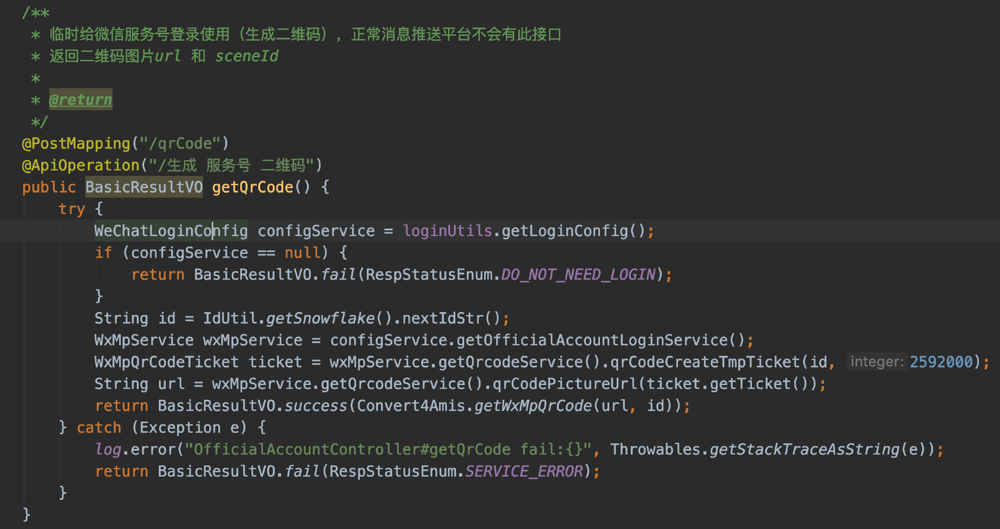
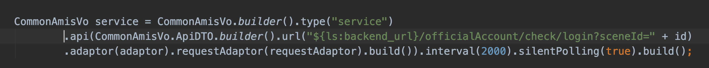
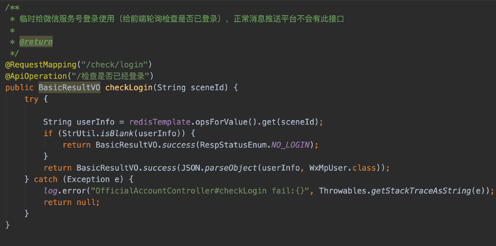
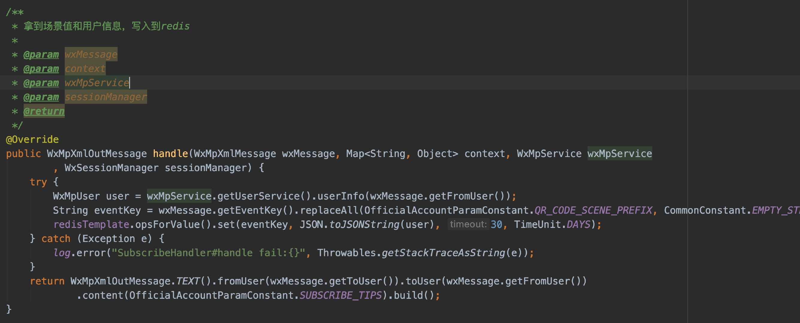

# 3.46 扫码微信登录（选看）

我在生产环境下是没有写过「用户登录」的，导致有些业务功能我也不知道线上是怎么实现的。而「用户登录注册」这个功能之前会听过和见识过一些技术栈「Shiro」、「JWT」、「Spring Security」、「CAS」、「OAuth2.0」等等。

现在不都**流行扫码登录**嘛？我不是已经接入了微信服务号的模板消息了吗，不正好有一个测试号给我去做吗？于是就开干了。

首先看看人家是怎么写的，于是被我找到了一篇博客：[https://blog.51cto.com/cxhit/4924932](https://blog.51cto.com/cxhit/4924932)

过程挺好懂的，**就按着他给出的时序图对着实现就完了**。后端对我来说实现并不难，花的时间最长的还是在前端的交互上。毕竟我这当时选用的是低代码平台啊，不能随便实现各种逻辑的。

**1**、首先我们要有一个接口，给到微信**回调**，所以我们一般会称该接口为回调接口。微信的一些重要的事件都会回调给我们，我们做响应的逻辑处理。就比如，**用户关注了服务号**，这种消息微信就调用我们的接口。

**2**、在微信后台**配置**我们的定义好的回调接口，给到微信进行回调。

（如果接口是通的，按正常的走，那就会配置成功）
PS：微信服务号测试账号地址：[https://mp.weixin.qq.com/debug/cgi-bin/sandboxinfo?action=showinfo&t=sandbox/index](https://mp.weixin.qq.com/debug/cgi-bin/sandboxinfo?action=showinfo&t=sandbox/index)

**3**、编写一个获取**微信带参数的二维码**给到前端做展示。

**4**、前端拿到二维码做展示，并且得到随机生成的参数**轮询**查看是否已登录。

**5**、编写**检查是否已登录的接口给到前端进行判断**。（如果能从Redis里拿到随机参数，说明已经登录了）

**6**、当用户扫码**关注了**服务号，则得到微信的回调。当用户关注服务号时，会把随机参数和openId传给服务器，我则将信息存入Redis。

**7**、前端得知已登录后，将用户信息写入**localStorage**

这个功能其实是不存在于消息推送平台里的，只是我做了个**在线预览地址**，所以才需要自己来做登录注册的功能（因为每个人理论上应该只能看到自己的模板，自己的数据）。

在正常的线上环境下，这个应该由用户团队开发，我们只需要接入就好了，所以该章节是选看。

> 原文: <https://www.yuque.com/u37247843/dg9569/ib5l1ii1magnev6h>