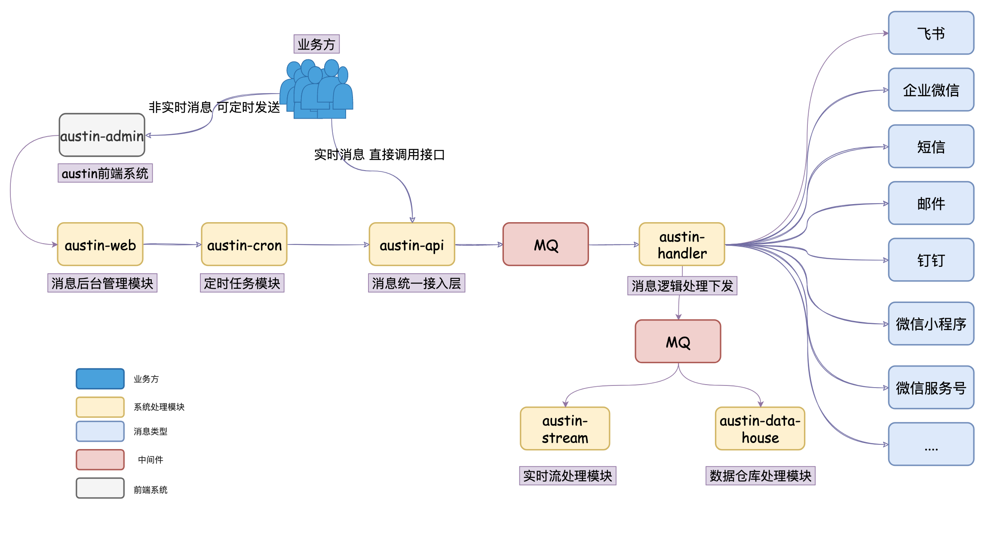

# 3.47 什么是数据仓库？

不知道大家还记不记得我当时规划austin时，所画出的架构图：

就剩下`austin-datahouse`这个模块没有实现了，也有挺多同学在看代码的时候问过我这个模块在哪...其实就是还没实现，**先规划，牛逼先吹出去**（互联网人必备技能）

至于这个模块吧，我预想它的功能就是把austin相关的**实时数据**写到**数据仓库**里。一方面是做**数据备份**，另一方面是**大多数的报表很多都得依赖数据仓库去做**。实际上，生产环境也会把很多的数据写到数仓中。

而在公司里，要把数据写到数据仓库，这事对开发来说一般很简单。因为有数仓这个东西，那大多数都会有相关的**基础建设**了。对于开发而言，可能就是把**日志数据写到Kafka**，在相关的后台配置下这个topic，就能将这个topic的数据同步到数据仓库里咯。如果**数据源**是数据库的话，那应该大数据平台有同步数据的功能，对普通开发来说也就配置下**表名**就能同步到数据仓库里咯。

在看数仓的同时，我之前在公司经常会听到**数据湖**这个词。我刚毕业的时候是没听过的，但这几年好像这个概念就火起来了。跟大数据那边聊点事的时候，经常会听到：**数据入湖**。

那既然看都看了，顺便了解**数据湖**是个什么东西吧？对着浏览器一轮检索之后，我发现这个词还是**挺抽象**的，一直没找到让我耳目一新的答案，这个数据湖也不知道怎么就火起来了。我浏览了一遍之后，**我大概可以总结出什么是数据湖，跟数据仓库有啥区别**：

1、数据仓库是存储**结构化的数据**，而数据湖是**什么数据都能存**（非结构化的数据也能存）。结构化数据可以理解为我们的**二维表**、**JSON数据**，非结构化的数据可以理解为**图像文件**之类的。

数据仓库在写入的时候，就要定义好schema了，而数据湖在写入的时候不需要定schema，可以等用到的时候再查出来。强调这点，说明数据湖对数据的**schema**约束更加灵活。

2、数据仓库和数据湖**并不是替代关系**。数据是先进数据湖，将数据**加工（ETL）**之后，一部分数据会到数据仓库中。

3、我们知道现有的数据仓库一般基于Hadoop体系的HDFS分布式文件系统去搭建的，而数据湖也得存储数据的嘛，一般也是依赖HDFS。

4、开源的数据湖技术比较出名的有**hudi**、**iceberg**、**Delta Lake**

看完上面的描述，是不是觉得有点空泛。看似学到了很多，但是实际还是不知道数据湖有啥牛逼之处。嗯，我也是这么想的。总体下来，感觉**数据湖就相当于数据仓库的ODS**，围绕着这些数据定义了对应的**meta信息**，做元数据的管理。

说到**ODS**这个词了，就简单聊下数据仓库的分层结构吧。这个行业通用的，一般分为以下：

1、**ODS（Operate Data Store）**，原始数据层，未经过任何加工的。

2、**DIM（Dictionary Data Layer）**，维度数据层，比如存储地域、用户客户端这些维度的数据。

3、**DWD（Data Warehouse Detail）**，数据明细层，把原始数据经过简单的加工（去除脏数据，空数据之后就得到明细数据）。

4、**DWS（Data Warehouse Service）**，数据维度汇总层，比如将数据明细根据用户维度做汇总得到的汇总之后的数据。

5、**ADS（Application Data Store）**，数据应用层，这部分数据能给到后端以接口的方式给到前端做可视化使用了。

至于为什么要分层，跟当初我们理解DAO/Service/Controller的思想差不多，大概就是**复用**和**便于后续修改变动**。

扯了那么多吧，回到ausitn项目吧，我是打算怎么做的呢？因为我的实时计算`austin-stream`模块是采用Flink去做的，我打算`austin-datahouse`也是采用`flink`去做，通过`Metabase`一个开源的**大数据可视化工具**把`Hive`的数据给读取出来。

我认为不要觉得自己是Java后端开发人员，就觉得可以不用了解大数据，又或者觉得大数据是很深奥的东西，又甚至抵触大数据。**我认为了解大数据组件和一些思想，对后端来说是很有必要的，这个过程也很有趣，至少比CRUD有趣多了**。

**别虚呀！大数据跟Java可是很搭的哟！**

> 原文: <https://www.yuque.com/u37247843/dg9569/qve18ghugb21aeo4>