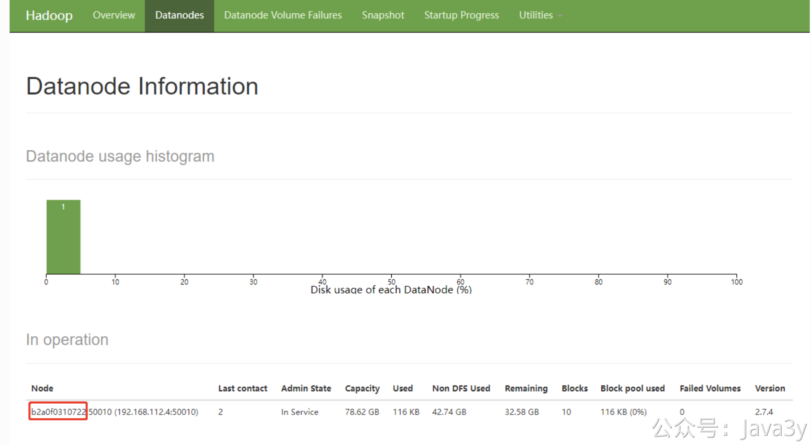
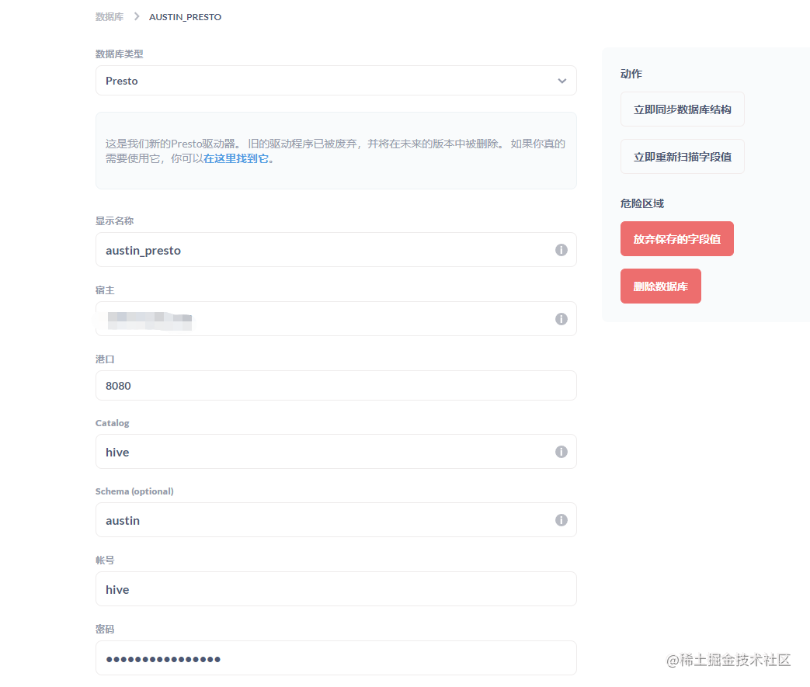
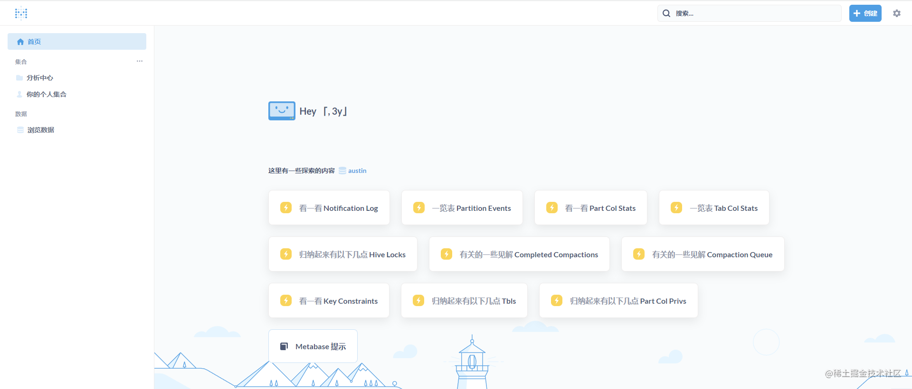

# 3.48 搭建数据仓库

要实现的功能其实很简单：消费`Kafka`的消息，写入`hive`。我在写全链路追踪功能实时引擎用的是`flink`，为了技术架构统一，我还是希望通过`flink`来实现。

`flink`和`hive`融合，实际上是借助`hive catalog`来打通`hive`。`hive catalog`对接着`hive metastore`(`hive`存储元数据的地方)。

当我们使用`flink`创建出的元数据，会经由`hive catalog` 最终持久化到`hive metastore`，同时我们会利用`hive catalog`提供的接口对`hive`进行写入和读取。


## 1、安装HIVE

1、把仓库拉到自己的服务器上
```shell
git clone git@github.com:big-data-europe/docker-hive.git
```

2、进入到项目的文件夹里
```shell
cd docker-hive
```

3、**微调下**docker-compose文件，**修改后的内容**如下：（主要是**增加了几个通信的端口**）
```yaml
version: "3"

services:
  namenode:
    image: bde2020/hadoop-namenode:2.0.0-hadoop2.7.4-java8
    volumes:
      - namenode:/hadoop/dfs/name
    environment:
      - CLUSTER_NAME=test
    env_file:
      - ./hadoop-hive.env
    ports:
      - "50070:50070"
      - "9000:9000"
      - "8020:8020"
  datanode:
    image: bde2020/hadoop-datanode:2.0.0-hadoop2.7.4-java8
    volumes:
      - datanode:/hadoop/dfs/data
    env_file:
      - ./hadoop-hive.env
    environment:
      SERVICE_PRECONDITION: "namenode:50070"
    ports:
      - "50075:50075"
      - "50010:50010"
      - "50020:50020"
  hive-server:
    image: bde2020/hive:2.3.2-postgresql-metastore
    env_file:
      - ./hadoop-hive.env
    environment:
      HIVE_CORE_CONF_javax_jdo_option_ConnectionURL: "jdbc:postgresql://hive-metastore/metastore"
      SERVICE_PRECONDITION: "hive-metastore:9083"
    ports:
      - "10000:10000"
  hive-metastore:
    image: bde2020/hive:2.3.2-postgresql-metastore
    env_file:
      - ./hadoop-hive.env
    command: /opt/hive/bin/hive --service metastore
    environment:
      SERVICE_PRECONDITION: "namenode:50070 datanode:50075 hive-metastore-postgresql:5432"
    ports:
      - "9083:9083"
  hive-metastore-postgresql:
    image: bde2020/hive-metastore-postgresql:2.3.0
    ports:
      - "5432:5432"
  presto-coordinator:
    image: shawnzhu/prestodb:0.181
    ports:
      - "8080:8080"
volumes:
  namenode:
  datanode:
```

4、最后，我们可以连上`hive`的客户端，感受下快速安装好`hive`的成功感。
```shell
# 进入bash
docker-compose exec hive-server bash

# 使用beeline客户端连接
/opt/hive/bin/beeline -u jdbc:hive2://localhost:10000
```


## 2、FLINK和HIVE融合
实时流处理的flink用的是docker-compose进行部署，而**与hive融合的flink我这边是正常的姿势安装**（主要原因是涉及的环境很多，用docker-compose就相对没那么方便了）

### 2.1 安装flink环境
1、下载`flink`压缩包 (如果 16.0 找不到，那就下载**16.1**） [https://dlcdn.apache.org/flink](https://dlcdn.apache.org/flink)

```shell
wget https://dlcdn.apache.org/flink/flink-1.16.0/flink-1.16.0-bin-scala_2.12.tgz
```

2、解压`flink`
```shell
tar -zxf flink-1.16.0-bin-scala_2.12.tgz
```

3、修改该目录下的`conf`下的`flink-conf.yaml`文件中`rest.bind-address`配置，不然**远程访问不到**`8081`端口，将其改为`0.0.0.0`
```shell
rest.bind-address: 0.0.0.0
```

4、将`flink`官网提到连接`hive`所需要的`jar`包下载到`flink`的`lib`目录下(一共4个)
```shell
wget https://repo.maven.apache.org/maven2/org/apache/flink/flink-sql-connector-hive-2.3.9_2.12/1.16.0/flink-sql-connector-hive-2.3.9_2.12-1.16.0.jar

wget https://repo.maven.apache.org/maven2/org/apache/hive/hive-exec/2.3.4/hive-exec-2.3.4.jar

wget https://repo.maven.apache.org/maven2/org/apache/flink/flink-connector-hive_2.12/1.16.0/flink-connector-hive_2.12-1.16.0.jar 

wget https://repo.maven.apache.org/maven2/org/antlr/antlr-runtime/3.5.2/antlr-runtime-3.5.2.jar
```

5、按照官网指示把`flink-table-planner_2.12-1.16.0.jar`和`flink-table-planner-loader-1.16.0.jar` 这俩个`jar`包移动其目录；
```shell
mv $FLINK_HOME/opt/flink-table-planner_2.12-1.16.0.jar $FLINK_HOME/lib/flink-table-planner_2.12-1.16.0.jar
mv $FLINK_HOME/lib/flink-table-planner-loader-1.16.0.jar $FLINK_HOME/opt/flink-table-planner-loader-1.16.0.jar
```

6、把后续`kafka`所需要的依赖也下载到`lib`目录下
```shell
wget https://repo1.maven.org/maven2/org/apache/flink/flink-connector-kafka/1.16.0/flink-connector-kafka-1.16.0.jar

wget https://repo1.maven.org/maven2/org/apache/kafka/kafka-clients/3.3.1/kafka-clients-3.3.1.jar
```

7、把工程下的`hive-site.xml`文件拷贝到`$FLINK_HOME/conf`下，内容如下(**hive_ip**自己变动)
```xml
<?xml version="1.0"?>
<?xml-stylesheet type="text/xsl" href="configuration.xsl"?>


<configuration>
    <property>
        <name>javax.jdo.option.ConnectionURL</name>
        <value>jdbc:postgresql://hive_ip:5432/metastore?createDatabaseIfNotExist=true</value>
        <description>JDBC connect string for a JDBC metastore</description>
    </property>

    <property>
        <name>javax.jdo.option.ConnectionDriverName</name>
        <value>org.postgresql.Driver</value>
        <description>Driver class name for a JDBC metastore</description>
    </property>

    <property>
        <name>javax.jdo.option.ConnectionUserName</name>
        <value>hive</value>
        <description>username to use against metastore database</description>
    </property>

    <property>
        <name>javax.jdo.option.ConnectionPassword</name>
        <value>hive</value>
        <description>password to use against metastore database</description>
    </property>

    <property>
        <name>hive.metastore.uris</name>
        <value>thrift://hive_ip:9083</value>
        <description>Thrift URI for the remote metastore. Used by metastore client to connect to remote metastore.
        </description>
    </property>

    <property>
        <name>datanucleus.schema.autoCreateAll</name>
        <value>true</value>
    </property>

</configuration>
```


### 2.2 安装hadoop环境
由于`hive`的镜像已经锁死了`hadoop`的版本为`2.7.4`，所以我这边`flink`所以来的`hadoop`也是下载`2.7.4`版本

1、下载`hadoop`压缩包
```shell
wget https://archive.apache.org/dist/hadoop/common/hadoop-2.7.4/hadoop-2.7.4.tar.gz
```

2、解压`hadoop`
```shell
tar -zxf hadoop-2.7.4.tar.gz
```

3、`hadoop`的配置文件`hdfs-site.xml`增加以下内容（我的目录在`/root/hadoop-2.7.4/etc/hadoop`）
```xml
<property>
    <name>dfs.client.use.datanode.hostname</name>
    <value>true</value>
    <description>only cofig in clients</description>
</property>
```


### 2.3 安装jdk11
由于高版本的`flink`需要`jdk 11`，所以这边安装下该版本的`jdk`：
```shell
yum install java-11-openjdk.x86_64
yum install java-11-openjdk-devel.x86_64
```


### 2.4 配置jdk、hadoop的环境变量
这一步为了能让`flink`在启动的时候，加载到`jdk`和`hadoop`的环境。

1、编辑`/etc/profile`文件

```shell
vim /etc/profile
```

2、文件内容最底下增加以下配置：

```shell
JAVA_HOME=/usr/lib/jvm/java-11-openjdk-11.0.17.0.8-2.el7_9.x86_64
JRE_HOME=$JAVA_HOME/jre
CLASS_PATH=.:$JAVA_HOME/lib/dt.jar:$JAVA_HOME/lib/tools.jar:$JRE_HOME/lib
PATH=$PATH:$JAVA_HOME/bin:$JRE_HOME/bin
export JAVA_HOME JRE_HOME CLASS_PATH PATH
export HADOOP_HOME=/root/hadoop-2.7.4
export PATH=$HADOOP_HOME/bin:$PATH
export HADOOP_CLASSPATH=`hadoop classpath`
```

3、让配置文件生效
```shell
source /etc/profile
```


### 2.5 增加hosts进行通信（flink和namenode/datanode之间）

在部署`flink`服务器上增加`hosts`，有以下(`ip`为部署`hive`的地址）：
```shell
127.0.0.1 namenode
127.0.0.1 datanode
127.0.0.1 b2a0f0310722
```

其中 `b2a0f0310722`是`datanode`的主机名，该主机名会随着`hive`的`docker`而变更，我们可以登录`namenode`的后台地址找到其主机名。而方法则是在部署`hive`的地址输入：
```
http://localhost:50070/dfshealth.html#tab-datanode
```




### 2.6 启动flink调试kafka数据到hive
启动`flink-sql`的客户端：
```shell
./sql-client.sh
```

在`sql`客户端下执行以下脚本命令，注：`hive-conf-dir`要放在`$FLINK_HOME/conf`下
```shell
CREATE CATALOG my_hive WITH (
    'type' = 'hive',
    'hive-conf-dir' = '/root/flink-1.16.0/conf'
);
```
```shell
use catalog my_hive;
```
```shell
create database austin;
```

重启`flink`集群
```shell
./stop-cluster.sh
```
```shell
./start-cluster.sh
```

重新提交执行`flink`任务（该任务是**austin-data-house**的jar包）
```shell
./flink run austin-data-house-0.0.1-SNAPSHOT.jar
```

启动消费者的命令（将`ip`和`port`改为自己服务器所部署的Kafka信息）：
```shell
$KAFKA_HOME/bin/kafka-console-producer.sh --topic austinTraceLog  --broker-list ip:port
```
向kafka输入测试数据：
```json
{"state":"1","businessId":"2","ids":[1,2,3],"logTimestamp":"123123"}
```


## 3、数据可视化
到上面为止，我们已经把数据写入到hive表了，我们是不可能每一次都在命令行窗口里查询hive的数据。一般在公司里都会有可视化平台供我们开发/数仓/数据分析师/运营 去查询hive的数据。

我简单看了几个开源的可视化平台：Superset/Metabase/DataEase。最后选择了**Metabase**，无他，看着顺眼一些。

部署`Metabase`很简单，也是使用`docker`进行安装部署，就两行命令（后续我会将其加入到`docker-compose`里面）。
```shell
docker pull metabase/metabase:latest
```
```shell
docker run -d -p 5001:3000 --name metabase metabase/metabase
```

完了之后，我们就可以打开`5001`端口到`Metabase`的后台了。


我们可以在`Metabase`的后台添加`presto`进而连接`hive`去查询记录。



这个`presto`服务我们在搭建`hive`的时候已经一起启动了，所以这里直接使用就好了。

到这一步，我们就可以通过在页面上写`sql`把消息推送过程中埋点的**明细数据**查询出来



## 4、后记
这数据仓库整个安装环境和调试过程确实折腾人，多次推倒重来（甚至不惜重装系统重来）。还好最后输入`Kafka`一条消息，在`hive`表里能看到一条记录，能看到结果之后，折腾或许是值得的。

参考资料：

- [https://nightlies.apache.org/flink/flink-docs-release-1.16/docs/connectors/table/hive/overview/](https://nightlies.apache.org/flink/flink-docs-release-1.16/docs/connectors/table/hive/overview/)
- [https://blog.51cto.com/u_15105906/5849229](https://blog.51cto.com/u_15105906/5849229)
- [https://blog.csdn.net/qq_38403590/article/details/126172610](https://blog.csdn.net/qq_38403590/article/details/126172610)


> 原文: <https://www.yuque.com/u37247843/dg9569/gofhb05ousfisy05>