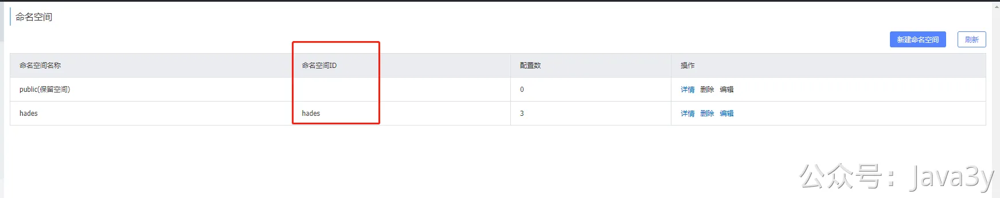

# 3.49 使用规则引擎提开发效率！

**0、需求背景**
austin作为消息推送平台，它是会接入多个**短信渠道**的。一方面是不同的渠道会有不同的价格，我们可能会尝试接入发送成本更低的渠道，另一方面，有多个短信渠道可以做容灾（假设只有一个短信渠道，要是该渠道挂了，那austin就相当于发不了短信了）
接入短信渠道这块，在austin是有设计过的（至少可以说是**面向接口编程**吧），每个渠道都要实现SmsScript接口。

而接入短信的代码往往很简单，核心逻辑只是编写代码调用其HTTP接口去下发短信，对于整个系统而言都**没什么新的依赖要引入**（很轻量）。
而每次接入短信（就相当于写一个类），我都要重启发布上线吗？这不靠谱吧？效率这么低？
解决方案：上**规则引擎**（hades）将业务代码抽离，无须上下线即可实现功能。

注：**比较轻的逻辑**是适合用规则引擎去做这种抽离的，这会提高我们的开发效率。而如果业务是**核心链路上的主流程**或者要**引入各种的SDK**才能实现的，这种就不适合用规则引擎了。

注：不适用场景：**脚本依赖项目里未有的SDK和对象**
**1、本地写好代码**
比如，我们现在系统已经接入了腾讯云短信了，现在商务说云片这个渠道更便宜，让我去接入下。这时候，我还是**正常在IDE上开发**，编写云片这个渠道的代码逻辑。
于是我写出以下的代码（实现了SmsScript接口：**组装参数，调用HTTP的过程**哈）：

**注：hades是基于Groovy实现的，虽然看起来就是Java代码。但是，这里不能用lombok和最好别用Java的lambda。**
如上的代码，我如果使用了lombok去生成Logger对象，这会在代码执行时会报错：

经过一轮验证之后，我们觉得这代码没啥问题了。正常是要走**发布流程**，把新写的代码发布上线生效的，**接入了hades的话，就可以动态生效了**。
**2、接入hades规则引擎**
目前hades提供两个客户端(apollo和nacos)，你项目用哪个分布式配置中心，你就引入哪个。
你也可以引入hades-core包，继承BaseHadesConfig，自行实现获取配置和配置实时通知的逻辑。这里我就不再多说了，先回到apollo和nacos这两个客户端吧。
**3、使用apollo接入**
当我们的本身项目环境使用的是apollo时，我们就用hades-apollo-starter包。于是在项目需要引入以下pom：
接入apollo本身就会需要指定以下配置：
所以这不是接入hades的重点，因为你项目本身就已经接入了apollo了（至少你需保证你的项目跟apollo是通的）。
而接入hades在hades-apollo-starter下需要有以下的配置：
这儿的hades.config-name其实指的就是apollo的namespace。于是乎，我们需要在austin这个app.id下创建namespace，名为hades。

**注：使用hades中，创建出来的所有namespace配置格式都需要是txt！**然后，往hades这个namespace填充值，如下：

然后创建出YunPianSmsScript这个namespace，填入我们本地已经写好的代码：

到这一步，启动项目就会有以下日志打印出来：
项目设计之初就考虑到这种情况了（**通过脚本名获取脚本对象**），所以在代码上我是通过ScriptName去得到Bean，然后去调用对应的方法的。

那么，当我在页面选中的是云片发送渠道，在**没有重启发布的情况下**， 就可以直接调用对应的逻辑了（就是YunPianSmsScript的代码）。如果修改了YunPianSmsScript的代码，那先在apollo发布YunPianSmsScript的代码。然后**手动**把hades主配置改了，**只要改时间updateTime就好**了。
**4、使用nacos接入**
当我们的本身项目环境使用的是nacos时，我们就用hades-nacos-starter包。于是在项目需要引入以下pom：
接入nacos本身就会需要指定以下配置（跟hades没什么关系），所以这不是接入hades的重点，因为你项目本身就已经接入了nacos了（至少你需保证你的项目跟nacos是通的）

而接入hades在hades-nacos-starter下需要有以下的配置：
这儿的hades.config-name其实指的就是nacos的dataId。于是乎，我们需要在hades这个namespace下创建dataId，名为hades

**注：使用hades中，创建出来的所有dataId配置格式都需要是text！**然后，往hades这个dataId填充值，如下：
然后创建出YunPianSmsScript这个dataId，填入我们本地已经写好的代码：

到这一步，启动项目就会有以下日志打印出来：
项目设计之初就考虑到这种情况了（**通过脚本名获取脚本对象**），所以在代码上我是通过ScriptName去得到Bean，然后去调用对应的方法的。

那么，当我在页面选中的是云片发送渠道，在**没有重启发布的情况下**， 就可以直接调用对应的逻辑了（就是YunPianSmsScript的代码）。如果修改了YunPianSmsScript的代码，那先在nacos发布YunPianSmsScript的代码，然后手动把hades主配置改了，只要改时间updateTime就好了。

**5、最佳实践**
如果云片YunPianSmsScript这个脚本逻辑确定要接入**长期使用**，建议在下一次发布的时候，将其带上。（毕竟脚本是**易动**的，**而固定的逻辑下来的应该要在项目中的程序代码里的**）
这时当发布过后，需要把hades主配置手动更新下，把YunPianSmsScript给删掉（**不然每次项目启动的时候，都是读的脚本，而非本地的代码**）：

JSON复制代码
1
2
3
4
{
"instanceNames": [],
"updateTime": "2023年3月20日10:26:0133"
}
既然能在已发布的应用上，动态新增一个SpringBean，这个SpringBean还能多次动态修改其逻辑。
那自然在已发布的应用上，动态修改一个**已有**SpringBean的逻辑，也是能做到的。（**灵活性会带来风险**，我是建议每次改这种代码逻辑，是要走beta/pre环境的，最后才上prod）

若有收获，就点个赞吧

 

> 原文: <https://www.yuque.com/u37247843/dg9569/ktqbnq6buis8m6ve>