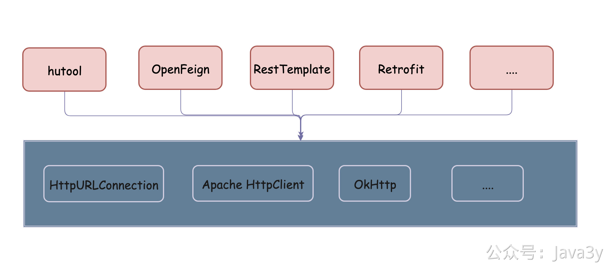

# 3.5 开发利器（工具包）

**视频讲解**：
[](https://www.yuque.com/u37247843/dg9569/xgghp21cottachgv?_lake_card=%7B%22status%22%3A%22done%22%2C%22name%22%3A%22%2307%20%E6%B6%88%E6%81%AF%E7%AE%A1%E7%90%86%E5%B9%B3%E5%8F%B0%20%E5%B8%B8%E7%94%A8%E7%9A%84%E5%B7%A5%E5%85%B7%E5%8C%85%20%E9%87%8D%E7%BD%AE.mp4%22%2C%22size%22%3A286440393%2C%22taskId%22%3A%22ud6a33a33-98f1-4c67-9c13-982ff2b8a58%22%2C%22taskType%22%3A%22upload%22%2C%22url%22%3Anull%2C%22cover%22%3Anull%2C%22videoId%22%3A%22inputs%2Fprod%2Fyuque%2F2023%2F1285871%2Fmp4%2F1687265954229-7d222239-b394-4b03-b369-7cfd1ee76466.mp4%22%2C%22download%22%3Afalse%2C%22__spacing%22%3A%22both%22%2C%22id%22%3A%22cGUjf%22%2C%22margin%22%3A%7B%22top%22%3Atrue%2C%22bottom%22%3Atrue%7D%2C%22card%22%3A%22video%22%7D#cGUjf)
## 01、什么是工具包

基本上，每个项目里都有一个包，叫做utils。这个包专门承载我们自己项目的工具类，比如常见的DateUtils、HttpUtils、Collections

所谓Utils就是：**这个东西我们用得很多，但是原API不够好用，于是我们给它封装为一个比较通用的方法**

如果是初学者，很多时候遇到这种类似的工具类也不会直接自己开写，会先去搜索引擎里找一通。找到了之后，看起来觉得可以就直接一个ctrl+c，一个ctrl +v往自己的main方法一贴，搞点测试数据，看能不能work起来。

能work起来，那就给它取个名字，放在utils包下。一顿操作过后，发现自己这操作姿势就是完美！

殊不知，你想要的工具类**很可能**人家已经写好对应的jar包，比某搜索引擎查到的某博客的代码可靠多了。

知道有此类jar 的人用得一直很香，不知道的人可能就一直缺什么就去拷贝什么，代码搞得非常脏乱。

## 02、JAVA工具包推荐

在Java领域里，在业内比较出名的工具包有两个：**commons和guava**

国人维护的一个工具包：**Hutool**

如果有相关的需求的话，我们在项目代码中可以尽可能使用这些工具包。它们的代码**一般情况下**都会比我们自己写的要好，而且工具类就是为了帮我们减少重复性代码的，多用会使项目的可读性变得更高。

至于它们能干什么，如果没了解过的可以先逛下他们的Guide，稍微了解下这些工具包封装了什么功能。等到自己要意识到需要封装某个功能时，先把这些工具包的文档给逛一遍，**真的找不到时，没有再自己实现**。

**不要重复造轮子，不要重复造轮子，不要重复造轮子。**

我贴下这些工具包的链接🔗 大家如果对这个不了解的话，建议去看看

- [https://commons.apache.org/](https://commons.apache.org/)
- [https://github.com/google/guava/wiki](https://github.com/google/guava/wiki)
- [https://www.hutool.cn/docs/#/](https://www.hutool.cn/docs/#/)

我截取hutool文档的一部分信息，大家稍微可以感受下，我个人认为还是比较全的：

| **模块** | **介绍** |
| --- | --- |
| hutool-aop | JDK动态代理封装，提供非IOC下的切面支持 |
| hutool-bloomFilter | 布隆过滤，提供一些Hash算法的布隆过滤 |
| hutool-cache | 简单缓存实现 |
| hutool-core | 核心，包括Bean操作、日期、各种Util等 |
| hutool-cron | 定时任务模块，提供类Crontab表达式的定时任务 |
| hutool-crypto | 加密解密模块，提供对称、非对称和摘要算法封装 |
| hutool-db | JDBC封装后的数据操作，基于ActiveRecord思想 |
| hutool-dfa | 基于DFA模型的多关键字查找 |
| hutool-extra | 扩展模块，对第三方封装（模板引擎、邮件、Servlet、二维码、Emoji、FTP、分词等） |
| hutool-http | 基于HttpUrlConnection的Http客户端封装 |
| hutool-log | 自动识别日志实现的日志门面 |
| hutool-script | 脚本执行封装，例如Javascript |
| hutool-setting | 功能更强大的Setting配置文件和Properties封装 |
| hutool-system | 系统参数调用封装（JVM信息等） |
| hutool-json | JSON实现 |
| hutool-captcha | 图片验证码实现 |
| hutool-poi | 针对POI中Excel和Word的封装 |
| hutool-socket | 基于Java的NIO和AIO的Socket封装 |
| hutool-jwt | JSON Web Token (JWT)封装实现 |

## 03、LOMBOK

我是在实习的时候接触Lombok这个工具的。他给我的第一感受就是：再也不用自己生成set/get方法了

其实用上了IDE以后，生成set/get方法就是一个快捷键的事，但是每当我们要增加/删除/修改类的属性时，我们都需要额外去为这些变动去生成一次。不过，这好像也不是事。毕竟增加/删除/修改的工作也不是特别多。

其实Lombok能做的事不仅仅只有set/get方法，用上了以后我还是比较推荐用的。像@Builder、@Slf4j、@Data这些注解我在项目中是经常用到的，如果还对Lombok不了解的话，可以去它的官网观望一波。

[https://projectlombok.org/features/all](https://projectlombok.org/features/all)

有没有人会好奇Lombok它是怎么做到的？曾经有个群里的小伙伴有遇到过这个面试题：你知道Lombok的原理是什么吗？

这个我在《**对线面试官**》系列的第一篇《注解》曾经聊过。其实不是特别复杂的东西，我们只要能想出Java的编译时大致的步骤以及注解的基础知识，这题就能答上了。

1. 注解是有生命周期的@Retention有SOURCE、CLASS和RUNTIME 三个常量，使用Lombok的注解就是SOURCE阶段的
2. .java文件被编译的时候，稍微简化下可以总结为几个步骤：语法分析->语义分析->**注解处理**->class文件
3. JDK提供了Hook，我们想要在编译时期做注解相关的事，可以继承AbstractProcessor 并实现process方法（Lombok就是这么干的）

## 04、JSON库

现在Java后端开发基本上是离不开JSON了，所以我们需要有**JSON库**帮我们做序列化和反序列化

- 前后端接口之间的交互基本上都是JSON格式了
- 我们有的时候为了方便，也会直接把数据直接转成JSON存储起来（这里的存储可以是MySQL，可以是HBase，可以是Redis 等等）
- ...

写到这里，我翻看了下我以前大学时候的学习笔记。我以前刚学JSON的时候，那时候跟着视频在学Spring和Strtus2，他俩都内置了JSON的解析库。我当时的水平，跟着视频学习调个API对我没什么难度的，所以也不以为然。

没想到，那时候视频教程还教我：如果抛离了Spring和Struts2环境下，那该怎么方便地操作JSON，然后在classpath果断引入了json-lib的包...看回以前大学的笔记，真的是回忆满满...

不扯别的了，说回现在吧。现在Java后端一般使用比较多的JSON库有fastjson、Gson和Jackson

我以前在公司用FastJson比较多的，**API使用非常简单，日常用得也很舒服**。但是，我是经历过曾经要强制升级fastjson版本的人！应该是19年吧，那时候安全团队告诉我们需要强制升级fastjson的版本，大概就是fastjson有漏洞，一定得升级。这我们作为库的使用方，没办法，那只能升级吧。

结果，没过几天。安全团队又拉了个群，说还是得升级xxx版本以上，之前升级过的版本还有问题...团队内为了升级fastjson版本也遇到过其他的坑，反正就被弄得很烦。

网上也有很多对比这几个JSON库的文章（主要的指标是性能、稳定），有兴趣的小伙伴可以去读读。

不过，austin项目还是选择fastjson作为JSON主要的序列化库（**多点包容**）

## 05、HTTP库

本来HTTP库我是已经忘的了。但正当我要实现发送短信功能的时候，我才恍然想起，HTTP也是经常用到的啊！于是火急地在发送文章之前补充下。

不知道你们第一次用Java调用HTTP的时候，是什么心情。在我印象里，就觉得这东西复杂得一批，调个HTTP真麻烦！后来，工作了以后，在项目里已经有大佬封装过HTTP啦。但还是有的时候，觉得HTTP调用就是那么的复杂（哎，各种头信息，一不小心设置错，那就是半天）

但不管怎么样，HTTP调用是非常常见的，很多公司对外的接口几乎都会提供HTTP调用。比如我们调用腾讯的API下发微信类消息，调用各个渠道商发送短信等等等。

扯远了，还是先回到HTTP库吧。在Java生态中，HTTP库可以大致分为三类：

- HttpURLConnection
- Apache HttpClient
- OkHttp

HttpURLConnection是JDK原始提供的HTTP库，它是没有实现HTTP连接池的（连接池还是非常重要的，池的概念我在这就不过于解释了）。我之前项目用的HTTP库都是Apache HttpClient 基础上封装的（Apache 出品的质量也有保证），而OkHttp可以说是后起之秀了（现在安卓端的HTTP库基本都是基于OkHttp）

一般我们使用这些HTTP工具库，都需要在原生的基础上再写Utils来简化对HTTP的调用，有Utils环境下就会有各类的工具包：

- 比如，上面提到的Hutool就对原生的HttpURLConnection进行封装（不过其封装是没用线程池）
- Square公司对自己出品的OkHttp又进行二次封装，开源出Retrofit(这个在安卓用得很多)
- Spring环境下提供RestTemplate 多种访问远程Http服务的方法（默认情况下是无线程池的，但可以使用Apache HttpClient和OkHttp将其封装至RestTemplate
- SpringCloud环境下提供OpenFeign进而调用HTTP服务
- 国产HTTP工具库Forest： 对Httpclient和OkHttp进行封装
- ...

这次我选择OkHtpp作为austin的http库

为什么OkHtpp？向前看吧，OkHtpp作为Http库确实现在已然成为标杆（至少在安卓火爆了，很多公司的SDK下都用的Okhttp作为Http库的依赖了）。在Spring环境下RestTemplate也不太好用，我这项目又没上SpringCloud，自然就没用上OpenFeign。Retrofit在安卓用得比较多（Java后端貌似相对较少）。

所以我选择了OkHttp。

## 06、总结
这篇文章是来讲austin项目所使用到的工具包，**对这些已经懂的人看完可能会觉得有点水，没必要**。

但有很多想要跟我一起学习这个项目的同学很多都是没做过项目的，所以我还是觉得有必要发出来总结下。很多时候我们所做的东西，别人觉得很low，其实就在于**信息差**。

我觉得阅读到这篇文章的，肯定也会有某些已经工作的小伙伴是没听说过Lombok、没用过Guava这类工具的(Commons应该多多少少都会用过，可能是潜在地用了，但不知道是有专门的apache工具类库）。 

其实**这类工具包在项目里使用的频率会非常高，用了这些工具库会让我们的项目代码变得更加简洁，代码可读性和维护性对于一个项目而言是非常重要的**。

对于这类工具，**我的建议是有空的时候上去看看它能提供什么功能。等发现自己要封装一个工具类的时候，进去看看它们是不是已经实现了，如果实现了直接用就完事了。如果对功能感兴趣的话，看下大佬们是怎么实现的，如果是自己实现的话可能会有哪些地方没想到。**

> 原文: <https://www.yuque.com/u37247843/dg9569/xgghp21cottachgv>