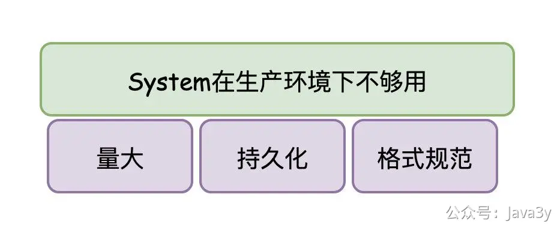

# 3.6 为什么我们要打日志

**视频讲解**：
[](https://www.yuque.com/u37247843/dg9569/nmom1xahzrtwkx3y?_lake_card=%7B%22status%22%3A%22done%22%2C%22name%22%3A%22%2308%20%E6%B6%88%E6%81%AF%E7%AE%A1%E7%90%86%E5%B9%B3%E5%8F%B0%20Java%E6%97%A5%E5%BF%97%E6%8E%A5%E5%85%A5.mp4%22%2C%22size%22%3A343978812%2C%22taskId%22%3A%22u8ba9b49c-0894-49bd-9b58-a94b0589de2%22%2C%22taskType%22%3A%22upload%22%2C%22url%22%3Anull%2C%22cover%22%3Anull%2C%22videoId%22%3A%22inputs%2Fprod%2Fyuque%2F2023%2F1285871%2Fmp4%2F1687265967641-a410a6c3-0e30-410e-8d84-726858e5d7a5.mp4%22%2C%22download%22%3Afalse%2C%22__spacing%22%3A%22both%22%2C%22id%22%3A%22jQkVh%22%2C%22margin%22%3A%7B%22top%22%3Atrue%2C%22bottom%22%3Atrue%7D%2C%22card%22%3A%22video%22%7D#jQkVh)

## 01、什么是日志

所谓日志，在我理解下就是：**记录程序运行时的信息**

在Java最初期又或是我们初学阶段，打印日志全凭System.out.println();

这好用吗？有待商榷。

对于大部分初学者来说，好用！我想看的信息，直接在console就能看到了，这是多么地方便阿。学习Java的第一个运行结果都是由System.out.println();出来的，不需要有任何的学习成本。

对于大部分工作者来说，本地调试可以，但如果程序部署到服务器以后，那就算了。

生产环境跟本地环境是有区别的：
●生产环境需要记录的日志会更多（毕竟是作为一个系统/项目在线上运行，不可能只打印一点点内容）
●生产环境的日志内容需要保留至文件（作为留存，线上不会说第一时间发现问题，很多需要查找历史日志数据）
●生产环境的日志内容需要有一定的规范格式（至少日志记录的时间需要有吧）
●…

上面这些要求，System.out.println();都是不具备的。

**所以，我们可以看到在公司里写的项目，是没有用System.out.println();记录日志的**

**02、Java日志体系**

**工作了以后，你会发现每次引入一个框架，这个框架下几乎都有对应的日志包。**

我之前在公司里曾经整合过几个项目（将原有的几个工程合并到一个项目内）。

系统分久必合合久必分，当时是认为以前的同事把项目拆得过于细，造成一定的资源浪费（毕竟每个工程跑在线上至少都会部署两台线上机器），所以有段时间公司就希望我们把一些细小的项目进行合并。

至于这做得对与错，这块我就不谈了。

在合并的过程中，最最最麻烦的就是解决依赖冲突的问题（都是Maven项目，会有Maven仲裁的问题），而这里边，最明显的就是Java日志包的问题。

如果你有那么一丢丢了解Java日志，你就应该多多少少听说过以下的名字：**Log4j**(log for java)、**JUL**(Java Util Logging)、**JCL**(Jakarta Commons Logging)、**Slf4j**(Simple Logging Facade for Java)、**Logback**、**Log4j2**

如果你比较细心，你会发现，不同的技术框架所采用的Java日志实现都很有可能不一样的。

既然实现不一样，那对应的API调用是不是就不一样？（毕竟它还不像是JDBC，定义了一套接口规范，各个数据库厂商去实现JDBC规范，程序员面向JDBC接口编程就完事了）

那这这这不是乱套呢？想到这里，血压就逐渐就上来了？这别慌，上面提到的Java日志**Slf4j**(Simple Logging Facade for Java)干的就类似JDBC做的事情。

它定义了日志的接口（门面模式），当项目使用别的日志框架时，那就适配它！（注意：JDBC是定义接口，数据库厂商实现。Slf4j也定义了接口，但是它适配其他的Java日志实现，骚不骚？）

我们看Slf4j官网的一张图，应该就挺好理解了：

扯了这么久，我想表达的是：**我们在项目中，最好是使用Slf4j提供的API，至于真实的LOG实现，都可以用Slf4j进行桥接（这样一来，或许将来有一天说要从log4j改为logback，那程序代码也不用改动）**

**03、日志有什么用?**

还没有过生产环境的开发的同学可能认为记录日志就是用来**定位问题**的，其实并不完全是。

日志一方面我们用它来定位问题，一方面我们**很多的数据也是来源于日志**

不要觉得存在数据库里的数据才是重要的，我们**程序运行时记录下的日志数据也同样重要**。

在大数据领域里，数据来源有很多：关系型数据库、爬虫、日志等等

举个例子，我以前的公司就有处理日志的一套框架：
1我们正常把日志信息输出到文件下
2框架提供后台给予我们配置（文件的路径以及Kafka Topic Name）

该框架做的事情说白了就是：把我们的日志文件内容转成Kafka消息（如果使用方需要将哪个日志文件的内容转为MQ消息，那在平台上配置下就完事了）

有了Kafka消息，那配合流式处理平台（Storm/Spark/Flink）再对日志进行清洗，是不是就能产生**有价值的数据**

**04、AUSTIN 日志**
扯了这么久的日志基础，只是想让还不了解日志的同学有个认知。

austin项目的搭建技术框架使用的是SpringBoot，SpringBoot默认的日志组合是：**Slf4j + logback**

我在公司接触到的项目几乎都是这个组合，所以我就不打算动了，就直接用logback作为austin的日志实现框架了（要是真有那么一天要改成别的日志实现，理论上只要引入对应的桥接包就完事了）。

**05、LOGBACK日志初体验**
在无任何配置的前提下，只要我们引入了SpringBoot的包，就能直接使用日志的功能了。具体效果入下图

SpringBoot是**约定大于配置**的一个框架

SpringBoot会默认去加载resources下名为**logback.xml **或者 **logback-spring.xml**的配置文件（ xml 格式也可以改为 groovy 格式）
如果都不存在，那么 logback 默认地会调用**BasicConfigurator** ，创建一个最小化配置。
最小化配置由一个关联到根 logger 的ConsoleAppender 组成。输出用模式为**%d{HH:mm:ss.SSS} [%thread] %-5level %logger{36} - %msg%n** 的 PatternLayoutEncoder 进行格式化

下图是默认的**BasicConfigurator**配置类

**06、LOGBACK配置**
从上面可以发现的是，**默认的logback配置是不符合我们的要求的（它是打印在console的）**，我们是希望把日志记录在文件下的。
所以，我们会在resources下新建一个logback配置。常见的配置内容参考**logback.xml文件即可**

若有收获，就点个赞吧
[3y](https://www.yuque.com/u1047901)
07-13 10:12
47

> 原文: <https://www.yuque.com/u37247843/dg9569/nmom1xahzrtwkx3y>