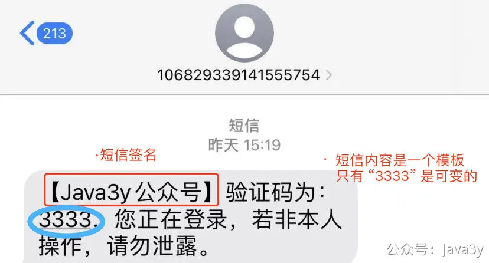

# 3.7 如何发送一条短信

**视频介绍讲解**：
[](https://www.yuque.com/u37247843/dg9569/rrn48zt08oigexsa?_lake_card=%7B%22status%22%3A%22done%22%2C%22name%22%3A%22%2309%20%E6%B6%88%E6%81%AF%E6%8E%A8%E9%80%81%E5%B9%B3%E5%8F%B0%20%E5%8F%91%E9%80%81%E4%B8%80%E6%9D%A1%E7%9F%AD%E4%BF%A1%E5%91%80.mp4%22%2C%22size%22%3A228440119%2C%22taskId%22%3A%22u05f3445c-8a0e-43b3-a5b5-94510c5cf4e%22%2C%22taskType%22%3A%22upload%22%2C%22url%22%3Anull%2C%22cover%22%3Anull%2C%22videoId%22%3A%22inputs%2Fprod%2Fyuque%2F2023%2F1285871%2Fmp4%2F1687265989803-94eb5cba-8edd-491c-adb1-6162387933d5.mp4%22%2C%22download%22%3Afalse%2C%22__spacing%22%3A%22both%22%2C%22id%22%3A%22cnA7B%22%2C%22margin%22%3A%7B%22top%22%3Atrue%2C%22bottom%22%3Atrue%7D%2C%22card%22%3A%22video%22%7D#cnA7B)[](https://www.yuque.com/u37247843/dg9569/rrn48zt08oigexsa?_lake_card=%7B%22status%22%3A%22done%22%2C%22name%22%3A%22%2310%20%E6%B6%88%E6%81%AF%E6%8E%A8%E9%80%81%E5%B9%B3%E5%8F%B0%20%E4%B8%8D%E6%98%AF%E5%B0%8F%E5%B7%A5%E5%85%B7.mp4%22%2C%22size%22%3A884051067%2C%22taskId%22%3A%22ub94fe41c-6d85-430c-be79-46806034ae1%22%2C%22taskType%22%3A%22upload%22%2C%22url%22%3Anull%2C%22cover%22%3Anull%2C%22videoId%22%3A%22inputs%2Fprod%2Fyuque%2F2023%2F1285871%2Fmp4%2F1687266633907-257e77d1-a007-4549-aab2-b28e98c771f7.mp4%22%2C%22download%22%3Afalse%2C%22__spacing%22%3A%22both%22%2C%22id%22%3A%22Vf2uS%22%2C%22margin%22%3A%7B%22top%22%3Atrue%2C%22bottom%22%3Atrue%7D%2C%22card%22%3A%22video%22%7D#Vf2uS)
## 01、短信介绍
我认为，短信是在一整个消息推送平台里**最重要**的一个消息类型了（毕竟关联了很多重要的业务场景），想想我们日常使用APP时的场景：

- **验证码**：登录注册、支付等等重要场景
- **通知类**：用户订单信息、重要信息通知用户、重要信息通知商家等等场景
- 营销类：运营在特定时间内发送营销短信，影响业务的KPI指标完成（不过这个相对就没那么重要）
- ...

**（试想下，如果系统挂了10分钟，会怎么样）**

发送短信在消息推送平台里**比较容易实现**的一种消息类型了
**02、发送短信必要准备**
隔着上次的系统架构图也有好几天了，先复习下我们austin系统的整个流程

我们要发送短信，一般直接接入**短信渠道商**就好了。以我的理解，发短信的过程大概是这样的：

有个兄弟的就是在公司做短信渠道商的相关业务的，他说接口有20W QPS并发量（之前在搞各种的中间件优化避免消息的堆积），他进去了才知道发送一条短信原来是会经过这么多的流程（**我复制下他原话**）

我现在才知道，原来一条短信发到我们手机，经过了不知道多少流程，包括黑名单检查风控检查，关键字检查，退订检查，模板检查，客户账号检查，路由网关检查，通道检查，状态报告检查，运营商检查。。。。。。。

一般我们要去评估是否使用某短信渠道商来发送，考量的点有两个：**成本和成功率**。这里应该还是比较好理解的，短信渠道商有很多，他们都需要赚钱，我们作为接入方需要省钱（那自然就有有价格的差异性）。如果某一个渠道商又便宜发送成功率又高，那当然用他作为主要渠道啊！

这次我选择的是**腾讯云**作为austin项目下**初步**发送短信的渠道商。

我这次选择的理由很简单：我进去短信产品了以后，**它免费给了我100条发送短信的体验卡**（应该是人人都有的？我不可能是天命之子吧）。

我发现有很多小伙伴在跟着我的步伐在做的，我肯定不能把自己的短信账号和密码直接公开给大家体验的。所以到时候**你们感兴趣可以用自己的账号体验一波**。

想要发送一条短信又或是接入一个短信渠道商必不可少的两个点：**短信模板**和**短信签名**。看不懂？没事，我以具体的一条测试短信为例：

有了**短信签名**可以让用户知道这可能是谁发过来的短信，有了**短信模板**可以让发送垃圾短信的概率大大减少。

有人可能就会问了：**那我每发一条短信，都需要有对应模板的话，那我维护起来不就非常麻烦？这毕竟是一个推送平台啊！每次有业务需要发送新的文案，还得去对应的渠道商后台申请模板吗？**

本来我以为这是正常的，**没想到，如果你是公司的话，还能谈的**（🐶一般人我还不告诉他）。所以，可能会有**通用短信模板**的存在。

但不管怎么样，短信渠道商还是会校验各种逻辑（**该验证的还是会验证，你乱发消息把你的账号给限流和设置抽样人工验证文案，这样就得不偿失了**）

**2024-03月更新：现在个人很难申请到腾讯云短信，可以试试别的短信渠道，比如云片之类的。**

**03、功能实现**

调用第三方API可能会有两种选择：**HTTP调用**和**内嵌SDK**（如果平台方有做SDK的话）。

我以前一般都是直接HTTP调用的，因为这样我的代码就不用内嵌别人家的SDK了（内嵌SDK意味着会引入其他依赖）。于是我就直接从他提供接入文档入手，尝试使用HTTP进行接入。

嗯，我花了两天多，还没接入成功，我直呼顶不住

腾讯云接口用HTTP验签也太太太复杂了吧！原来他的**注（下图红框）**不是在吓唬我：

我搞了两个晚上已经心灰意冷了，只能妥协用他们提供的SDK了，再加上自动生成代码，嘎嘎很快地就成功了（我好奇有没有勇士曾经按照最新的API文档用HTTP接入过他们的接口）

具体的代码我就不贴了，大家直接从代码里搜这个类 **com.java3y.austin.handler.script.impl.TencentSmsScript **看代码就好了，问题不大。

**04、如何利用austin接收到一条短信（实战）**

接入腾讯云渠道可参考**《第二章 各个渠道接入的姿势》**，参数配置参考**《第七章 腾讯云 账号配置参数》**

**05、如何做短信的容灾和流量分配（提升点）**

参考 **《第三章 动态流量配置短信渠道》**

若有收获，就点个赞吧

 

## 

> 原文: <https://www.yuque.com/u37247843/dg9569/rrn48zt08oigexsa>