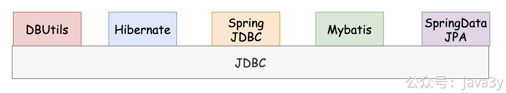

# 3.9 ORM 框架选择

**视频讲解**：
[](https://www.yuque.com/u37247843/dg9569/kl741lfc605hffnu?_lake_card=%7B%22status%22%3A%22done%22%2C%22name%22%3A%22%2311%20%E4%B8%BA%E4%BB%80%E4%B9%88MySQL%E5%92%8CSpringData%20JPA.mp4%22%2C%22size%22%3A529546331%2C%22taskId%22%3A%22u5b21b5e6-154e-4c50-bae0-5e5867b78de%22%2C%22taskType%22%3A%22upload%22%2C%22url%22%3Anull%2C%22cover%22%3Anull%2C%22videoId%22%3A%22inputs%2Fprod%2Fyuque%2F2023%2F1285871%2Fmp4%2F1687266642399-19e3929d-f81f-442a-8457-95d42f9c3995.mp4%22%2C%22download%22%3Afalse%2C%22__spacing%22%3A%22both%22%2C%22id%22%3A%22tRD2v%22%2C%22margin%22%3A%7B%22top%22%3Atrue%2C%22bottom%22%3Atrue%7D%2C%22card%22%3A%22video%22%7D#tRD2v)
记得几年前我刚接触数据库和Java的时候，那时候要用JDBC连接数据库来操作数据，我就很不解：明明我可以通过各种的数据库客户端就能对数据进行操作，为啥我要用JDBC，好麻烦啊

至于为什么会有这种疑问，我也不理解我当时是怎么想的（哈哈哈哈）。后来想通了以后，也学习了很多在程序上“简化JDBC模板”的姿势（DBUtils/Hibernate/Spring JDBC/Mybatis/SpringData JPA)

我在生产环境中接触过的都是Mybatis，但这一次我在asutin项目中决定使用**SpringData JPA作为ORM框架**。

在austin项目里使用数据库的场景都是**非常轻量级**的，我个人也偏好在于**单表操作**，所以我选择了SpringData JPA 作为我的ORM框架。

继续往下看**《时间字段我为什么用int类型？》**我会有对在互联网生产环境使用数据库的场景，或许就能窥探我为什么用SpringData JPA

若有收获，就点个赞吧

 

> 原文: <https://www.yuque.com/u37247843/dg9569/kl741lfc605hffnu>