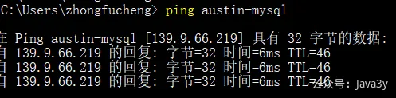

# 2.1 使用现搭好的服务（VIP专属）

看过austin项目的README的同学可能都知道要启动Austin要部署好几个服务(**完全部署所有的服务，大概16G+内存**)

austin项目**强依赖**MySQL/Redis，弱依赖prometheus/graylog/flink/xxl-job/nacos/kafka/apollo

为了节省大家的时间，除了xxl-job分布式定时任务和flink，我都给大家搭好了。xxl-job没办法，因为xxl-job架构是**调度器和执行器是分离**的，要想在**本地调试**的时候只能在本地启动它。flink是由于暴露公网端口**挖矿程序**会一直搞事。

**注意1：请勿外传服务器的ip和端口！**
**注意2：请勿随意破坏服务的数据！**
**注意3：目前服务是共享的，注意保护自己的隐私！**
**注意4：使用hosts前确认没有开VPN代理！**
**01、绑定hosts**

Windows我使用的是：[https://github.com/oldj/SwitchHosts](https://github.com/oldj/SwitchHosts)

（如果使用SwitchHosts软件**有权限**问题，可以参考：[https://blog.csdn.net/nxg0916/article/details/122656910](https://blog.csdn.net/nxg0916/article/details/122656910)）

SwitchHosts 压缩包下载：
SwitchHosts_windows_installer_x64_4.1.2.6086.exe.7z(61.8 MB)

Mac OS 我使用的是：[https://github.com/2ndalpha/gasmask](https://github.com/2ndalpha/gasmask)

你完全可以在本机不借助任何的软件去修改hosts，不过下载一个软件会方便一些。hosts内容如下：

```
# 9009
119.91.205.248 austin-graylog
# 3000
119.91.205.248 austin-grafana
# 9090
119.91.205.248 austin-prometheus
# 9100
119.91.205.248 austin-node
# 8899
119.91.205.248 austin-cadvisor
# 8080
119.91.205.248 austin-apollo-config
# 8070
119.91.205.248 austin-apollo-admin
#############
# 3306
117.50.186.19 austin-mysql
# 6379
117.50.186.19 austin-redis
# 9092
117.50.186.19 austin-kafka
# 8848
117.50.186.19 austin-nacos
```
绑定hosts后，尝试打开常用的中间件后台，打开这些后台实际并不重要，重要的是明白为什么我要引入这些中间件**（密码就在括号后面）**：
●graylog：[http://austin-graylog:9009/search](http://austin-graylog:9009/search) (admin/admin)
●apollo：[http://austin-apollo-admin:8070/signin](http://austin-apollo-admin:8070/signin) (apollo/admin)
●grafana：[http://austin-grafana:3000/login](http://austin-grafana:3000/login) （admin/admin) 
●nacos ：[http://austin-nacos:8848/nacos/index.html](http://austin-nacos:8848/nacos/index.html) （nacos/nacos）

在绑定成功后，尝试**ping**下域名，看能不能通，能通说明就是绑定成功了。



若有收获，就点个赞吧

 


> 原文: <https://www.yuque.com/u37247843/dg9569/gflqm92tk31w8gba>