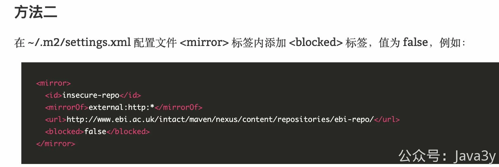
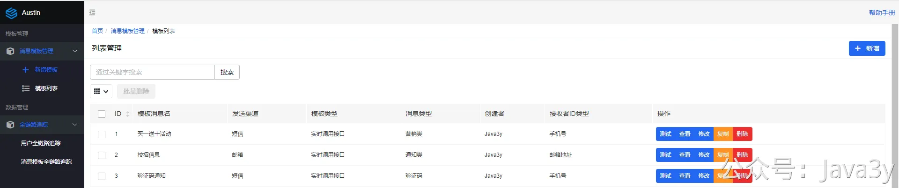
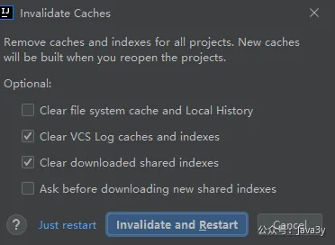
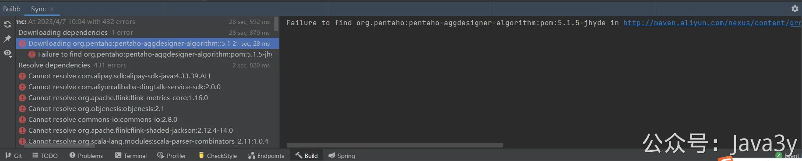
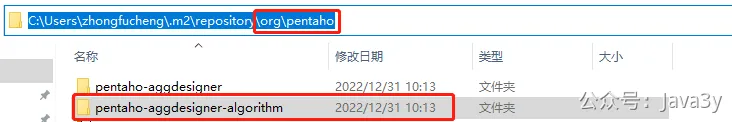
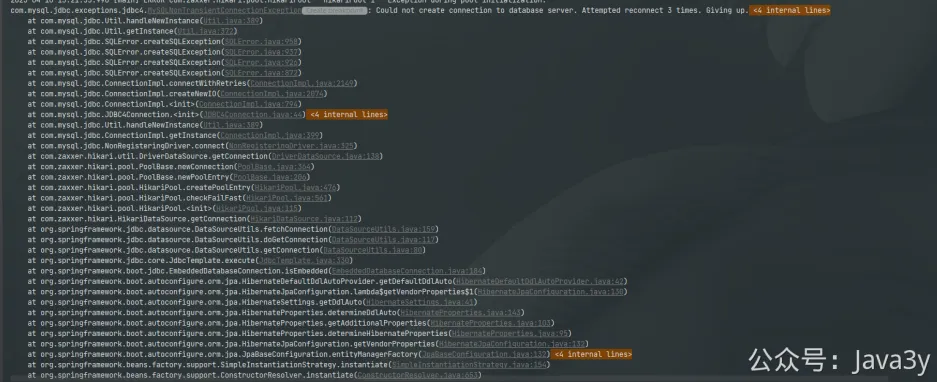

# 2.2 如何在本地启动项目？

**00、确认环境**
**JDK 版本1.8 **高版本有可能因为apollo的兼容性问题，无法启动项目。**maven仓库**可以参考我的配置（settings文件）：
**注：maven3.8.x版本**不支持http，可通过**注释settings.xml的内容**解决

**01、启动服务端**
GitHub仓库：[http://github.com/ZhongFuCheng3y/austin](http://github.com/ZhongFuCheng3y/austin)
Gitee仓库：[http://gitee.com/zhongfucheng/austin](http://gitee.com/zhongfucheng/austin)

从[Gitee](http://gitee.com/zhongfucheng/austin)或者[GitHub](http://github.com/ZhongFuCheng3y/austin)仓库拉取代码到本地，直接就能启动了，默认使用了项目最少的依赖（MySQL和Redis），由于在上一节配置了**Hosts**，所以这个过程是很顺利的。

启动后端入口：**com.java3y.austin.AustinApplication**

**02、启动前端**
1、从 [Gitee-austin-admin](https://gitee.com/zhongfucheng/austin-admin) 或者 [Github-austin-admin](https://github.com/ZhongFuCheng3y/austin-admin) 拉取代码

2、在百度搜“windows 安装npm”或者“mac 安装npm”，随便跟着一篇教程安装下npm的环境

3、在**拉取austin-admin代码的目录下**执行下方命令，启动前端工程
打开 [http://localhost:3000](http://localhost:3000/) 就能看到页面

**03、启动项目常见问题**
**3.1 maven依赖下载爆红**
遇到**idea爆红**的问题，**重启清缓存**试试。

如果只是下面的包报错，其实不影响正常启动（是hive的包，**正常项目启动是不会依赖austin-data-house这个模块的**)。

实在是有强迫症的同学，可以把下面的文件夹，导入到自己的maven仓库里

pentaho-aggdesigner-algorithm.7z(42 KB)

比如我的maven仓库路径是：**C:\Users\zhongfucheng\.m2\repository**

**3.2 后端连接数据库失败**

1、确定host是否配置了，可以**ping域名**下检查
2、**vpn**是不是忘了关？
3、**代码是不是最新的**

若有收获，就点个赞吧

 

> 原文: <https://www.yuque.com/u37247843/dg9569/yuxphmswob568wg4>