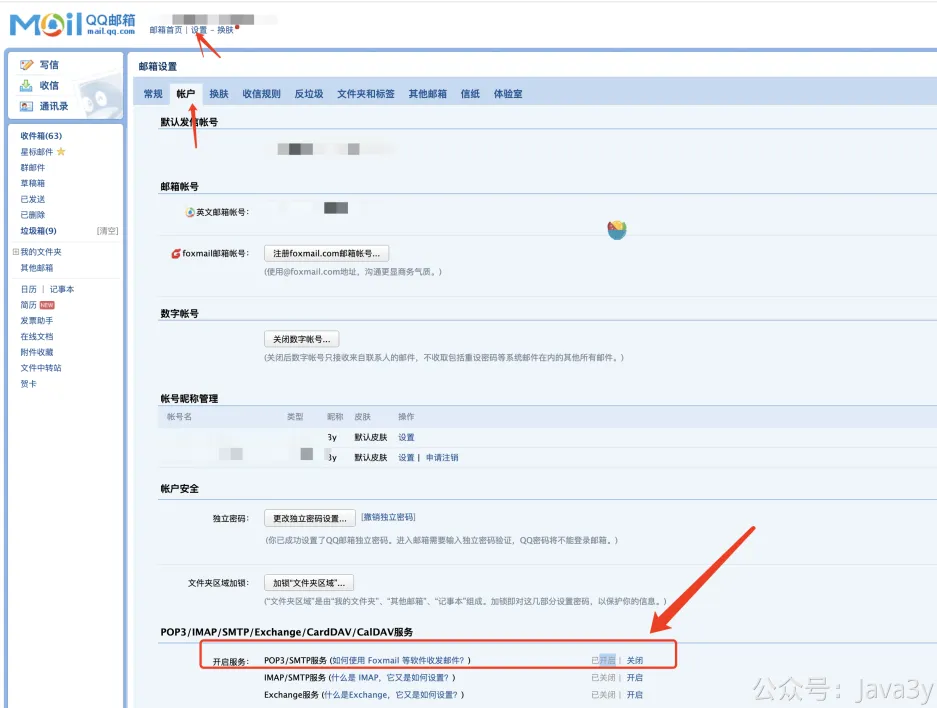
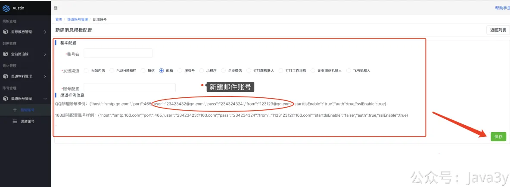
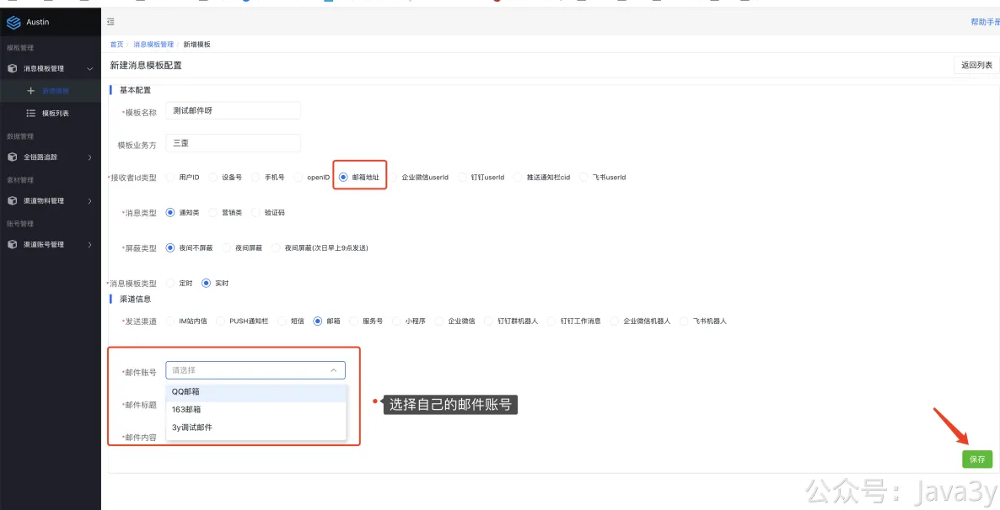
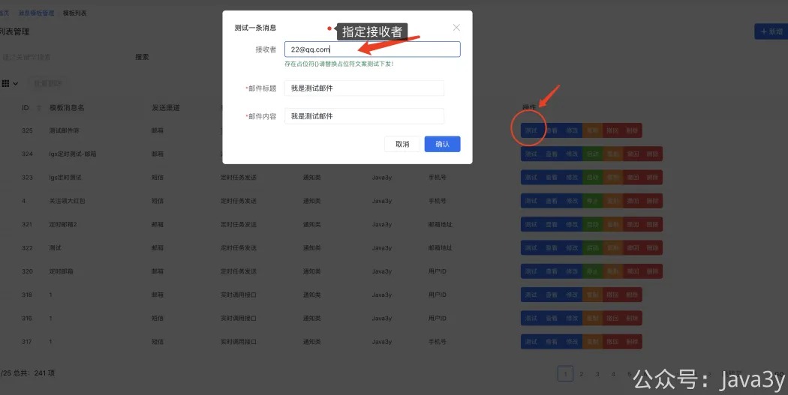
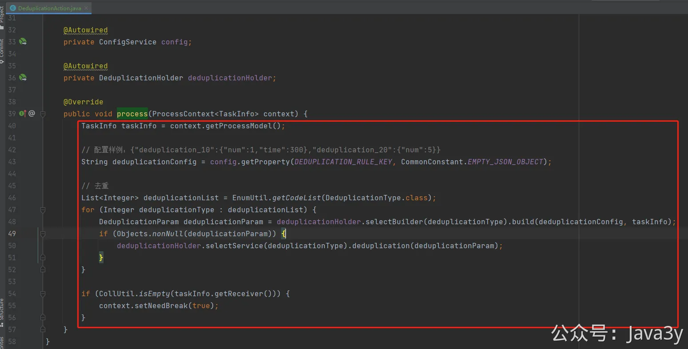
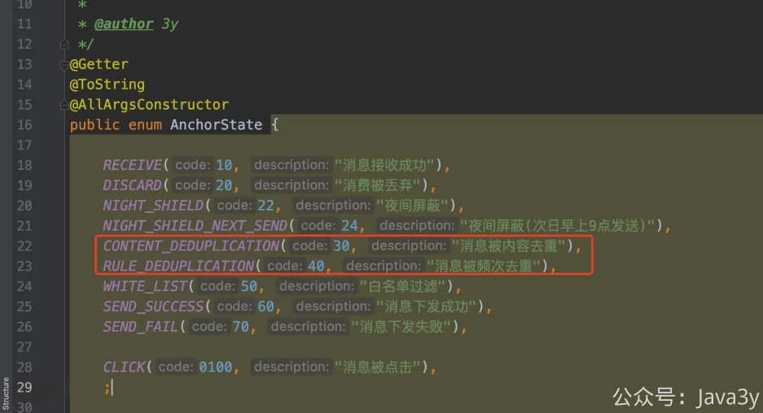
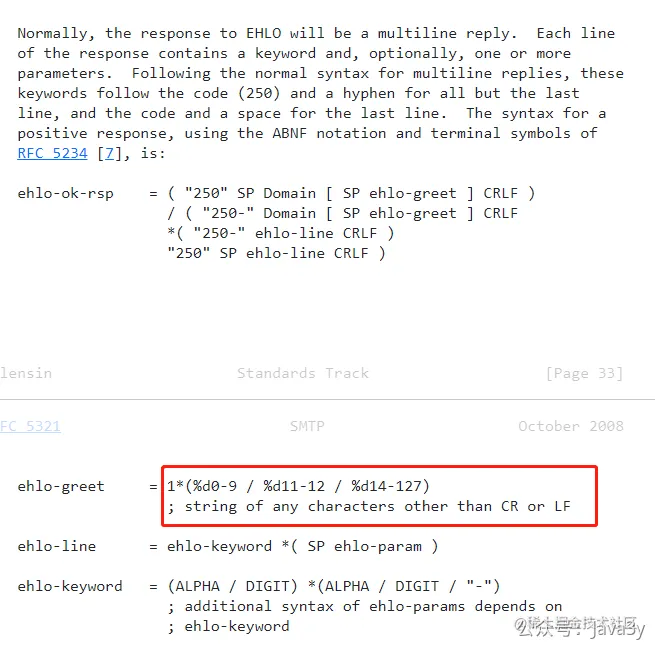

# 2.3 万事开头难？接收一条消息！

**一、快速入门**
现在我们在本地已经起好了项目了，前后端都能正常跑通了。那就可以**通过前端新建一个模板，**发送一条邮件给自己。

为什么是邮件，而不是其他的渠道消息呢（比如短信），主要是邮件的最简单，入门先以简单的为主。等发送邮件成功了以后，我建议就去发短信（只要把全个链路过程短信渠道搞明白了，那消息推送平台也就学会了）。

**发送邮件的账号是需要自己去配置的**，以QQ邮箱为例，主要是去开启**SMTP服务（开启时会有个授权码，这个码在下面会用到）**

在前端新建一个邮件的账号：

**配置里的pass填入的是授权码（在开启STMP时的授权码）** ，**from和user都填自己的邮箱即可（两者相同）**

随后创建一个模板，测试发送一封邮件

**到这一步，那你已经成功收到一条给自己发的邮件啦！**
**二、常见问题**
**2.1 消息被去重**
**注：如果多次失败或者下发的频率太高，会触发去重的逻辑，此时可把com.java3y.austin.handler.action.DeduplicationAction#process**的去重代码给注释掉，继续调试。

（整个方法都可以注释掉）

打出的日志会有 **30**/**40**的提示比如会看到以下的日志：
INFO com.java3y.austin.support.utils.LogUtils - {"businessId":2000000520230410,"ids":["xxxx@163.com"],"logTimestamp":1681109996272,**"state":30**}
INFO com.java3y.austin.support.utils.LogUtils - {"businessId":2000000520230410,"ids":["xxxx@163.com"],"logTimestamp":1681109996272,**"state":40**}

**2.2 邮件账号配置不对**
1、继续检查 **pass** 是否为SMTP的授权码
2、检查 **from**和 **user **是否完全一致
3、检查账号配置是否是**json**格式。
**2.3 电脑的hostname不能是中文**
如果出现类似以下的错误：

Java复制代码
1
2
3
4
5
6
7
8
9
10
11
12
ERRORc.java3y.austin.handler.handler.impl.EmailHandler-EmailHandler#handlerfail!cn.hutool.extra.mail.MailException: MessagingException: 502Invalidinput from 125.22.222.22tonewxmesmtplogicsvrszb6-0.qq.com
atcn.hutool.extra.mail.Mail.send(Mail.java:393)
 at cn.hutool.extra.mail.MailUtil.send(MailUtil.java:416)
 at cn.hutool.extra.mail.MailUtil.send(MailUtil.java:194)
 at cn.hutool.extra.mail.MailUtil.send(MailUtil.java:176)
 at com.java3y.austin.handler.handler.impl.EmailHandler.handler(EmailHandler.java:60)
atcom.java3y.austin.handler.handler.BaseHandler.doHandler(BaseHandler.java:61)
atcom.java3y.austin.handler.pending.Task.run(Task.java:66)
atjava.util.concurrent.ThreadPoolExecutor.runWorker(ThreadPoolExecutor.java:1149)
 at java.util.concurrent.ThreadPoolExecutor$Worker.run(ThreadPoolExecutor.java:624)
 at java.lang.Thread.run(Thread.java:748)
Caused by: javax.mail.MessagingException: 502Invalidinput from 125.22.222.22tonewxmesmtplogicsvrszb6-0.qq.co
EHLO命令会对domain有限制：https://datatracker.ietf.org/doc/html/rfc5321#section-4.1.1.1

若有收获，就点个赞吧

 

> 原文: <https://www.yuque.com/u37247843/dg9569/wx8rlgs5s9r5e1d0>