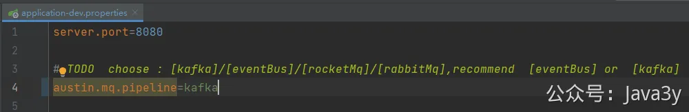
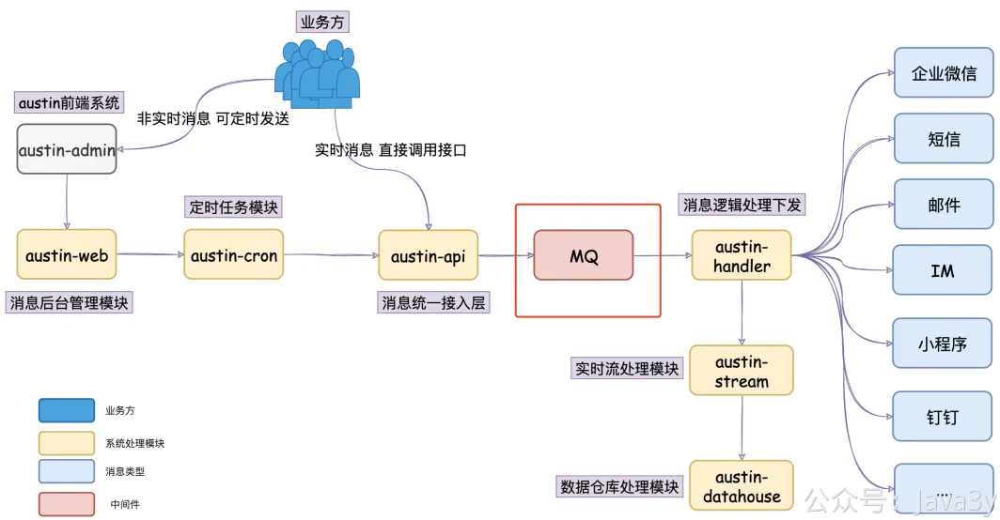
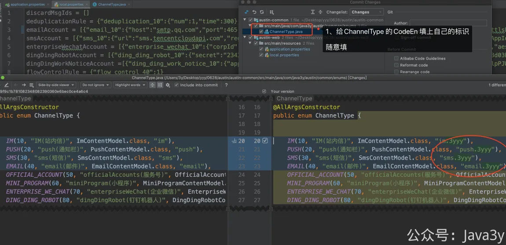
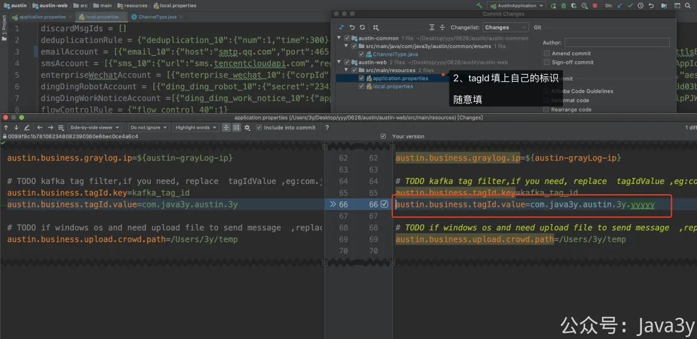

# 2.4 把灵魂的消息队列用起来！

# 2.4 把灵魂的消息队列用起来！
接收到了一封邮件后，debug整条链路，**先看看我是怎么发送一条邮件的，我是怎么设计的（建议先读3.1~3.13章节再回来）**。当你大概懂了之后，那**进阶的来了**！

在默认的情况下，是使用eventBus作为消息接入与下发层解耦的实现，但在线上环境里，一般都是要用消息队列的。目前Austin消息推送平台支持eventBus/**kafka**/rocketMq/rabbitMq

我推荐使用**Kafka**进行测试，**稳定且我就提供这个MQ的远程服务**。只需要把配置austin.mq.pipeline=eventBus改为**austin.mq.pipeline=kafka**

重新启动，那么现在就使用了Kafka进行逻辑处理的解耦，其实就是架构图的这块：

用了Kafka之后，那好玩的事情又多了，可以看看**Receiver**和**ReceiverStart**的设计，如果还没学Kafka的，可以看看Kafka是什么，怎么用的。

如果使用了**Kafka**进行调试，需要使用**Tag过滤功能**才不会互相影响到对方的消息

**topic：由于Kafka topic是共用的，那就有可能消费到其他股东的消息，所以我们可以单独设置对应的group，groupId由ChannelType的标识组成，可以改掉对应的CodeEn达到消费整个topic的内容，并且非自身的tag过滤，这样一来消费得到的就是自身发送的内容**

1、修改com.java3y.austin.common.enums.ChannelType的**codeEn**渠道的标识（随意改就行）

2、修改application.properties的 austin.business.tagId.value（随意改就行）

若有收获，就点个赞吧

 

> 原文: <https://www.yuque.com/u37247843/dg9569/mh3lbr1qh1mvlhi6>