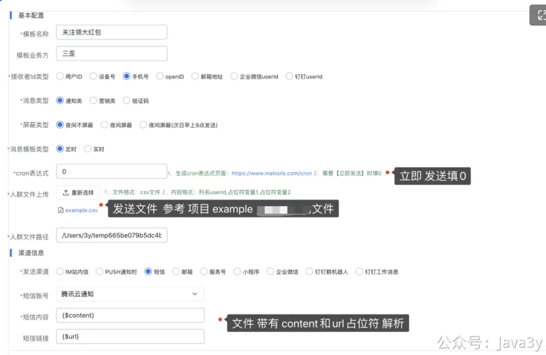

# 2.5 使用圈选人群的方式发送消息

**（这一节可以先暂缓，建议先刷第三章节的内容，刷到了分布式定时任务再回头来看这）**

项目的圈选人群发送定时任务是依赖**xxl-job分布式定时任务框架**的，目前**定时消息发送**、**定时刷新钉钉Token、个推鉴权Token**、**夜间屏蔽次日发送**都是用**xxl-job**实现的。

如果想要体验分布式定时任务框架的功能，需要在本地部署起来。这是**它架构**（调度器和执行器分离）决定的，没办法，部署姿势如下：

1、在[Gitee-xxl-job](https://gitee.com/xuxueli0323/xxl-job) 或者 [Github-xxl-job](https://github.com/xuxueli/xxl-job) 拉取xxl-job的项目源码

2、在**本地MySQL**中执行**/xxl-job/doc/db/tables_xxl_job.sql**的SQL脚本

3、修改xxl-job-admin调度中心的数据库配置，**启动xxl-job-admin项目**

3.0 注：如果是新版本的xxl-job，需要填写**access_token**（执行器和调度器的access_token需要相同），否则会出现以下问题；

注：可参考 《第七章 xxl-job部署token的问题》

3.1、修改消息推送平台**application.properties**配置里的**austin.xxl.job.enabled=true**

注：如果是Windows用户且需要使用文件上传的功能，需要把**application.properties**配置下的austin.business.upload.crowd.path 改成 自己电脑下的绝对路径

4、新建一个**定时**消息模板发送玩玩

**最后启动模板，查看后台的日志，有没有调用成功（消息未必最终能下发，但如果已经到下发层了，那说明已经成功了）**。

注：**csv文件格式需要注意格式的问题（直接使用我项目上的会比较好）**，要是有条件，可以**vi**看下文件的内容（看看有没有特殊的字符），比如有的股东可能会出现**多了逗号**的问题。

5、打开xxl-job-admin 后台地址：[http://localhost:6767/xxl-job-admin/](http://localhost:6767/xxl-job-admin/)查看调度的状态

若有收获，就点个赞吧
[3y](https://www.yuque.com/u1047901)
07-13 10:12
57

> 原文: <https://www.yuque.com/u37247843/dg9569/gy8y8k8u704wpg4z>