# 2.7 各个渠道接入的姿势

**00、账号配置**

**注：发送渠道的账号用自己的，我不对外提供渠道账号**

目前austin项目所有的发送渠道的账号信息都**已交由MySQL存储，由后台管理统一增删。**

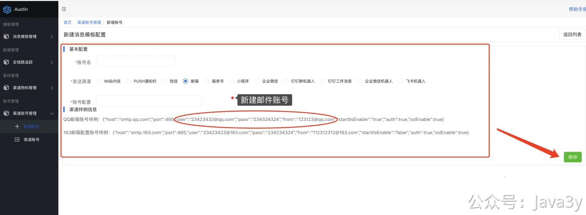

**01、短信**

短信我目前用的腾讯云渠道，需要创建**签名**和**模板**（具体的位置如图）

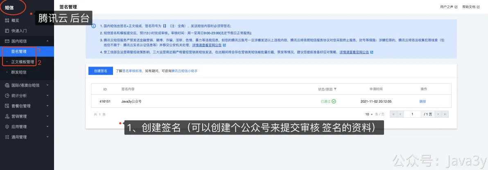

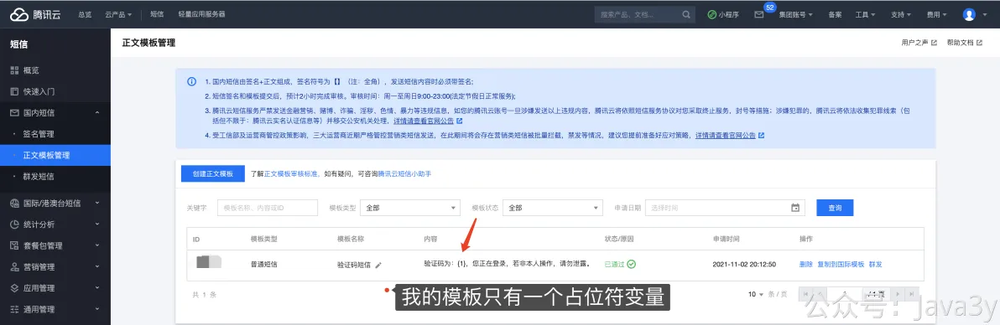

关于短信渠道的具体内容，可以参考 [如何发送一条短信](https://www.yuque.com/u1047901/qpbueg/gz0m9o)，准备好了签名和模板之后在新增配置即可发送。

腾讯云的参数可参考：[腾讯云 账号配置参数](https://www.yuque.com/u1047901/qpbueg/zkxcyo)
**2024-03更新：个人现在也没法申请到腾讯云的短信了。可以尝试 云片等小渠道**

**注：**目前austin只支持**单账号单模板**，原因详看：[https://gitee.com/zhongfucheng/austin/issues/I952PR](https://gitee.com/zhongfucheng/austin/issues/I952PR)

**02、邮件**

以QQ邮箱为例，主要是去开启**SMTP服务**

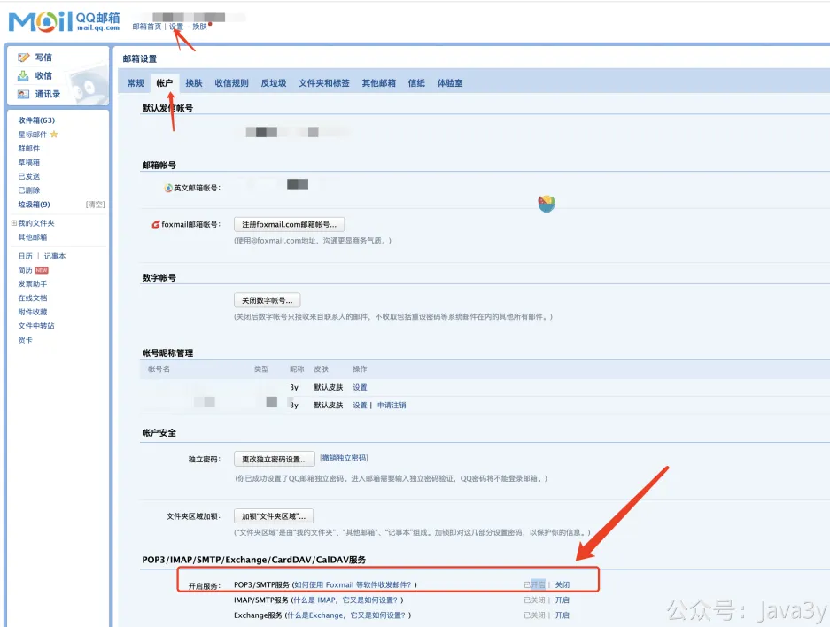

QQ邮箱：
**03、企业微信**

**3.1 企业微信应用消息**

1、找到官方文档：[https://developer.work.weixin.qq.com/document/path/91201](https://developer.work.weixin.qq.com/document/path/91201)，稍微读一读它的基本概念介绍

2、接入企业微信当然你得有个企业微信账号嘛，所以要注册一个企业微信账号：[https://work.weixin.qq.com/wework_admin/register_wx?from=loginpage](https://work.weixin.qq.com/wework_admin/register_wx?from=loginpage)

3、登录进后台以后，创建一个应用

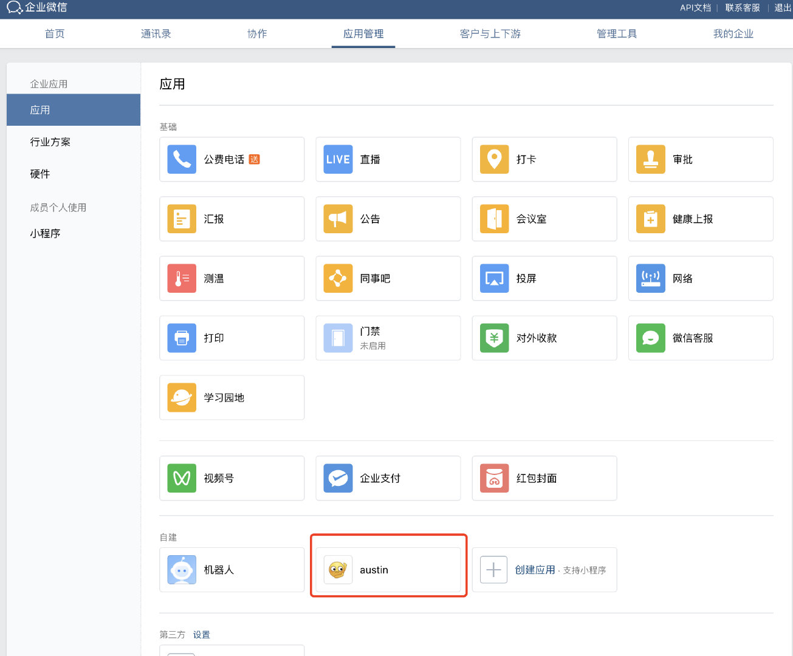

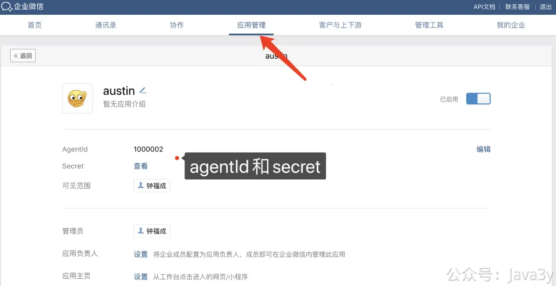

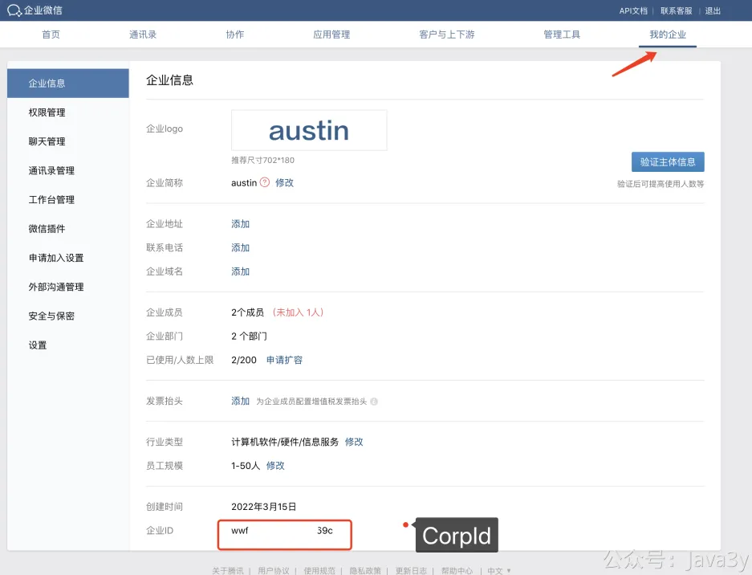

4、到后台新增账号**（aesKey和token这俩个参数对于发送消息来说暂未有用，是接收消息的参数，用于后续扩展，可不配置）**
**3.2 企业微信机器人消息**

1、查看官方文档：[https://developer.work.weixin.qq.com/document/path/91770#%E6%96%87%E6%9C%AC%E7%B1%BB%E5%9E%8B](https://developer.work.weixin.qq.com/document/path/91770#%E6%96%87%E6%9C%AC%E7%B1%BB%E5%9E%8B)

2、在群里增加机器人，得到wehook地址

3、到后台新增账号
**04、钉钉**
**4.1 钉钉群机器人**

**1**、阅读官方文档：[https://open.dingtalk.com/document/group/custom-robot-access](https://open.dingtalk.com/document/group/custom-robot-access)

**2**、创建智能群助手，得到**Webhook地址**和**加密的值**

**4.2 钉钉工作消息**

**1**、在官网文档了解基础概念：[https://open.dingtalk.com/document/org/basic-concepts](https://open.dingtalk.com/document/org/basic-concepts)

**2**、进入企业管理后台： [https://open-dev.dingtalk.com/fe/app#/corp/app](https://open-dev.dingtalk.com/fe/app#/corp/app) ，随后创建应用

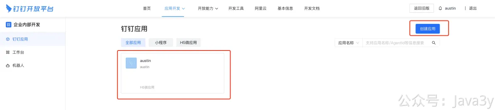

**05、PUSH通知消息（安卓）--个推**

总体的流程大致如下：

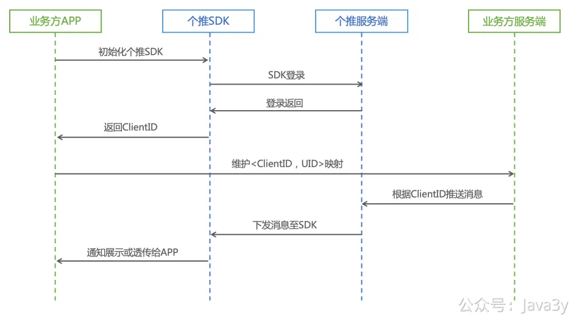

正常发送PUSH是**需要客户端开发**的，Austin更多关注的是服务端推送，而非客户端的内容，所以我直接用个推提供的SDK Demo做调试。

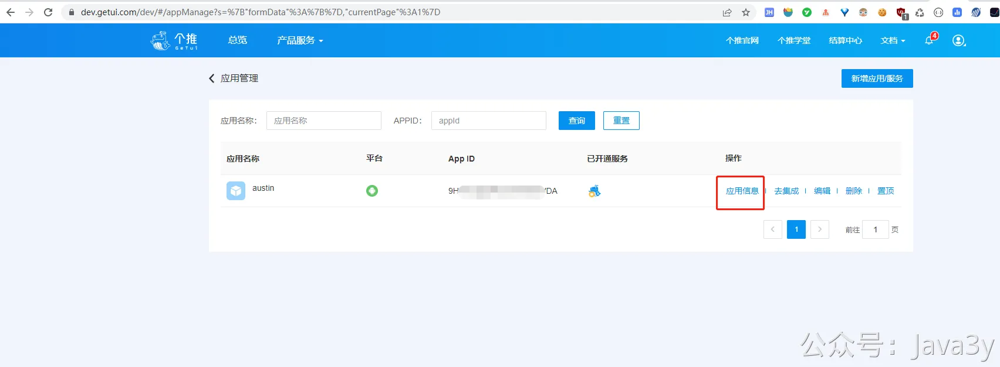

文档如下：[https://docs.getui.com/getui/start/product/](https://docs.getui.com/getui/start/product/)

从文档里以及我的实践后发现要使用该SDK，可以分为以下步骤：

**1**、登录注册个推账号，得到appid、appkey、appsecret

**2**、下载Android版本的消息推送Demo：[https://docs.getui.com/download.html](https://docs.getui.com/download.html)

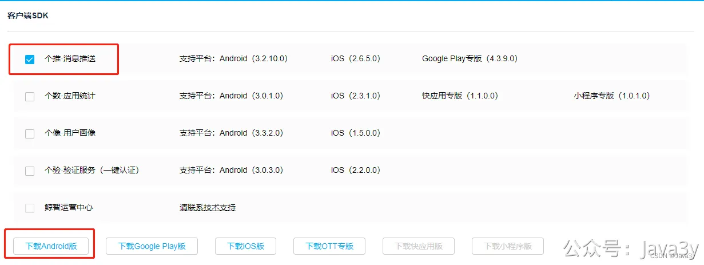

**3**、下载Android Studio来打开刚才下载的SDK：[https://developer.android.com/studio](https://developer.android.com/studio)

**4**、修改config.gradle文件的账号相关参数值：

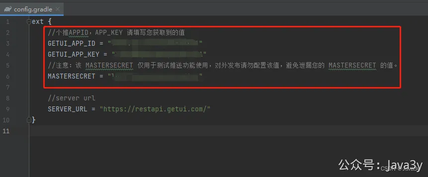

**5**、编译成功后，直接build出对应的apk

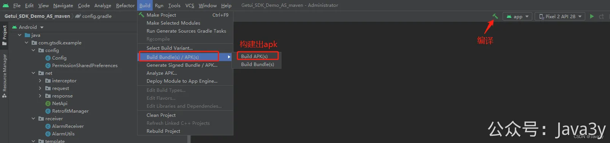

**6**、将apk文件给安卓的手机下载，就完事了（打开SDK demo就能看到自己的cid）

账号样例配置：

**06、微信服务号模板消息**

要实现微信服务号的模板消息推送，首先我们得有一个服务号。要值得注意的是，**服务号是服务号，订阅号是订阅号**。

没有服务号的同学，可以申请测试号进行调试：**https://mp.weixin.qq.com/debug/cgi-bin/sandbox?t=sandbox/login**

进入到测试号以后，我们能把自己加入到测试的微信号，拿到对应的**openId，并且**创建几个测试下发的模板；

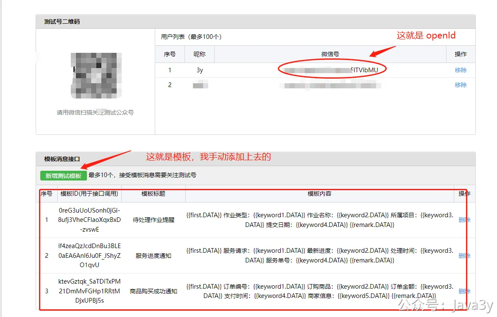

可以粘贴下面的内容，新增测试模板
我们还能直接拿到**appID**和**appsecret**，这就相当于当前服务号账号的信息。那我要做的就是把这个信息加入到消息推送平台的账号体系下。

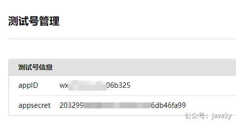

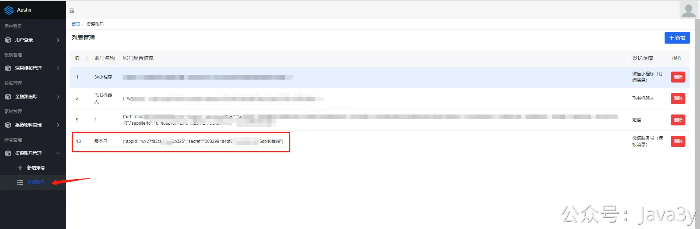

**07、微信小程序订阅消息**
首先注册了一个微信小程序，拿到小程序**appId**和**secret**，并在微信后台**创建了几个订阅消息**的模板。

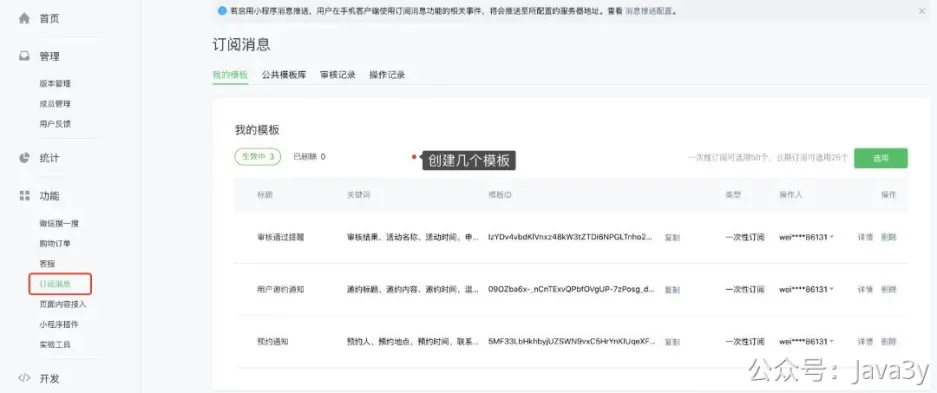

**测试小程序**的链接：[https://mp.weixin.qq.com/wxopen/waregister?action=step1&token=&lang=zh_CN](https://mp.weixin.qq.com/wxopen/waregister?action=step1&token=&lang=zh_CN)

这个把小程序的账号就接入到消息推送平台的账号管理体系下：

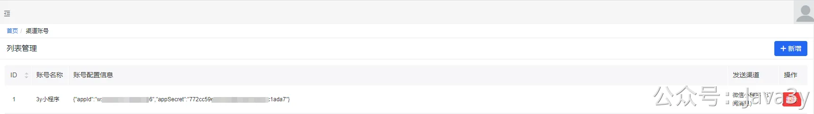

下载一个微信小程序开发工具：[https://developers.weixin.qq.com/miniprogram/dev/devtools/download.html](https://developers.weixin.qq.com/miniprogram/dev/devtools/download.html)

下载调试微信小程序的demo的代码：[https://github.com/zhangkaizhao/wxapp-subscribe-message-demo](https://github.com/zhangkaizhao/wxapp-subscribe-message-demo)

将代码的「**wxapp**」文件夹导入到小程序的开发工具里，在工具内改动两块地方：

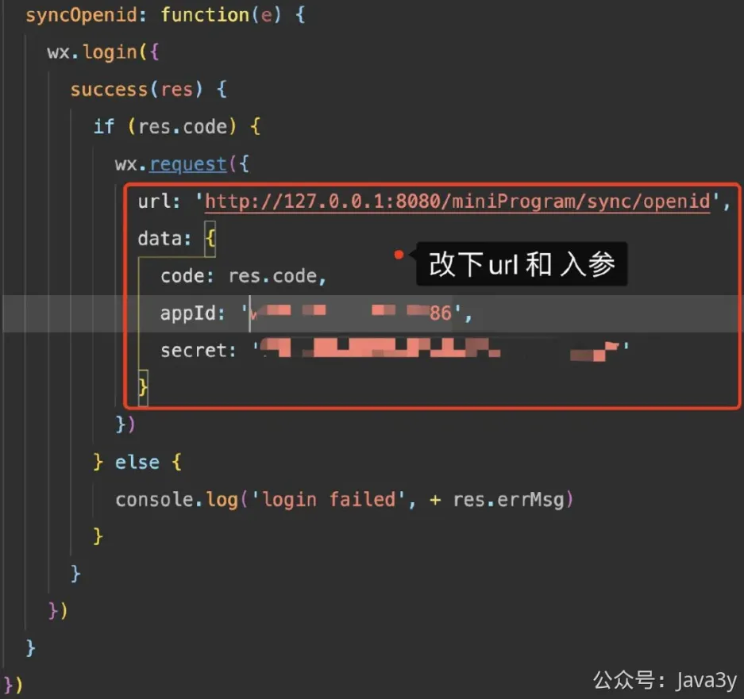

appId和secret以自己的为准：

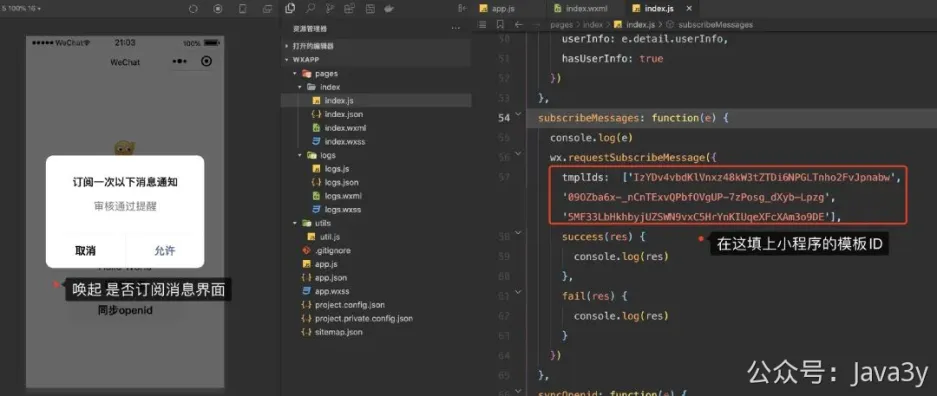

数组内的模板ID以自己的账号为准

得到下发的**openId**和允许服务端推送小程序消息

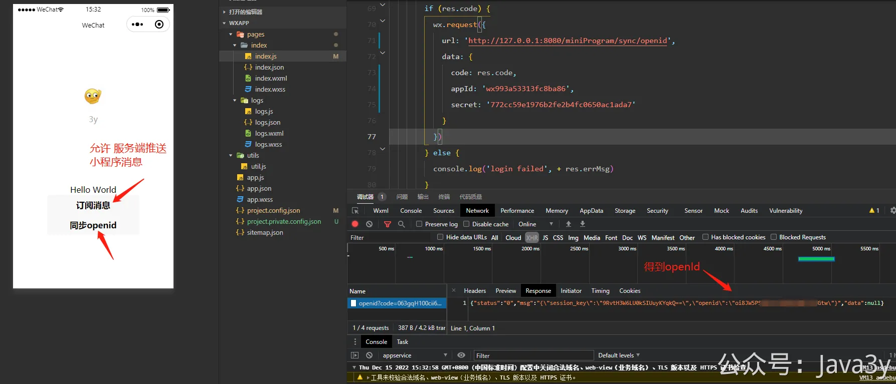

在测试时，**要注意的是**：对于小程序订阅消息来说，模板的每个字段都是有类型的，**有类型意味着对于文案的内容是有要求的，比如如果是日期格式，那该字段的文案只能填日期，不能填其他了**。

类型的信息可以参照这：

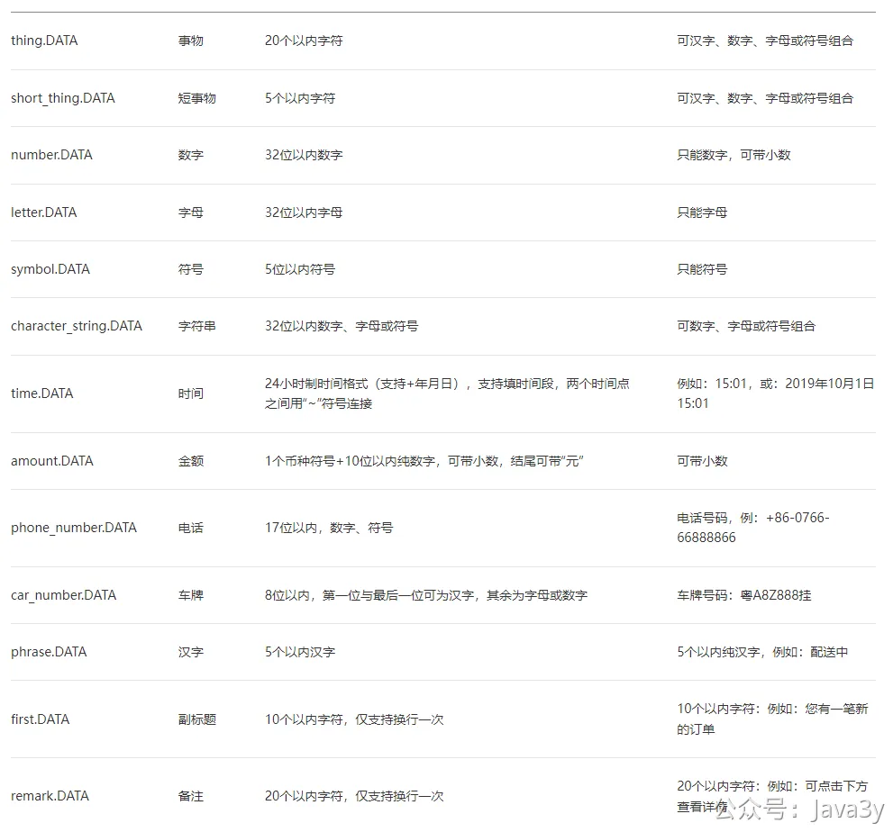

链接：[https://developers.weixin.qq.com/doc/offiaccount/Message_Management/Template_Message_Interface.html#%E8%8E%B7%E5%8F%96%E6%A8%A1%E6%9D%BF%E5%88%97%E8%A1%A8](https://developers.weixin.qq.com/doc/offiaccount/Message_Management/Template_Message_Interface.html#%E8%8E%B7%E5%8F%96%E6%A8%A1%E6%9D%BF%E5%88%97%E8%A1%A8)

若有收获，就点个赞吧
[3y](https://www.yuque.com/u1047901)
07-13 10:12
45

> 原文: <https://www.yuque.com/u37247843/dg9569/gyqyf9li03v0howf>