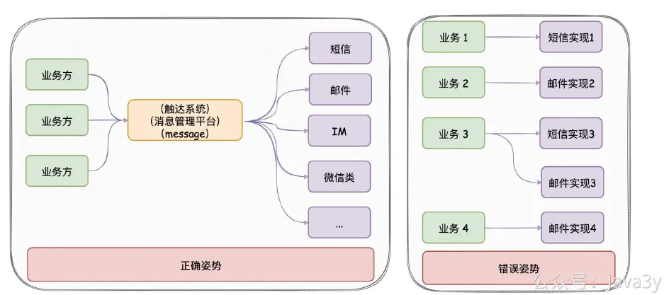
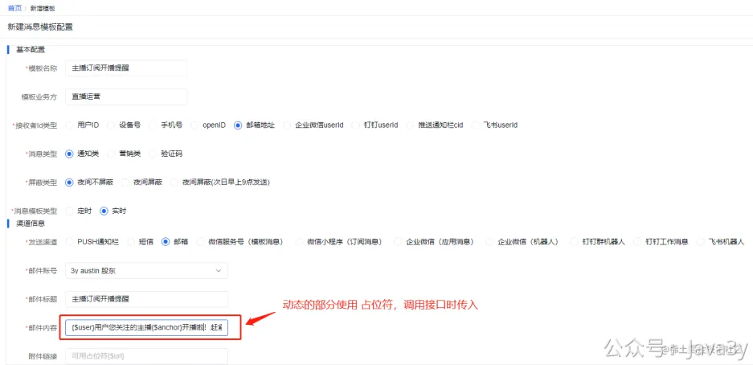
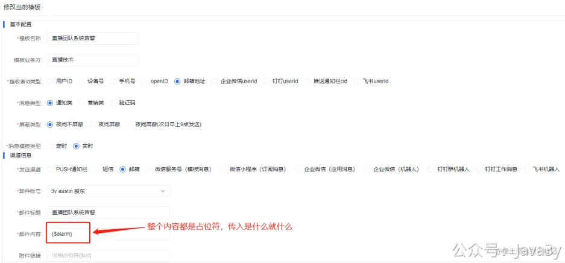
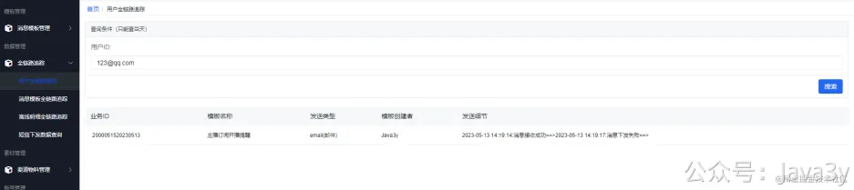
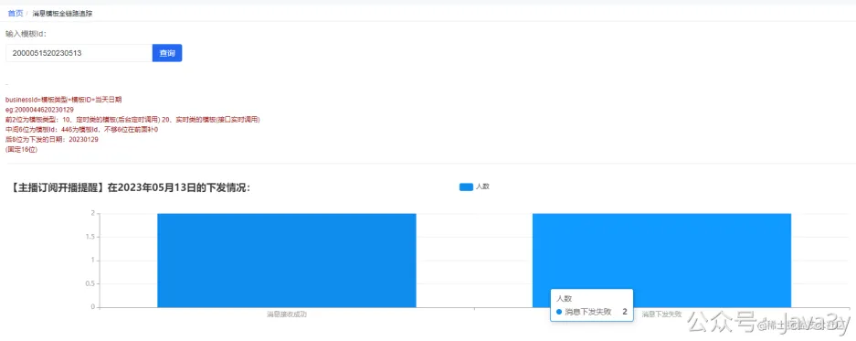

# 2.9 技术团队接入消息推送平台文档

只要公司内部有发送消息的需求，都应该要有类似austin的项目。消息推送平台对各类消息进行统一发送处理，这有利于对功能的收拢，以及提高业务需求开发的效率。

如果是业务第三方(别的团队技术)是怎么使用的？今天就以**实际场景**来看看！

现在运营给直播团队提了个需求，说要发送**主播开播提醒消息**以**邮件**这个渠道给到订阅主播的用户。文案为：**xxx用户您关注的主播xxx开播啦！赶紧来看:xxx链接**

因为公司内部有消息推送平台，所以承接该需求的直播团队技术就会找到消息推送平台的负责人，说要接入消息推送平台来实现这个需求。
**1、创建模板**
无论是运营还是技术想要发送消息，都需要在消息推送后台创建模板，有了模板才会有全链路追踪，这是使用平台的前提。

于是直播团队的开发就去消息推送后台创建对应的模板：

这时候直播团队的技术又想了，如果我也想把系统的告警也发邮件通知下，是不是也可以？

现在模板创建完，就已经OK了。
**2、接口文档**
目前austin只提供了HTTP接口，没有RPC接口，要用RPC的需要将austin改造下，我相信也不难。一个技术团队里，往往也不止一种技术栈，Java/Python/Go这些语言都是比较常见的，而HTTP接口是通用的，很适合作为平台接口给到第三方去调用。
**2.1 单文案发送接口**
接口解释：相同的文案发给1个或多个用户
接口路径:/send
接口参数样例：

**2.2 多文案发送接口**
接口解释：不同的文案发给不同的用户
接口路径:/batchSend
接口参数样例：

**2.3 调用接口**
刚刚创建出来的两个模板分别为514和515：

当调用515的模板(直播订阅)参数可能会如下：

variables的key就对应着模板里的占位符：{$user}用户您关注的主播{$anchor}开播啦！赶紧来看:{$url}链接

最后下发的文案就是：**小红用户您关注的主播Java3y开播啦！赶紧来看:www.so.com链接**

当调用514的模板(直播程序告警)参数可能会如下：

JSON复制代码
1
2
3
4
5
6
7
8
9
10
11
12
// 调用的是send接口，因为是相同的文案发给1到N个人
{
"code": "send",
"messageParam": {
"receiver": "345@qq.com,445@qq.com,444@qq.com",
"variables": {
"alarm": "2023-05-13 14:16:04.697 [dynamic-tp1] ERROR c.java3y.austin.handler.handler.impl.EmailHandler - EmailHandler#handler fail!cn.hutool.extra.mail.MailException: Invalid Addresses: null \tat cn.hutool.extra.mail.Mail.send(Mail.java:391) \tat cn.hutool.extra.mail.MailUtil.send(MailUtil.java:416) \tat cn.hutool.extra.mail.MailUtil.send(MailUtil.java:194) \tat cn.hutool.extra.mail.MailUtil.send(MailUtil.java:176) \tat com.java3y.austin.handler.handler.impl.EmailHandler.handler(EmailHandler.java:60) \tat com.java3y.austin.handler.handler.BaseHandler.doHandler(BaseHandler.java:61) \tat com.java3y.austin.handler.pending.Task.run(Task.java:66) \tat java.util.concurrent.ThreadPoolExecutor.runWorker(ThreadPoolExecutor.java:1149) \tat java.util.concurrent.ThreadPoolExecutor$Worker.run(ThreadPoolExecutor.java:624) \tat java.lang.Thread.run(Thread.java:748) Caused by: com.sun.mail.smtp.SMTPSendFailedException: 550 The recipient may contain a non-existent account, please check the recipient address. \tat com.sun.mail.smtp.SMTPTransport.issueSendCommand(SMTPTransport.java:1388) \tat com.sun.mail.smtp.SMTPTransport.finishData(SMTPTransport.java:1215) \tat com.sun.mail.smtp.SMTPTransport.sendMessage(SMTPTransport.java:586) \tat javax.mail.Transport.send0(Transport.java:169) \tat javax.mail.Transport.send(Transport.java:98) \tat cn.hutool.extra.mail.Mail.doSend(Mail.java:407) \tat cn.hutool.extra.mail.Mail.send(Mail.java:385) \t... 9 more ,params:TaskInfo(messageTemplateId=515, businessId=2000051520230513, receiver=[123@qq.com], idType=50, sendChannel=40, templateType=20, msgType=10, shieldType=10, contentModel=EmailContentModel(title=主播订阅开播提醒, content=小红用户您关注的主播Java3y开播啦！赶紧来看:www.so.com链接, url=null), sendAccount=373) 2023-05-13 14:16:04.698 [dynamic-tp1] INFO com.java3y.austin.support.utils.LogUtils - {\"businessId\":2000051520230513,\"ids\":[\"123@qq.com\"],\"logTimestamp\":1683958564698,\"state\":70}"
}
},
"messageTemplateId": 514
}

variables的key就对应着模板里的占位符：{$alarm}
**2.4 查看调用下发情况**
根据下发用户的维度查询：

根据模板的维度查询：

若有收获，就点个赞吧
[3y](https://www.yuque.com/u1047901)
07-13 10:12
38

> 原文: <https://www.yuque.com/u37247843/dg9569/khe54saq05uds6ma>