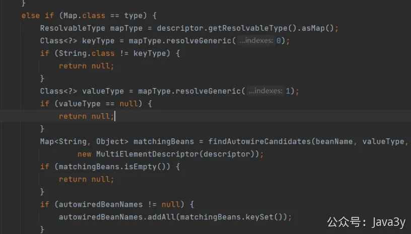

# 5.2 Spring注入集合

**Spring注入集合**

之前我一直不知道，原来Spring是能注入集合的，直到一个pull request被提了过来。

[https://gitee.com/zhongfucheng/austin/pulls/31](https://gitee.com/zhongfucheng/austin/pulls/31)

我之前写了一个**自定义注解**，它的作用就是收集自定义注解所标识的Bean，然后最后把这些Bean放到Map里
```java
@Component
public class SmsScriptHolder {

    private Map<String, SmsScript> handlers = new HashMap<>(8);

    public void putHandler(String scriptName, SmsScript handler) {
        handlers.put(scriptName, handler);
    }
    public SmsScript route(String scriptName) {
        return handlers.get(scriptName);
    }
}


/**
 * 标识 短信渠道
 *
 * @author 3y
 */
@Retention(RetentionPolicy.RUNTIME)
@Target({ElementType.TYPE})
@Component
public @interface SmsScriptHandler {

    /**
     * 这里输入脚本名
     *
     * @return
     */
    String value();
}

/**
 * sms发送脚本的抽象类
 *
 * @author 3y
 */
@Slf4j
public abstract class BaseSmsScript implements SmsScript {

    @Autowired
    private SmsScriptHolder smsScriptHolder;

    @PostConstruct
    public void registerProcessScript() {
        if (ArrayUtils.isEmpty(this.getClass().getAnnotations())) {
            log.error("BaseSmsScript can not find annotation!");
            return;
        }
        Annotation handlerAnnotations = null;
        for (Annotation annotation : this.getClass().getAnnotations()) {
            if (annotation instanceof SmsScriptHandler) {
                handlerAnnotations = annotation;
                break;
            }
        }
        if (handlerAnnotations == null) {
            log.error("handler annotations not declared");
            return;
        }
        //注册handler
        smsScriptHolder.putHandler(((SmsScriptHandler) handlerAnnotations).value(), this);
    }
}
```

结果，pull request提的代码过来特别简单就替代了我的代码了。只要在使用的时候，直接注入Map：

```
@Autowired
privateMap<String,SmsScript> smsScripts;
```

这一行代码就能够实现，把SmsScript的实现类都注入到这个Map里。同样的，我们亦可以使用List<Interface> 把该接口下的实现类都注入到这个List里。

这好奇让我去看看Spring到底是怎么实现的，但实际上并不难。入口在org.springframework.beans.factory.annotation.AutowiredAnnotationBeanPostProcessor.AutowiredFieldElement#inject
接着定位到：org.springframework.beans.factory.support.DefaultListableBeanFactory#resolveDependency
深入 org.springframework.beans.factory.support.DefaultListableBeanFactory#doResolveDependency
最后实现注入的位置： org.springframework.beans.factory.support.DefaultListableBeanFactory#resolveMultipleBeans 数组 相关实现





若有收获，就点个赞吧

 


> 原文: <https://www.yuque.com/u37247843/dg9569/rv9igfrf9gypmg6a>