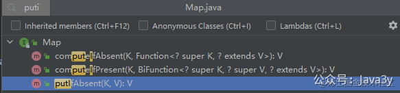

# 5.3 Map.computeIfAbsent使用

在重构渠道账号的逻辑时，我很快地写出以下的代码：
```java
if (clazz.equals(WxMaService.class)) {
    if (Objects.nonNull(miniProgramServiceMap.get(channelAccount))) {
        return (T)miniProgramServiceMap.get(channelAccount);
    }
    WxMaService wxMaService = initMiniProgramService(JSON.parseObject(channelAccount.getAccountConfig(), WeChatMiniProgramAccount.class));
    miniProgramServiceMap.put(channelAccount, wxMaService);
    return (T) wxMaService;
} else if (clazz.equals(WxMpService.class)) {
    if (Objects.nonNull(officialAccountServiceMap.get(channelAccount))) {
        return (T)officialAccountServiceMap.get(channelAccount);
    }
    WxMpService wxMpService = initOfficialAccountService(JSON.parseObject(channelAccount.getAccountConfig(), WeChatOfficialAccount.class));
    officialAccountServiceMap.put(channelAccount, wxMpService);
    return (T) wxMpService;
}
```

等我写完，然后简单做了下自测，**发现这代码咋这么丑啊**，两个`if`的逻辑实际上是一样的。

我想，这一定会有什么工具类能帮我去优化下这个代码的，我正准备翻`Hutool`/`Guava`这种工具包时，我突然想起：**JDK在1.8好像就提供了putIfXXX的方法啦，我还找个毛啊，直接看看JDK的方法能不能用先**。
很快啊，我就找到了。

我首先看的是`putIfAbsent`，发现它实现**很简单**，就是做了一层封装。
```java
default V putIfAbsent(K key, V value) {
    V v = get(key);
    if (v == null) {
        v = put(key, value);
    }

    return v;
}
```

**但却很适合**用来优化我上面的代码。于是，很快啊，我就改成了这样：
```java
if (clazz.equals(WxMaService.class)) {
    return (T) miniProgramServiceMap.putIfAbsent(channelAccount, initMiniProgramService(JSON.parseObject(channelAccount.getAccountConfig(), WeChatMiniProgramAccount.class)));
} else if (clazz.equals(WxMpService.class)) {
    return (T) officialAccountServiceMap.putIfAbsent(channelAccount, initOfficialAccountService(JSON.parseObject(channelAccount.getAccountConfig(), WeChatOfficialAccount.class)));
}
```

这看着真简洁啊，**好像已经很完美了**，本来有好几行的代码，优化了下变成了一行。

但我又思考了下，这个`putIfAbsent`的`V`我这边传入的是一个方法，每次这个方法都会执行的（不论我的`Map`里有没有这个`K`），**这又感觉不太优雅了**。

我又点进去`computeIfAbsent`看了下，嗯！这就是我想要的了：如果`Map`的`V`不存在时，才去执行我生成`V`的逻辑
```java
default V computeIfAbsent(K key,
                          Function<? super K, ? extends V> mappingFunction) {
    Objects.requireNonNull(mappingFunction);
    V v;
    if ((v = get(key)) == null) {
        V newValue;
        if ((newValue = mappingFunction.apply(key)) != null) {
            put(key, newValue);
            return newValue;
        }
    }
    return v;
}
```

这个其实我在学`lambda`和`stream`流的时候曾经是体验过的，我日常也会简单写点，只是不知道在`JDK`里`Map`也有这样的方法。）于是，最后的代码就成了：
```java
if (clazz.equals(WxMaService.class)) {
    return (T) miniProgramServiceMap.computeIfAbsent(channelAccount, account -> initMiniProgramService(JSON.parseObject(account.getAccountConfig(), WeChatMiniProgramAccount.class)));
} else if (clazz.equals(WxMpService.class)) {
    return (T) officialAccountServiceMap.computeIfAbsent(channelAccount, account -> initOfficialAccountService(JSON.parseObject(account.getAccountConfig(), WeChatOfficialAccount.class)));
}
```

又后来，等我发布到Git仓库后，有人提了`pull request`来修复`ConcurrentHashMap`的`computeIfAbsent`存在性能的问题。呀，不小心又学到了点东西。
[https://bugs.openjdk.java.net/browse/JDK-8161372](https://bugs.openjdk.java.net/browse/JDK-8161372)

若有收获，就点个赞吧

 


> 原文: <https://www.yuque.com/u37247843/dg9569/nmzy20dm4rtk6sdc>