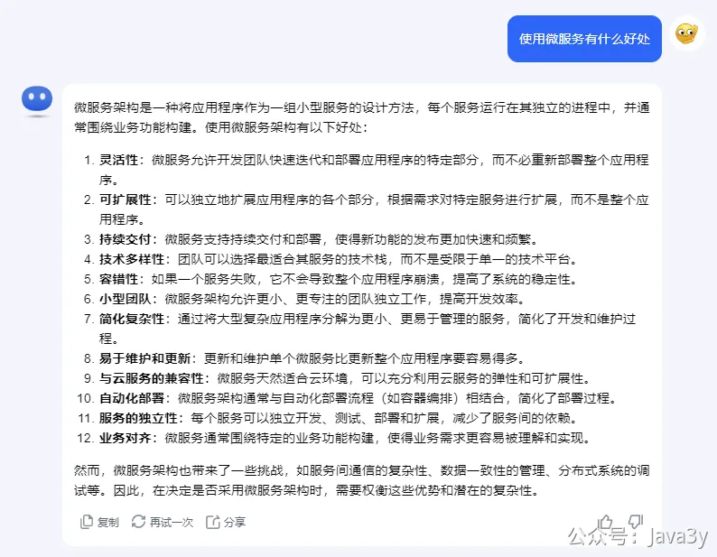
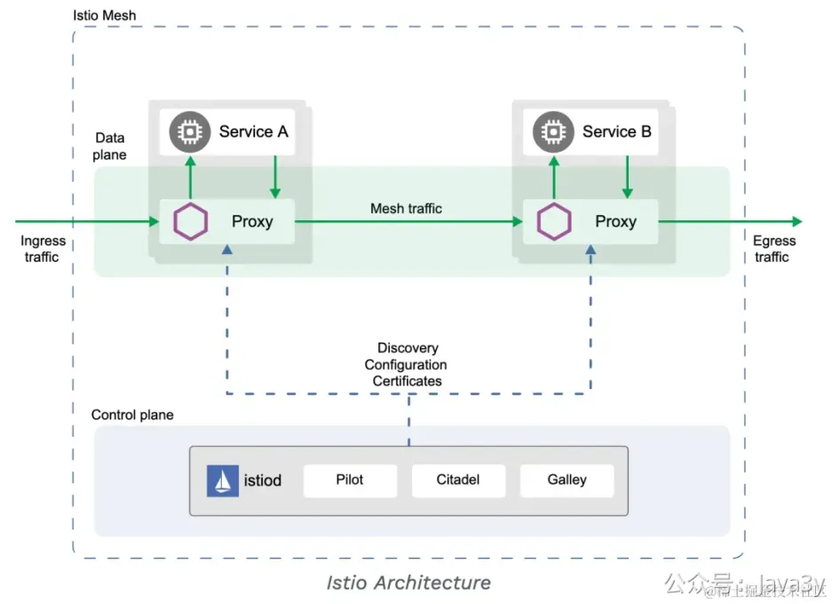

# 8.1 什么是微服务

**01、基础概念**
先来了解几个基础的概念：

**1、集群**：同一个业务，部署在多个服务器上(不同的服务器运行同样的代码，干同一件事)

**2、分布式**：一个业务分拆多个子业务，部署在不同的服务器上(不同的服务器，运行不同的代码，为了同一个目的)

注：集群和分布式并不冲突，可以有**分布式集群**

**3、分布式/微服务/SOA：**这几个概念所表达的含义都差不多，**没必要细分到每个具体的概念**，没有啥意义，毕竟我们不是在搞八股文。

**02、为什么微服务**
使用微服务的好处，GPT其实就总结得很不错：

你去知乎上搜，大概也是说的这些内容，如果不太理解的话，我也是建议去知乎搜下相关的问题。

PS：有时候**理解性的技术类的问题**，知乎可能比谷歌都要好使。

**03、微服务不是必须存在**

不要微服务而微服务，实际上大部分应用都没有微服务的需求。

1、**它不解决高并发高性能高可用的问题**，单体应用照样也能实现负载均衡，弹性扩缩容，还少了很多网络的交互呢。

2、说是解耦吧，我单体应用也能划**分模块解耦**。

但得承认，确实分模块是没有微服务那么彻底，毕竟都进程隔离了。进程隔离了，项目启动更快了，如果出问题，也只出在对应的进程里了。

好处是有的，但没想象中那么美好。代码烂不烂，跟是不是微服务也没多大关系。

有的单体应用，模块划分得好，代码照样好看。有的微服务应用，共用代码到处复制，就为了省事不发包，每次改都要全局搜，每一份都有点细微的差别。

服务拆开了以后，问题倒是有一大堆，解决这些分布式问题的就是**分布式治理的框架**。

**04、系统总是分分合合的**

曾经，我待在的互联网公司应用系统也是拆分得很细的。到后来，降本增效，要缩减服务器，启动广进计划。

本来每个服务在线上都要分配两台机器（为了做高可用），现在要**缩减服务器**了，最简单的办法就是**把系统合起来**。

比如，本来有个消息推送后台web服务，微信管理后台web服务，本来是分开不同的服务的，一共要占用4台机器。

降本可以这样做，把消息推送后台web服务和微信管理后台web服务的代码合起来部署，这样线上一共只要2台机器，高可用没变，这就省了两台机器的钱，简直是美滋滋。

“什么？这两个系统本来就应该分开的，不搭边的，怎么能合起来啊？”

“真不是，那是你的项目名没取对，比如你叫奥斯丁管理后台，那不就得了。只要项目名不跟具体业务挂钩，在里面放什么都合理”

“**有理**”

大部分合并是同类型的业务进行合并，比如本来都是提供对外服务的，少部分确实是有些从RPC调用改为本地调用。

经过几个月奋斗，**服务器哗啦啦的减**，这个过程中小的事故是在所难免的，但运行了一段时间后，也没什么大问题。

**05、微服务技术选型**
在**Java领域上**，微服务解决方案最常见的是Dubbo和SpringCloud，现在几乎是SpringCloud的天下了。

但SpringCloud**也许是过渡方案**

Spring Cloud是微服务架构的一个解决方案，他的具体实现之一是：Spring Cloud Alibaba

Service Mesh（服务网格）也是微服务架构的一个解决方案，他的具体实现之一是：istio

SpringCloud是侵入式的，istio是非侵入式的。Spring Cloud支持的，Service Mesh基本都支持。

我们要用SpringCloud要在代码中引入spring-cloud-starter-alibaba-nacos-discovery服务注册发现，spring-cloud-starter-loadbalancer服务负载均衡这种SDK包，要额外部署服务注册中心（如nacos）这种服务。

而Service Mesh不用，它的目标就是要将微服务治理体系**下沉为一套与业务无关的基础设施**。

我们只需要写简简单单的SpringBoot，不需要引入各种的服务发现，负载均衡的SDK，就能实现SpringCloud所类似的功能，服务治理的相关都由基建完成。

非侵入式，让程序员专注业务，**是未来**。

**短期是SpringCloud，**不管有没有必要上微服务，现在已经有很多公司已经用上了SpringCloud架构了。

比如我19年实习的小公司，算上我，一共就4个后端，都引入了SpringCloud的依赖...

SpringCloud也许是过渡方案，但存量的项目一般是不会重构改造的。这道理很易懂，jdk都发布到23版本了，我们还在用8，是不是。

**很多同学的简历不写上微服务的技术栈，都不好意思投递了**...

若有收获，就点个赞吧

 

> 原文: <https://www.yuque.com/u37247843/dg9569/wv8gf4i3gp75dhdg>