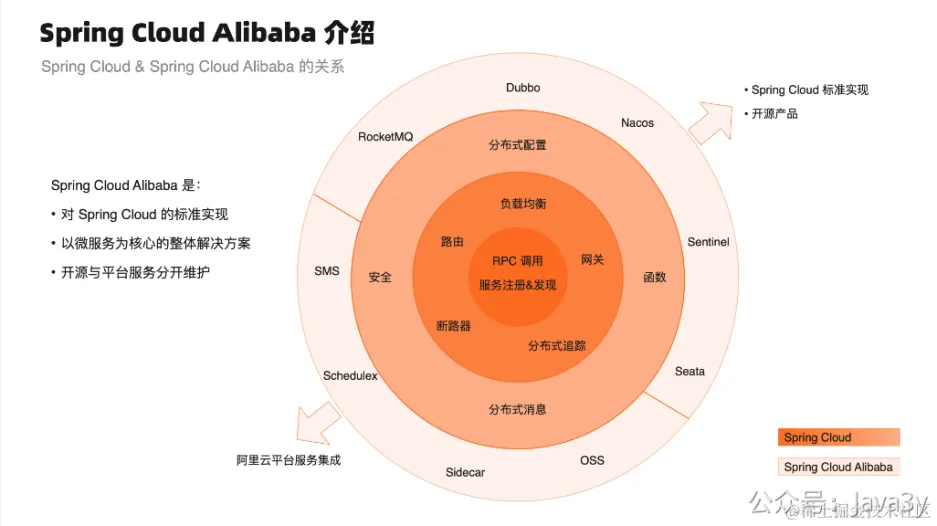
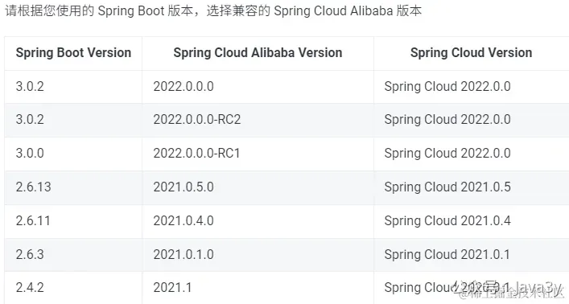

# 8.2 austin-cloud改造思路

**00、思路**
再次回到看austin的系统架构图：

现在是项目是分开module模块的，austin-web（管理后台）/austin-cron（定时任务）/austin-api-impl（接入层）/austin-handler（下发逻辑处理层）**这几个都可以单独抽出来部署**。

单独部署了以后，再通过「**服务治理**」的组件进行管理，那系统就是「分布式」的架构了。听着听不难，对不对？实际上也确实不难。

现在市面上用Spring Cloud Alibaba 是比较多了，所以我在austin上也使用它作为服务治理的鸡架。

**01、SpringCloud版本选择**
JDK和SpringBoot的版本决定着Spring Cloud Alibaba使用什么版本：
●2023.x 分支对应的是 Spring Cloud 2023 与 Spring Boot 3.2.x，最低支持 JDK 17。
●2022.x 分支对应的是 Spring Cloud 2022 与 Spring Boot 3.0.x，最低支持 JDK 17。
●**2021.x 分支对应的是 Spring Cloud 2021 与 Spring Boot 2.6.x，最低支持 JDK 1.8**。

由于austin在构建的时候，使用的是JDK 1.8和SpringBoot 2.5.6。本着以最低的成本升级，我决定使用2021.x版本，并把SpringBoot升级到2.6.13版本

 

> 原文: <https://www.yuque.com/u37247843/dg9569/gin7xoggr1567yps>