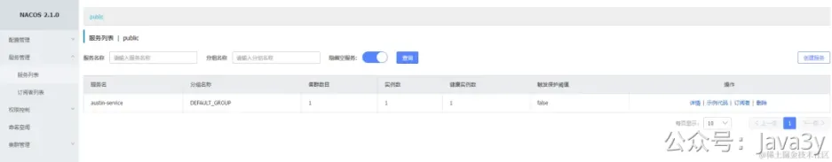
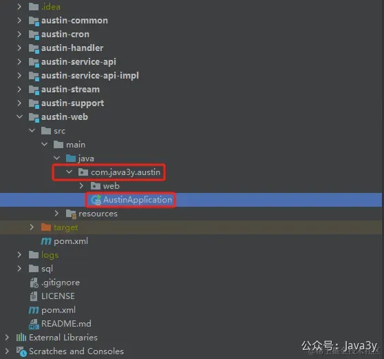
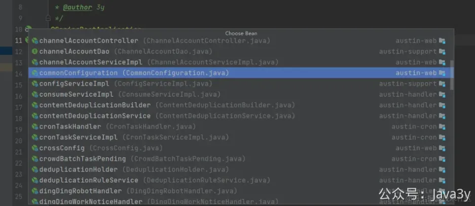
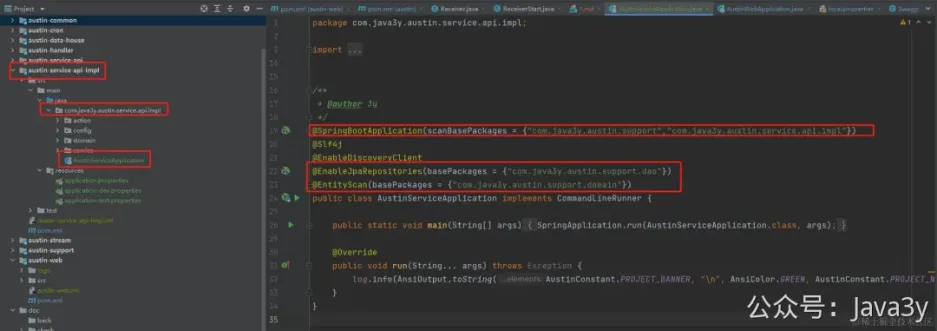
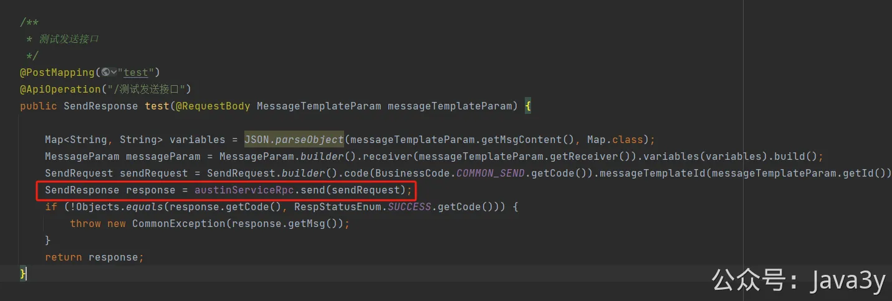

# 8.3 系统拆分&注册发现服务


## 01、将服务注册到注册中心

以austin-service-api-impl模块为例，在原来的基础上，注册服务大致有以下步骤：

1、 增加spring-cloud-starter-alibaba-nacos-discovery和spring-boot-starter-web的maven依赖 

```

<!-- Nacos 服务发现 -->
<dependency>
    <groupId>com.alibaba.cloud</groupId>
    <artifactId>spring-cloud-starter-alibaba-nacos-discovery</artifactId>
</dependency>
<dependency>
    <groupId>org.springframework.boot</groupId>
    <artifactId>spring-boot-starter-web</artifactId>
</dependency>
```

2、 增加spring-boot-maven-plugin打包plugin 
3、 增加 单独的 Application 启动类 
4、 暴露接口，注册服务
服务启动后，就可以在nacos上看到应用被注册到注册中心上了。



**02、分布式架构后，路径配置扫描问题**
austin之前只有一个入口类，在模块austin-web包下，路径为：com.java3y.austin.AustinApplication



不少人很好奇，为什么austin-support下config中@Value注解如何拿到austin-web下yml中的值？没有看到开启MapperScanner也能生成代理类？

原因很简单，启动类是在com.java3y.austin这个路径下的，其他的模板都是基于com.java3y.austin.*之上的。

SpringBoot在启动时，**如果没有指定，默认会把当前启动类的路径当做扫描路径**，所以其他的模块的对象&配置都能注入。



当升级为分布式时，**则需要指定对应的路径扫描对应的包**



**03、消费端调用RPC服务**
以austin-web模块为例，在原来的基础上，消费服务大致有以下步骤：

1、 增加spring-cloud-starter-alibaba-nacos-discovery和spring-cloud-starter-openfeign 和spring-cloud-starter-loadbalancer的maven依赖 

Properties复制代码
1
spring.cloud.nacos.discovery.server-addr=${austin.nacos.addr.ip:austin-nacos}:${austin.nacos.addr.port:8848}

2、 增加 FeignClient的配置信息 

Java复制代码
1
2
3
4
5
6
7
8
9
10
11
12
13
14
15
16
17
18
/**
 * @author 3y
 * austin-service-impl模块的接口
 */
@FeignClient(name="austin-service")
publicinterfaceAustinServiceRpc{
 @RequestMapping(value="/send")
SendResponsesend(@RequestBodySendRequestsendRequest);
 @RequestMapping(value="/batchSend")
SendResponsebatchSend(@RequestBodyBatchSendRequestbatchSendRequest);
 @RequestMapping(value="/recall")
SendResponserecall(@RequestBodySendRequestsendRequest);
 @RequestMapping(value="/traceByMessageId")
TraceResponsetraceByMessageId(@RequestBodyStringmessageId);
}

3、 使用 FeignClient代理类去调用服务



若有收获，就点个赞吧

 


> 原文: <https://www.yuque.com/u37247843/dg9569/gcygsovotw5k7678>