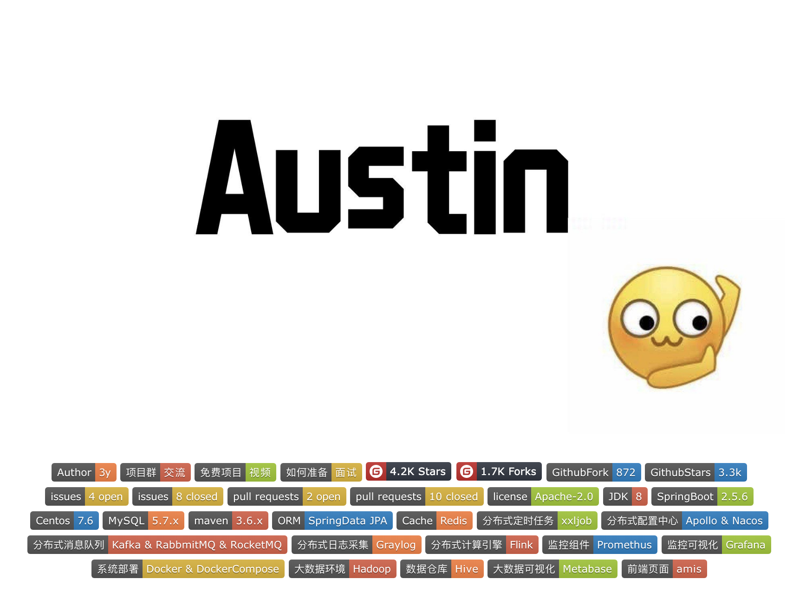

# 6.1 学Austin需要什么基础？

有很多人问过我，学习开源项目消息推送平台austin需要有什么基础，我往往会回答：**有**`**SpringBoot**`**基础就够了**。

我在几年前总结过从零学习`Java`的路线，现在看来也没有很过时：

-  `Java`基础：流程控制-->面向对象(包括语法)-->集合-->`IO`流-->异常-->多线程-->网络编程-->反射 
-  `JavaWeb`基础：`Tomcat`-->`XML`/注解->`Servlet`-->`HTTP`-->`Filter`过滤器和监听器-->`AJAX`/`JSON`-->数据库(`MySQL`)-->`JDBC` 
-  项目管理工具：`Maven` 
-  技术框架：`SpringBoot` 
-  环境&部署：`Linux`和`Git`基本命令 

如果打开过`austin`的`Git`仓库，那你肯定在`README`里看到我列举了`austin`用到的很多技术栈。这或许可能会让你觉得要学完这些技术栈才能去看`austin`，甚至有些人就看到有这么多技术栈就放弃了。

曾经我初学的时候有过类似的想法：我要学会了这个技术栈，才能使用或者看得懂这个技术栈相关的代码。现在回看，**这种想法是有问题的**。

`austin`经过我多轮地迭代，它上手的门槛已经非常低了，要启动`austin`只需要依赖`mysql`和`redis`就能用系统核心功能了，有`SpringBoot`基础的基本一般也是有`Mysql`基础。也许可能没有`Redis`基础，但我有教程会教你呀！

**只要应用能从本地起来，那一切就好说了。有了调试的环境和实际的应用场景去学相关的技术栈，这个成长速度是最快的。**

比如，你没有学过`xxl-job`，但你可能知道他是一个分布式定时任务框架。虽然不知道为什么要接入它，以及在生产环境可能是怎么用的，解决了什么问题。**而**`**austin**`**接入的每一种技术栈我都说明了为什么要用，给出了使用场景，并给出了部署的文档**。

`austin`又有本地调试的能力，这时候你只要`debug`一下就相当于有了个现成的案例，不用上网去找各种的`demo`慢慢调试环境。这个能节约多少时间，应该不用我多说吧？

不要遇到不懂的框架就感到害怕。先去看看这类框架解决的是什么问题，它们的设计理念是怎么样的，剩下的无非就是接入，调用`api`到这就已经入了个门了。

至于框架源码，千万不要觉得我们会经常看源码。只要系统没遇到问题，对其不是特别感兴趣，一般我们都不会看源码实现的。

所以**只是入门一个技术框架，挺简单的。有了环境和现成的应用代码，那就更快了**。

> 原文: <https://www.yuque.com/u37247843/dg9569/qexmtxwudpuab471>