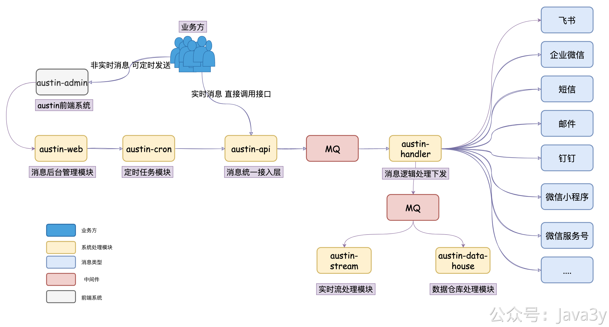

# 6.4 应该怎么学习Austin代码？

现在Austin的文档我觉得还是比较全的，但到了看代码的时候，可能有的同学就不知道应该怎么看，有想知道模块之间的调用链路，有想一点一点把细节给全看了。这时候就很可能在项目里犯迷糊了，绕不出不来了。

我工作了几年，也接手过很多新的业务，这里聊聊我的经验。

**1、在看代码之前，先整体认识下当前的系统，到底是干什么的。由几个模块组成，上下游的关系是怎么样的。**
这个对于Austin来说就很简单啦，**就发送消息**。核心就是由接入层->MQ->消费逻辑层给组成，另外提供一个后台管理以及一个流处理模块

| ****工程模块** | **作用** |
| --- | --- |
| **austin-common** | **项目公共包：存储着项目公共常量/枚举/Bean** |
| **austin-support** | **项目工具包：对接中间件/组件** |
| **austin-cron** | **定时任务模块：对xxl-job封装和项目定时任务逻辑** |
| **austin-web** | **后台管理模块：提供接口给前端调用** |
| **austin-service-api** | **消息接入层接口定义模块：只有接口和必要的入参依赖** |
| **austin-service-api-impl** | **消息接入层具体实现模块：真实处理请求** |
| **austin-handler** | **消息处理逻辑层：消费MQ下发消息** |
| **austin-stream** | **实时处理模块：利用flink实时处理下发链路数据** |
| **austin-data-house** | **数据仓库模块：消费MQ数据写入hive** |

**2、了解了当前系统之后，这时候把代码给下载到本地，看看有没有办法在本地运行，或者在测试环境中远程debug。这一步就是为了能让自己真实体验下功能，试着追下整体逻辑（不用细看）。**

这块Austini也好办，因为在本地就可以起来，发消息本地也是正常发送的。就从接入层的发送接口开始，**一步一步的bug**，方法我这边基本都会有注释，有“难懂”的代码应该都有文档告诉你当时我是怎么设计的。

这时候不用去看很细的内容，比如某个字段是怎么拼接的，比如我做去重功能的时候key是什么，value是什么。**反正先大体把每一个方法给过一遍**，知道会有这些处理，最后就发送了一条消息。

**3、整体逻辑过完了以后，再次回到架构图或者功能图，看看是不是又理解些了。这时候就应该不会感到抽象，应该已经又进一步明白了系统的整体功能了，甚至了解到了写代码的人的风格。**

**4、继续debug！看细节！探索为什么要这样设计代码，如果是你写有没有更好的写法，或者现有这写法有没有值得吐槽的。**

这时候就得看一些你疑惑的细节功能是怎么实现的，比如之前可能不知道去重在redis 是怎么实现的，这时候就看看key是什么，value是什么。可能不知道数据隔离是怎么实现的，原来现在用的是SpringBoot  Kafka 新版本提供的特性（在创建kafka容器前就可以动态去更改groupId）。比如为什么我要在这一步打上日志，看看发送消息时，打印的日志是哪些，这条日志打下来是干什么的。

> 原文: <https://www.yuque.com/u37247843/dg9569/nxbf5f6xown8uk4r>