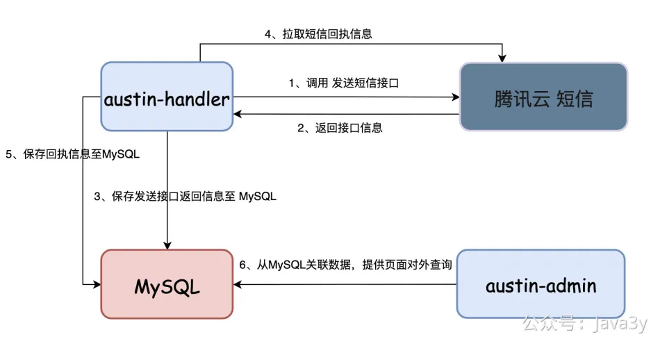
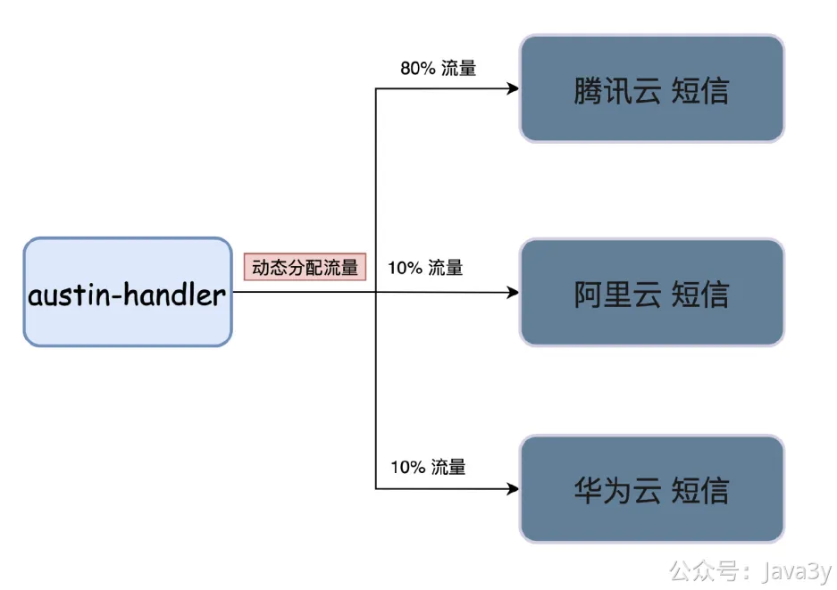
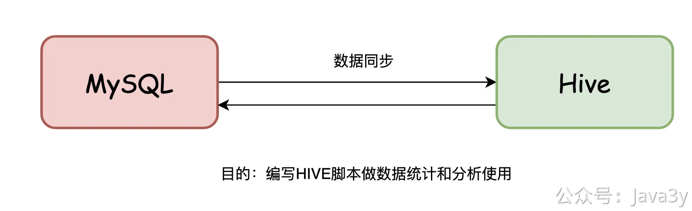
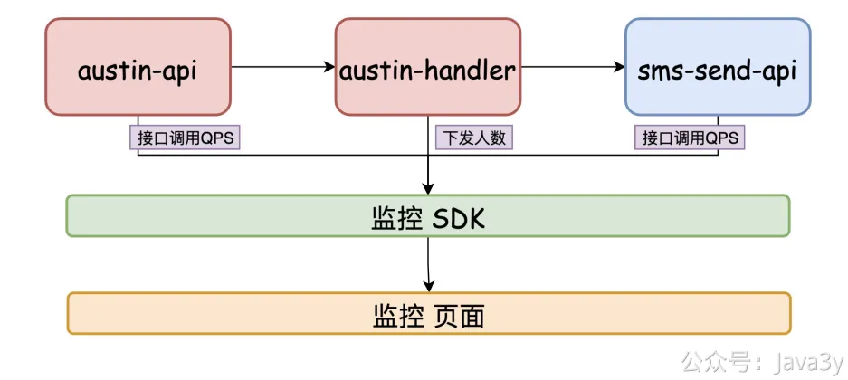
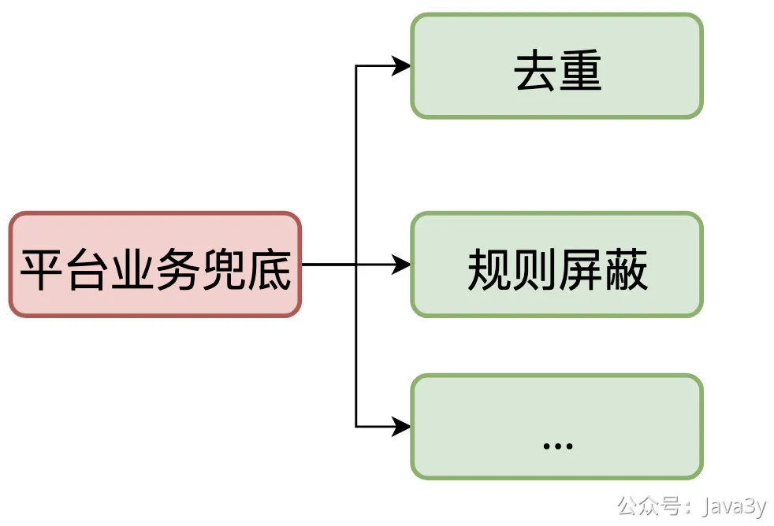
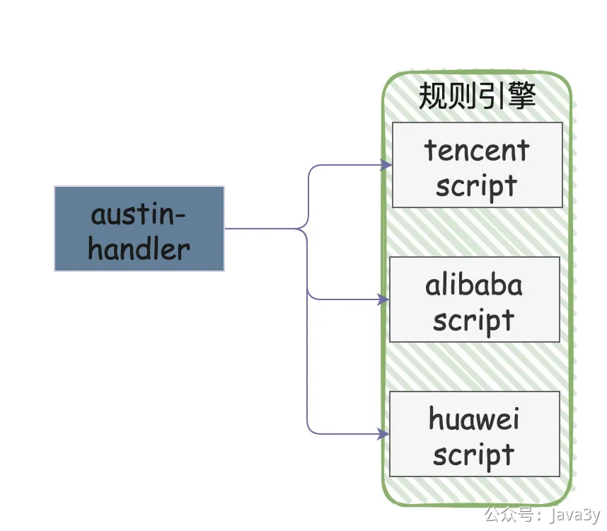

# 6.6 为什么austin是消息推送平台

为什么我们说ausitn是消息推送平台，以发短信为例

实现发送短信是一件很简单的事，发送其他渠道的消息其实也很简单。**从本质上讲**，就是对接API调用发送接口进行发送。

作为一般项目，发完消息就没有后续了，但如果作为一个「平台」而言，这是远远不够的。
**01、调用发送短信接口后，如果用户反馈收不到怎么办？**

我们只调用了发送短信的接口，没有记录接口的返回信息（也就没有发送凭证），当别人找过来的时候，我们也无济于事（我们什么都没记录，什么都不知道）。

**解决方案**：我们需要**存储**把发送的记录给存起来，也需要有接口把短信的回执拉回来并存储，并在推送后台管理系统提供相关的页面给予快速查询。

**02、某个短信渠道商挂了怎么办？**

别以为我们的依赖是阿里云、腾讯云或者华为云这种大公司，他们提供的产品不是万无一失的，挂也是很正常的事。那如果我们只依赖一个短信渠道，它挂了，是不是相当于我们就挂了。

**解决方案**：短信需要接入多个渠道商，调用接口失败需要继续调用其他渠道商，支持**动态分配**渠道商的流量（一旦有提前预警，直接切换渠道商）

**03、这个月短信花了多少钱，我怎么知道？**

接入的短信后台都有对应的统计，但我们量大的话是需要「对账」，以我们的**发送记录与回执**统计跟短信的后台进行统计。

毕竟都是钱啊，不能全部信他们的啊。我曾经就有遇到过，对方的账单跟我们自己统计的数量有比较大的出入，后来排查发现他们的统计是存在问题的。

**解决方案**：将短信的发送和回执数据导入到Hive，每个月跑一次Hive脚本统计进行对账

**04、现在调用短信的量大吗？**

第三方接口一般都会有限流的，比如在腾讯云官网上看到对发送接口有3000QPS的限制。**我们是需要知道现在各种类型的消息的发送情况是怎么样的，是否有限流的操作**。如果限流了，是不是可以告诉业务方可能是原因目前发送量过大导致触发限流。

系统上有完备的监控，你知道了各种的系统指标数据，自己才不会慌。（排查问题有监控会很容易定位）

要是某一天有人跟你说你的系统挂了，你不会还傻乎乎地去服务器上看日志吧？打开监控看下有没有流量，流量正不正常不就一眼就能看到了吗。

**解决方案**：监控从接口调用到消息下发整个过程的数据（主要是接口QPS和下发人数）

**05、业务方不小心连续发了两次怎么办？**

业务方使用不当，不小心连续推送了两次，如果没有任何限制，那就真的下发了两次。试想下，如果你点了下验证码，霎时间，收到了两条一模一样的短信，你是什么感受？

**解决方案**：作为平台需要有这种**兜底**的功能（尽可能避免由于业务使用不恰当，导致出现事故）

**06、这条短信谁发的啊？**

客服反馈：用户接收到了一条短信（用户对具体短信的细节不理解）。客服看着短信也两眼懵逼，公司那么大，不知道由哪个业务团队下发出来的。现在只有短信的文案，怎么能快速找到下发短信的团队呢。

我们需要让所有经过austin项目的消息都有一个「载体」（说白了就是模板），有了**模板**之后，业务方在接入的时候需要填写各类的信息，有了这些信息再配合搜索引擎就可以快速定位出信息。

"**溯源**"在很多时候都很有用（比如：你提供了一个HTTP接口，如果没对业务做任何的限制。或许有朝一日，你希望对该接口进行大改动，但你不知道现在有谁进行调用，就会很头疼）

**解决方案**：给接入方套”模板“，有了模板才能溯源，才能做数据追踪，**模板是作为平台的基石**。（下一篇等我建表的时候，我会再来跟大家详细说说对应的业务）

**07、经常要接入短信渠道怎么办？**

商务又找到了便宜的短信渠道了，接入一下看看效果吧？这可是实打实省钱的啊！每次写一个类（接入短信就相当于写一个类），我都要重启发布上线吗？这不靠谱吧？

**解决方案**：上规则引擎将业务代码抽离，无须上下线即可实现功能。

.......

若有收获，就点个赞吧

 

> 原文: <https://www.yuque.com/u37247843/dg9569/ke3hy4acgka900md>