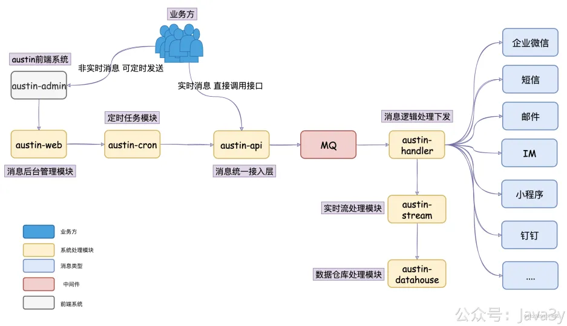
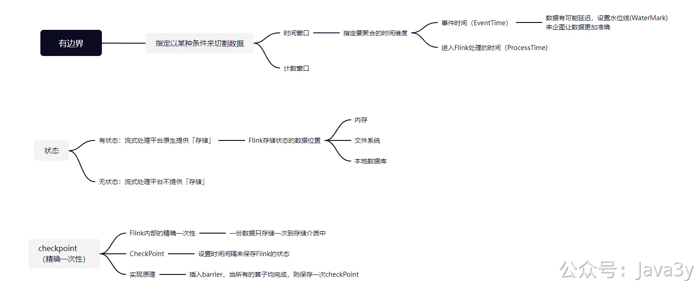

# 6.8 有什么好用的画图工具？

现在我文章的**架构图/流程图**一般都是用 [https://draw.io/](https://draw.io/) 画的，很多博主的图也是用这个工具画的（花点心思就可以画得比较好看了）

思维导图我用的是 [https://processon.com/](https://processon.com/)

若有收获，就点个赞吧

 

> 原文: <https://www.yuque.com/u37247843/dg9569/qpyg5mdy7ovbfyic>