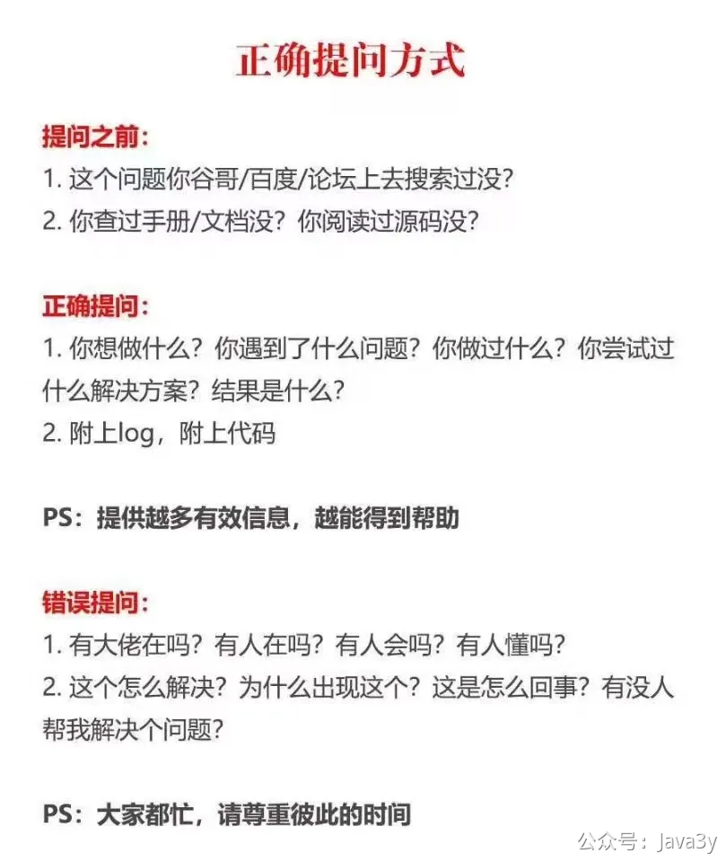

# 六、常见Q&A

**1、问题现象**
这个发送短信是显示成功了，后台日志也没显示报错，但是邮箱没有收到邮件这个是怎么回事的？xxxxxxx

**（理论上，“功能失败” 都会有日志，所以日志很重要）**
**2、问题日志**
要是自己能定位出关键日志，就把关键日志发我。要是定位不到关键日志，把请求之后的日志发我（**光截图我是看不全的**）xxxxxxxxxxx
**3、（最好有）自己的想法**
日志你有没有看，你觉得是什么原因导致的？xxxxxxxxx
**4、提问将心比心**
学习相关的问题都可以**在评论区@我回复**，我每天都会抽时间看看，高频的问题我会抽取成单独的文档沉淀在这个目录下面。
在提问的时候，我至少希望你能做到**自己有过思考、将心比心，这样的问答才会有意义和高效；**
[https://github.com/ryanhanwu/How-To-Ask-Questions-The-Smart-Way/blob/main/README-zh_CN.md](https://github.com/ryanhanwu/How-To-Ask-Questions-The-Smart-Way/blob/main/README-zh_CN.md)

 

> 原文: <https://www.yuque.com/u37247843/dg9569/kd2gewxepcubitqn>