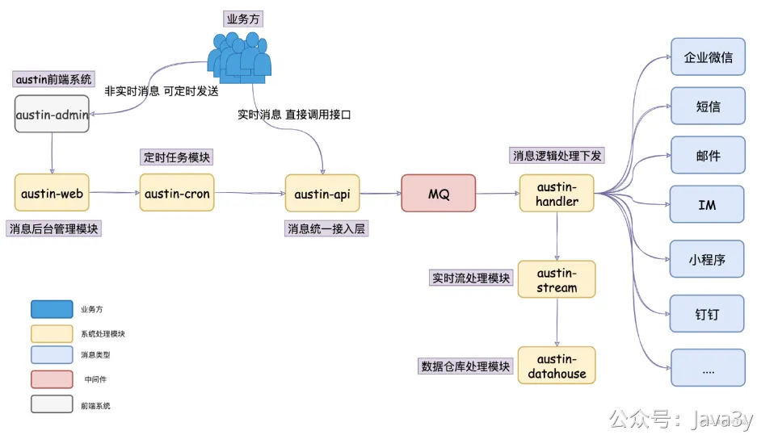

# 4.11 阿里一面&二面

**消息隔离之后，如果说消费消息的那几个渠道是在不同服务器上，某一个挂了，那么消息队列那个服务器中的消息堆积怎么处理（前提是这个消费服务器第一时间无法正常重启）。**

1、首先要根据业务判断这种消息有无时效性，如果时效性很强的消息（比如验证码短信），那可能我们直接就丢弃了。

2、如果时效性是能接受，但我们又想服务恢复后快速消费完所有的消息。我们可以考虑临时扩容，方案大概就是：写一个程序把现有topic的消息写入另一个topic（这个topic比原有的topic扩展出更多的partition，来提高它的并行性）。然后临时写个程序消费这个新建的topic消息（开更多的消费者去干这个事）。当然了，做这个事的前提是我们的下游发送消息的处理能力是跟得上的。

**你用的redis是吧，redis为啥快，顺序写和内存随机写效率如何，另外mysql和redis中怎么保证数据一致性，延时双删你能不能分析一下会出现什么问题，如何解决。**

redis它是纯内存操作，内存本身就很快。其次，它是单线程的，Redis服务器核心是基于非阻塞的IO多路复用机制，单线程避免了多线程的频繁上下文切换问题。至于这个单线程，其实官网也有过说明（：表示使用Redis往往的**瓶颈在于内存和网络**，而不在于CPU

顺序写和随机写效率？应该对比的是磁盘顺序写和内存随机写？这个还真不好说，不过我感觉还是内存的比较快。但磁盘顺序写也确实很快（毕竟像各大的中间件的持久化机制几乎都是顺序写来做的）

mysql和redis中怎么保证数据一致性
1、redis在使用的时候设置过期时间key，那数据是能保证最终一致性的。
2、一般我们可以使用删除缓存再更新数据库的方案，也可以使用更新数据库再删除缓存的方案。但这在严格的并发条件下多少还会出问题。延时双删是其中的一种优化的方案，但实际上我在线上环境并没有用过。
3、我们线上环境一般是监听数据库的变更所产生的binlog，把binlog的信息写入到kafka，然后使用flink程序消费binlog的消息实现 数据库与缓存的一致性的。

[面试前必须要知道的Redis面试题](https://mp.weixin.qq.com/s?__biz=MzI4Njg5MDA5NA==&mid=2247484609&idx=1&sn=4c053236699fde3c2db1241ab497487b&chksm=ebd745c0dca0ccd682e91938fc30fa947df1385b06d6ae9bb52514967b0736c66684db2f1ac9###rd)

**介绍一下你这个项目的架构。**

这个过程中，你可以拿上你的笔和纸给面试官**画画**，交流交流，其实就是我GitHub仓库中README的这个图：

这个过程可以这样跟面试官描述：
**1**、在消息推送平台里，我们有个接入层austin-api，它是**消息的统一入口**，所有的消息推送都会经过该接入层进行处理。
**2**、使用消息推送平台的业务方可以简单分为两种角色：运营和技术。如果是技术，他会调用我在接入层暴露的接口。如果是运营，他会使用我的消息推送后台去设置定时任务推送，所以我们会有个推送后台austin-admin以及定时任务模块austin-cron
**3**、接入层干的事情比较简单，简单概括就是消息做简单的校验以及参数拼装后就写入到了消息队列
**4**、写到了消息队列之后，自然就有个逻辑层对消息队列的消息进行消费，在我这边叫做austin-handler模块，它主要对消息做去重、夜间屏蔽等逻辑，最后就分到不同的消息类型Handler进行消息发送
**5**、消息推送平台跟普通消息下发最大的不同是我们是实现对**消息全链路追踪**的，业务方可以通过推送后台实时查看消息下发的情况，针对消息模板和用户都是OK的（比如这个用户是否接收到消息，如果没接收到，那可能是因为什么被过滤了）
**6**、所以消息推送平台会有个实时流的模块，用Flink实现的。我在消息处理的过程中**对多个关键的位置进行埋点**，在Flink对这些信息做清洗处理，实时的会写进Redis、离线的会落到Hive中
基于这个描述，以及你画的图，面试官一般就能有个比较简单的认知了，至少这个过程中你证明了你这系统是有设计的。有可能听到一半就会被打断问细节的，也可能会听你说完全程，**但至少你要有类似这种描述**。

**你的定时任务是怎么做的，知不知道还有其他的什么方法可以实现，你觉得那种比较好点，或者说什么场景用什么方式。**

定时任务我这边用的是开源的分布式定时任务框架：**xxl-job**来实现的。

如果是单机的定时任务，我们可以使用 Timer、ScheduledExecutorService、Quartz、或者直接使用 Spring封装好的@Schedule注解来实现。

但我们一旦上了生产环境，应用部署**往往**都是集群模式的。在集群下，我们一般是希望**某个定时任务**只在某台机器上执行，那这时候，单机实现的定时任务就不太好处理了。

Quartz是有**集群部署**方案的，所以有的人会利用**数据库行锁**或者使用**Redis分布式锁**来自己实现定时任务跑在某一台**应用机器**上；做肯定是能做的，包括有些挺出名的分布式定时任务框架也是这样做的，能解决问题。

但我们遇到的问题不单单只有这些，比如我想要支持**容错**功能（失败重试）、**分片**功能、**手动触发**一次任务、有一个比较好的管理定时任务的**后台界面**、**路由**负载均衡等等。这些功能，就是作为「**分布式定时任务框架**」所具备的。

**你的消息去重是怎么做的？**
我将去重的逻辑**统一抽象**为：在**X时间段**内达到了**Y阈值**。去重实现的步骤可以简单分为：
●从Redis获取记录
●判断Redis存在的记录是否符合条件
●符合条件的则去重，不符合条件的则重新塞进Redis

在这场景下，我使用Redis用**批量**操作来减少请求Redis的次数的，这对于我们这种业务场景（在消费的时候需要大量请求Redis，使用**批量操作**提升还是很大的）

具体回看**3.19**节

若有收获，就点个赞吧

 

> 原文: <https://www.yuque.com/u37247843/dg9569/pgf0z9t44g7adzip>