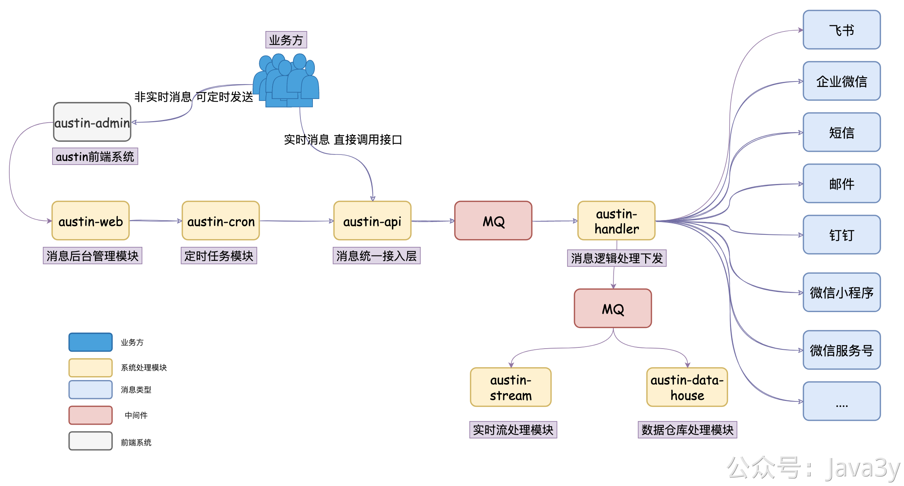
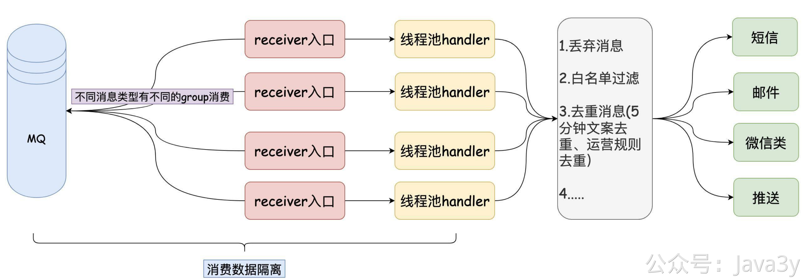
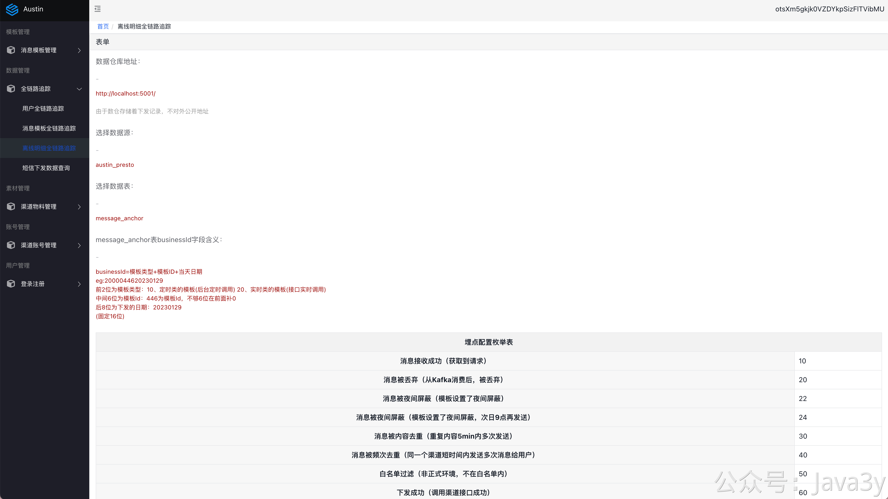
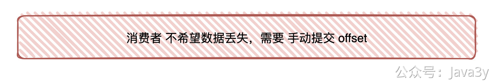
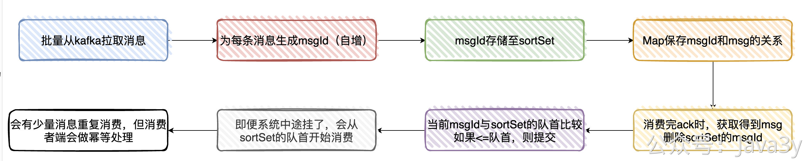
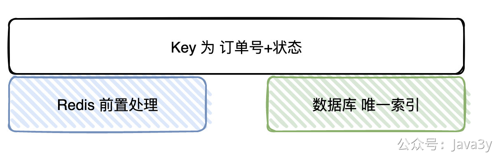
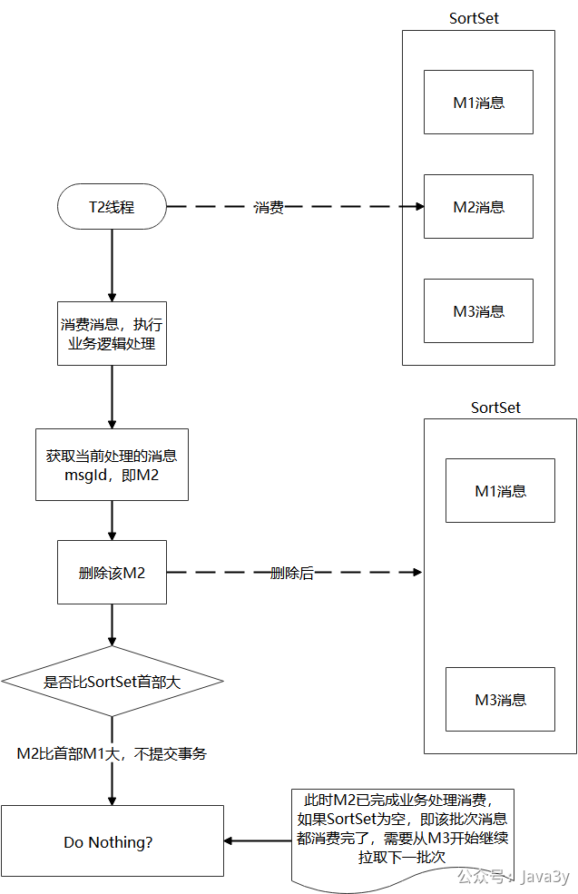

# 4.12 消费数据能保证不丢失吗？

我们在使用mq的时候，就会很自然思考一个问题：**怎么保证数据不丢失**？

现在austin接入层是把消息发到mq，下发逻辑层从mq消费数据，随后调用**对应渠道接口**来下发消息。

消息丢弃一般我们考虑的是**消费端**，于是重点看的是下发逻辑层。

（因为对于mq使用方来说：生产端只要配置mq相关的参数，在调用下发时有回调重试机制。那就足够了，生产端能做的东西确实不多）

目前为止，下发逻辑层(消费端)使用的是**自动提交offset**策略。只要消费端存在系统重启或者进程被kill掉，那就会有丢消息的情况。
```
spring.kafka.consumer.enable-auto-commit=true
```

当前下发逻辑层(消费端)有可能放大了这个丢弃消息的问题，因为现在是消费到mq数据后，会把消息给到线程池去处理。线程池会指定一个阻塞队列，那队列数量越大，**可能由重启所丢弃的消息就越多**。


这里我的策略是：当应用重启的时候，系统里的线程池是**优雅关闭**的(尽可能等待一段时间，等阻塞队列里没有消息了，再关闭线程池)。
但回到问题的本质上，**只要消费端是自动提交offset策略，就一定会有丢消息的问题**。所以要做到消费端的消息不丢，我们就要设置为手动提交offset，这个是必要条件。


## 有没有必要保证不丢
在探讨具体的技术实现方案之前，我们来看看在业务上有没有必要保证消息不丢。我刚接触到消息推送平台的时候，当时那个交接的哥们告诉我和我学长：**消息少发比多发要好**。

**1、重要的消息用户很可能会手动重试触发。**
austin是一个发送各类渠道消息的平台，从我的经验来说，这里面最重要的是**短信渠道**。经过austin下发很可能是登陆验证码，银行卡提现验证码，这类消息从全局上看是最重要的。

而其他渠道，例如push通知栏的通知消息，微信渠道的营销消息，这种消息即便用户没收到，也不会对用户带来很大的使用体验问题。这种消息或许对绝大数用户都是无感知的（少发几条，用户可能更乐意）。

我们先假设用户的某一次银行卡提现的验证码**恰好因为我们重启系统而丢弃**。这时候，绝大数用户可能怀疑自己的信号问题，**会继续操作，重新发送一次**。

(因为客服经常找我排查这种问题，每次都能看到有好几条下发记录。当然了，能到技术的，**99%的问题都不是由系统重启丢失消息导致的**，更多可能是用户的客户端本身确实就存在问题)

**2、消息是有时效性的。比如验证码这种短信一般就5min的时效性，由于系统的问题，你超过这个时间给用户发送，对用户的体验是非常差的。**

**3、消息推送平台是有全链路追踪的**
我们是可以知道下发的消息有没有到达到用户手上，至少都可以知道在我们的系统内部执行过程中有没有丢。如果这条消息真的那么重要，那可以**单独为丢弃的消息单独做重发处理**，这些功能在消息推送平台都是支持的。


---

由于实现难度以及业务的问题，**到目前为止austin都没有实现消费至少一次语义**。

**但可以了解下，我们以前订单类是消息处理，是怎么保证不丢的（这在面试的时候就能聊了）。**

## 订单类的消息我们是怎么保证不丢的？

**候选者**：我们这边是这样实现的：
**候选者**：一、从Kafka拉取消息（一次批量拉取500条，这里主要看配置）时
**候选者**：二、为每条拉取的消息分配一个msgId（递增）
**候选者**：三、将msgId存入内存队列（sortSet）中
**候选者**：四、使用Map存储msgId与msg(有offset相关的信息）的映射关系，通过msgId用来获取相关元信息
**候选者**：五、当业务处理完消息后，ack时，获取当前处理的消息msgId，然后从sortSet删除该msgId（此时代表已经处理过了）
**候选者**：六、接着与sortSet队列（本地内存队列）的首部第一个Id比较（其实就是最小的msgId），如果当前msgId<=sort Set第一个ID，则提交当前offset
**候选者**：七、系统即便挂了，在下次重启时就会从sortSet队首的消息开始拉取，实现至少处理一次语义
**候选者**：八、会有少量的消息重复，但只要下游做好幂等就OK了。

**面试官**：嗯，你也提到了幂等，你们这业务怎么实现幂等性的呢？
**候选者**：嗯，还是以处理订单消息为例好了。
**候选者**：幂等Key我们由订单编号+订单状态所组成（一笔订单的状态只会处理一次）
**候选者**：在处理之前，我们首先会去查Redis是否存在该Key，如果存在，则说明我们已经处理过了，直接丢掉
**候选者**：如果Redis没处理过，则继续往下处理，最终的逻辑是将处理过的数据插入到业务DB上，再到最后把幂等Key插入到Redis上
**候选者**：显然，单纯通过Redis是无法保证幂等的（：
**候选者**：所以，Redis其实只是一个「前置」处理，最终的幂等性是依赖数据库的唯一Key来保证的（唯一Key实际上也是订单编号+状态）
**候选者**：总的来说，就是通过Redis做前置处理，DB唯一索引做最终保证来实现幂等性的

由于看了这块思路，问问题的股东比较多，这里我总结下常见的问题：
**Q：内存队列sortSet在重启后，里面的数据都没了。下次重启时就会从sortSet队首的消息开始拉取，此时的sortSet队列还有数据吗？**
**A：**sortSet是没数据的**，**sortSet是**暂存offset**的数据结构，存在sortSet的offset说明没被commit，**但kafka是有状态的**。kafka默认就会从未提交的offset重新拉取。

---

**Q：还是看不出sortSet的作用？**
**A：不用sortSet，那你得保证消费的顺序性。比如，你消费线程有a和b，a消费了offset 1，b消费了offset2,此时b消费完了，手动提交了offset 2，系统重启了。a还没消费完，数据就丢了。用了sortSet其实就是解决这个消费顺序的问题，当前是最小的offset，才去提交。**

---

**Q：sortSet要替换成redis吗？这样重启也能知道最小的offset了**
**A：如果有场景的话，是可以的。但我没遇到过。正如第一个问题，kafka是有状态的，他默认就会从未提交的offset重新拉取**

---

**分享一张股东画的图：
**

## 如果要保证AUSTIN数据不丢需要做什么？
保证数据不丢简单来说，就是我们要在消费端手动ack offset，不能再用自动提交策略了。这样当我们系统重启时，kafka会自动从未ack的offset中拉取。

如果要实现消息推送平台不丢消息的话，有几个问题是需要考虑的：

1、消息少发比多发要好，那么要实现消息不丢，就**必须要在系统内实现幂等**。因为现在的消息不丢，一般都是基于【至少一次]消费语义去做的。

2、那实现幂等的逻辑是在调用渠道下发接口前，还是渠道下发接口后？

如果做在下发接口前，那是不是会有可能第一次下发记录写入了，但实际调用下发接口却失败了，后面的重试都被幂等处理掉了。
如果做在下发接口后，那是不是会有可能调用调用下发接口成功了，但写入幂等处理的消息失败了，后面的重试就会导致消息多发

3、消息是有时效性的，那**如果重试的处理时间过长，那是不是要考虑把这条消息给丢弃掉**，不再重试了。

4、重试的消息不应该影响到正常消息的下发，**他得作为一种补偿的机制，而非主流程**。

稍微细想下技术实现，应该不太好搞，还有很多细节的地方得关注到。比如业务上的：应该是不需要所有的渠道的所有类型消息都得实现消息不丢吧？**现在的设计是追求高性能的**，能在短时间内下发批量的消息。而**如果做到所有消息不丢，肯定会影响到下发的速率**。


> 原文: <https://www.yuque.com/u37247843/dg9569/kcrnyepe3w94wlfd>