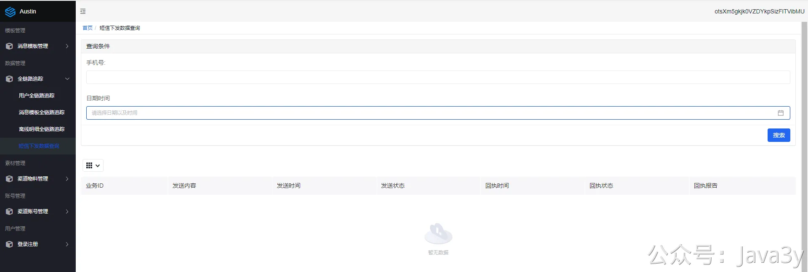
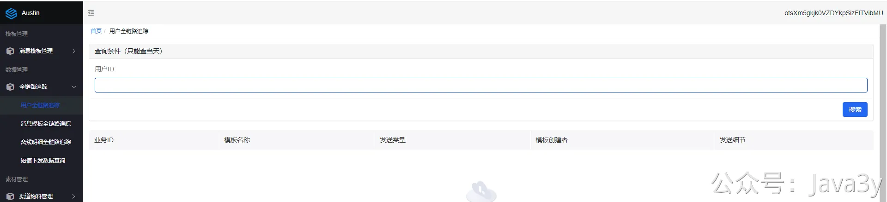
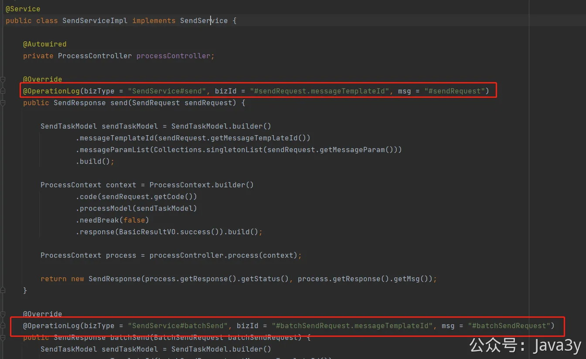
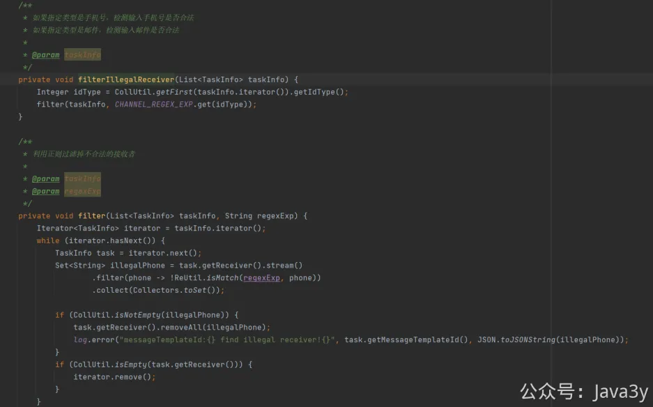
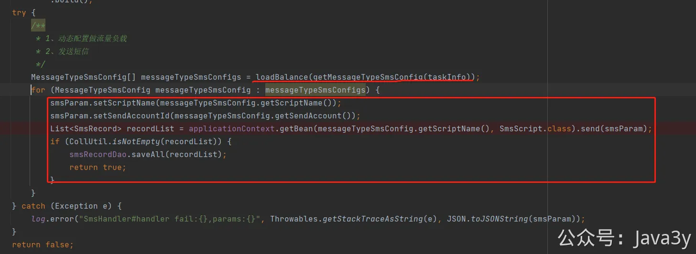

# 4.13 用户没收到短信的话有哪些情况

短信是消息推送平台里很重要的一个渠道，这也是为什么我要把短信的下发记录写在数据库里。正常来说，如果有短信渠道面向用户下发，平时还是会有蛮多的业务方找过来问：**为什么xxx用户没有收到短信呀**。

这时候，我们要给出解释，为什么这个用户没有收到短信，根据我的线上历史经验，来聊聊**下发短信时可能会遇到什么问题**。

我以前线上排查短信接收不到的思路是这样的：
1、首先我们的是有保存**下发短信记录**，并拉取了**回执**信息的，需要看回执是否已经成功了。（绝大大数短信收不到都是回执是不成功的，这时候要去找**渠道商（比如腾讯）**去问具体是怎么回事。

**回执失败常见**的有以下的可能性：
●携号转网用户，短信通道供应商侧未使用正确运营商通道处理
●运营商短信网关判定用户号码被轰炸，对短信进行拦截
●用户取消了订阅
如果**回执是成功**的，那大概率是用户本身的问题了，有可能是：
●用户屏蔽了垃圾短信（各种拦截软件）
●用户短信箱满了
●单纯信号不好
2、第一步走完，其实能解决**99%**的问题了，大概率都是**回执失败**导致用户收不到短信的。如果**此时没有找到下发记录**，那说明很可能是消息推送平台内部的问题了。这时候就得看是不是被**平台去重**、**夜间屏蔽 **这种平台内部的功能导致下发被过滤掉了。（**全链路追踪可以看看**）

由于消息下发只有**强依赖**消息队列，所以不必怀疑redis挂了会不会导致下发失败。
3、如果全链路追踪也没找到记录，那我们就需要在**接口层找调用日志了**。我们在接口入口层打了日志，很有可能是业务觉得他调用了我们的接口是成功了，但实际上我们是没接收到的（**拿日志说话**，有过好几次就是他们没调用，就来问我为什么没收到短信，其实是他们系统内部就有问题）。

这一步的关键在于，如果接收到了请求，但确实用户没收到，那就是消息推送平台的锅。如果没接收到请求，那我们也不要查了，让对应的技术团队自查是不是自己本身出了问题（**日志说话**）
4、那有没有可能是我们真的接收到了消息，但是确实没下发成功呢？还真的有**两个样例**，但是现在已经都被我优化过了。
4.1 调用接口时，传入的**手机号格式**有问题。比如用户团队没有对手机号做格式处理（多了个特殊的字符，比如说空格或者制表符，这在日志和数据库都完全看不出来，最后粘贴出来才发现。。）

4.2 渠道商的接口挂了，虽然概率很低（提供的往往只是一个网关接口），但是确实会有挂的情况。而消息推送平台在全局上是没有重试的功能的（参考**4.12**），所以有一次腾讯云渠道的接口挂了，导致某一批依赖腾讯云账号的短信下发失败了。
后来，做了**动态流量负载**的功能（可配置流量），以及**增加容错**（如果调用接口就挂了，那就换下一个渠道发送）

4.3 **消息队列挂了？**目前我还没试过，但是确实会有这个可能性。我们能做的，可能就是**异构 ：**如果消息队列挂了，我们转头把消息发给redis临时做队列充当使用，让下发消息正常。

若有收获，就点个赞吧

 

> 原文: <https://www.yuque.com/u37247843/dg9569/bdr7xud64t1mm9b6>