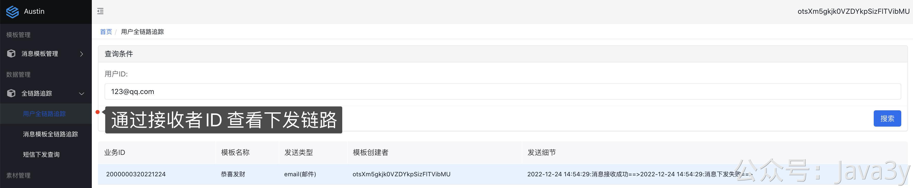
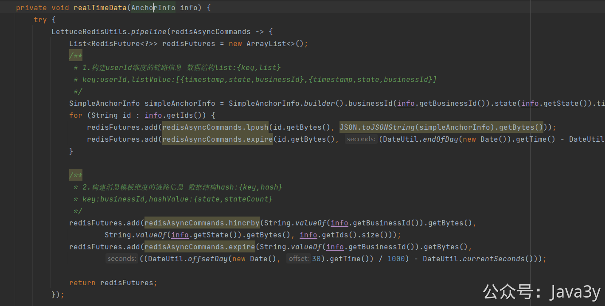
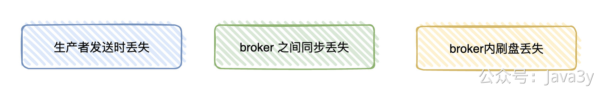
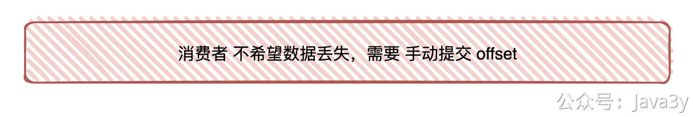
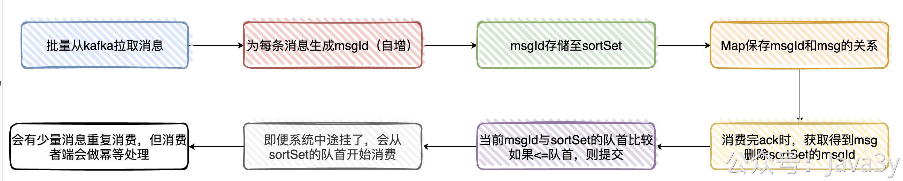
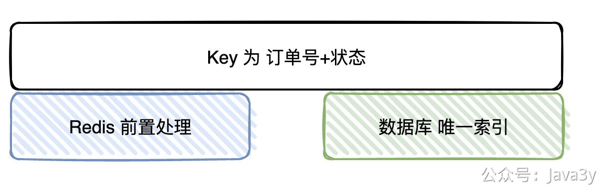

# 4.15 xx科技项目


## Flink统一清洗处理的意思，什么数据清洗？实时数据是哪些？离线数据是哪些？举个例子，上下游是什么？
在全链路的功能中，我们会**系统处理过程中**的日志写到kafka
```java
// 处理层打印入口日志（表示成功消费到Kafka的消息 state=10）
2022-01-08 15:44:53.622 [org.springframework.kafka.KafkaListenerEndpointContainer#6-0-C-1] INFO  com.java3y.austin.utils.LogUtils - 
{"businessId":1000000120220108,"ids":["13288888888"],"state":10,"timestamp":1641627893622}

// 处理层打印逻辑过滤日志（state=20，表示这条消息由于配置了丢弃，已经丢弃掉）
2022-01-08 15:44:53.623 [pool-8-thread-3] INFO  com.java3y.austin.utils.LogUtils - 
{"businessId":1000000120220108,"ids":["13288888888"],"state":20,"timestamp":1641627893622}
```
接着会由flink处理kafka的消息（**上面的日志数据就是数据源**）。只是我们一般称，写到**hive里的叫离线数据**（很少会提供在线接口服务并且数据落到hive需要一定时间，而写到redis则会提供**在线的接口服务查询**（这个就叫做实时数据）

总结：数据源来自应用日志，下游则是flink消费程序，而上游就是消息推送后台的产品功能。


## 什么叫固化出实时和离线的统一推送基础模型？
意思是，无论是实时还是离线，我都用**统一的结构体**去接受和处理，不是实时有一套，离线有一套去分别区分处理。其实就是这个类：
```java
/**
 * 埋点信息
 *
 * @author 3y
 */
@Data
@Builder
@AllArgsConstructor
@NoArgsConstructor
public class AnchorInfo {

    /**
     * 发送用户
     */
    private Set<String> ids;

    /**
     * 具体点位
     *
     * @see com.java3y.austin.common.enums.AnchorState
     */
    private int state;

    /**
     * 业务Id(数据追踪使用)
     * 生成逻辑参考 TaskInfoUtils
     */
    private Long businessId;


    /**
     * 日志生成时间
     */
    private long logTimestamp;

}
```

## 为什么要把实时数据写入redis,离线数据写入hive?redis和hive的区别，为什么不用mysql存储？
因为redis有丰富的数据结构，而我又恰好要根据**用户**和**模板**的维度去给到功能产品侧去查询，于是就用了redis。

离线数据进hive是很正常的事，因为我们的日志量会很大。1个用户1条消息下发，可能中途处理的日志数据就会有4条，**消息量会很大**，不适合存mysql。
redis是缓存数据库，拥有非常好的读写性能，hive是数据仓库（底层是hdfs，适合存储海量的数据）
mysql是关系型数据库，适合处理事务相关的逻辑，不适合存大量的数据库，也不适合在内部使用各种的统计。

## 如何保证消息不丢失？
（参考《对线面试官》的内容回答即可，非austin项目问题）
**面试官**：今天我想问下，你觉得**Kafka会丢数据吗？**
**候选者**：嗯，使用Kafka时，有可能会有以下场景会丢消息
**候选者**：比如说，我们用Producer发消息至Broker的时候，就有可能会丢消息
**候选者**：如果你不想丢消息，那在发送消息的时候，需要选择带有 callBack的api进行发送
**候选者**：其实就意味着，如果你发送成功了，会回调告诉你已经发送成功了。如果失败了，那收到回调之后自己在业务上做重试就好了。
**候选者**：等到把消息发送到Broker以后，也有可能丢消息
**候选者**：一般我们的线上环境都是集群环境下嘛，但可能你发送的消息后broker就挂了，这时挂掉的broker还没来得及把数据同步给别的broker，数据就自然就丢了
**候选者**：发送到Broker之后，也不能保证数据就一定不丢了，毕竟Broker会把数据存储到磁盘之前，走的是操作系统缓存
**候选者**：也就是异步刷盘这个过程还有可能导致数据会丢
[](https://p.ipic.vip/zhexw8.jpg)
**候选者**：嗯，到这里其实我已经说了三个场景了，分别是：producer -> broker ，broker->broker之间同步，以及broker->磁盘
**候选者**：要解决上面所讲的问题也比较简单，这块也没什么好说的…
**候选者**：不想丢数据，那就使用带有callback的api，设置 acks、retries、factor等等些参数来保证Producer发送的消息不会丢就好啦。
**面试官**：嗯…
**候选者**：一般来说，还是client 消费 broker 丢消息的场景比较多
**面试官**：**那你们在消费数据的时候是怎么保证数据的可靠性的呢？**
**候选者**：首先，要想client端消费数据不能丢，肯定是不能使用autoCommit的，所以必须是手动提交的。
[](https://p.ipic.vip/gcjc80.jpg)
**候选者**：我们这边是这样实现的：
**候选者**：一、从Kafka拉取消息（一次批量拉取500条，这里主要看配置）时
**候选者**：二、为每条拉取的消息分配一个msgId（递增）
**候选者**：三、将msgId存入内存队列（sortSet）中
**候选者**：四、使用Map存储msgId与msg(有offset相关的信息）的映射关系，通过msgId用来获取相关元信息
**候选者**：五、当业务处理完消息后，ack时，获取当前处理的消息msgId，然后从sortSet删除该msgId（此时代表已经处理过了）
**候选者**：六、接着与sortSet队列（本地内存队列）的首部第一个Id比较（其实就是最小的msgId），如果当前msgId<=sort Set第一个ID，则提交当前offset
**候选者**：七、系统即便挂了，在下次重启时就会从sortSet队首的消息开始拉取，实现至少处理一次语义
**候选者**：八、会有少量的消息重复，但只要下游做好幂等就OK了。
[](https://p.ipic.vip/yf3g9r.jpg)
**面试官**：嗯，你也提到了幂等，你们这业务怎么实现幂等性的呢？
**候选者**：嗯，还是以处理订单消息为例好了。
**候选者**：幂等Key我们由订单编号+订单状态所组成（一笔订单的状态只会处理一次）
**候选者**：在处理之前，我们首先会去查Redis是否存在该Key，如果存在，则说明我们已经处理过了，直接丢掉
**候选者**：如果Redis没处理过，则继续往下处理，最终的逻辑是将处理过的数据插入到业务DB上，再到最后把幂等Key插入到Redis上
**候选者**：显然，单纯通过Redis是无法保证幂等的（：
**候选者**：所以，Redis其实只是一个「前置」处理，最终的幂等性是依赖数据库的唯一Key来保证的（唯一Key实际上也是订单编号+状态）
**候选者**：总的来说，就是通过Redis做前置处理，DB唯一索引做最终保证来实现幂等性的
[](https://p.ipic.vip/mbih0r.jpg)


## 当下游来不及处理上游发送的消息，该怎么办？如何消费者扩容？
这里我默认就是MQ交互的。如果下游来不及处理上游发送的消息，那显然第一反应就是**MQ会堆积**。
这时候消费者能做的事就是：
1、看消费者机器本身的性能还有没有空余，能否调整消费的性能（比如austin里的**动态线程池**就是为了这个场景去做的）
2、如果用的是kafka，并且partition数>消费者数量，那就直接增加消费者进程就可以了
3、如果用的是kafka，partition数<=消费者数量，那考虑是否要开新的topic，这个topic的partition的数量多一些，把现有的topic数据写入到新的topic，再提高消费者的进程数量，消费新的topic数据。
4、其实最主要是检查消费者的消费性能，看是不是由于程序的问题导致消费慢了，来不及处理上游的数据，先解决bug），其次是我们要做好MQ的堆积监控，及时发现问题。


> 原文: <https://www.yuque.com/u37247843/dg9569/zo5geg8pdzodmuf1>