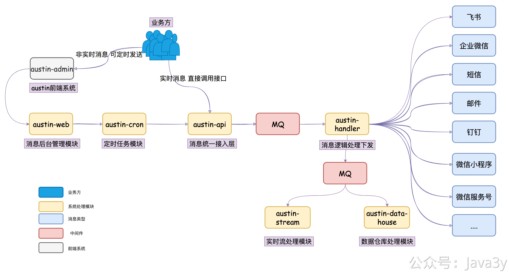

# 4.16 项目瓶颈在哪？解决方案是什么

消息推送平台的**核心逻辑**是发送**多渠道**（短息/邮件/小程序..）的消息，目前的系统架构如下图：

austin-api是接入层，接收到了消息下发的请求之后，做些简单的校验和处理就把请求发送至**MQ**了。理论上我们的接口瓶颈就在于**MQ的吞吐量**，只要MQ能承受，我们的系统是没什么性能压力的。

而又因为MQ一般支持的TPS都很高，我们的austin-api接入层又有提供**批量**下发接口，所以发消息的瓶颈**往往不在于内部系统层面上**的性能。

我们都是调用外部的渠道接口进行消息下发的。比如短信有**腾讯云/云片**这种渠道商，邮件可能会经由**腾讯邮件**服务，钉钉会经由阿里服务器下发....

无论是哪种渠道，对应的开放平台其接口**往往**都会**限制下发的QPS**。那其实**下发消息的速率**，瓶颈就是对应渠道所支持的并发量。比如，腾讯邮件一秒可能最多我们去调用30QPS（官方没给出具体的数值，但调用频繁它就直接报错了，这是我们线上遇到过的）。正因为如此，我们系统里才会有**限流**这个功能。

我们系统是做了**消息隔离**的，每种渠道消费MQ都是互不影响的，我们做的就是让**每个渠道的消费能力达到其开放平台所限制的最大值就OK了**（这个并不难实现，都是**网络IO，**况且我们每个渠道消费MQ的时候，设计成**动态线程池**的）。那如果是系统瓶颈的话，就是**机器的网络IO能力**了（austin是可以横向扩展的）。

---

如果面试官对上面的回答不满意的话，你可以根据**自己现有已知的知识，**但把未写进简历技术栈的告诉面试官。（**其实就是面试官想看你的思考能力和解决问题的思路**）

比如说，很多同学是没有把flink写在简历上的，可能就是说用**另外单独一个普通java程序**去消费kafka的日志，这时候你就可以说后面可以上**实时流处理平台**（flink），提高我们消费日志的横向扩展能力，消费的语义等等问题。让全链路追踪功能变得更加稳定可靠易扩展

又或许你没有把xxl-job分布式配置中心写简历，就可以说后面可以开发个**定时任务**的功能给到用户直接在消息推送后台使用，你就说调研相关的技术栈（比如xxl-job），去动态的配置定时任务等等。

又或许你上面没提到动态线程池，你也可以说后续会引入，来更方便地去修改其消费能力（核心线程数）等等

> 原文: <https://www.yuque.com/u37247843/dg9569/vkub0odyckdds2fa>