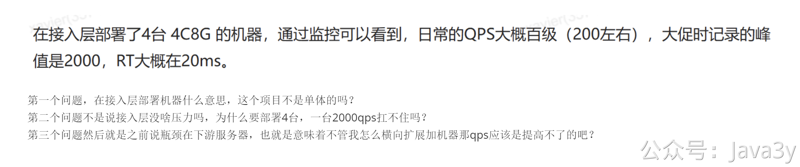

# 4.17 austin线上指标问题

有很多股东用austin去面试，经常会被问到线上的数据情况，但又不知道怎么回答，感觉很虚。我总结起来大概有以下的问题：

1、你这数据库表有多大的量级啊？
2、你这接口能支持多大的QPS啊？RT多少？你部署了多少台机器？
3、你这Redis有多大的量级啊？
4、kafka有没有考虑消息不丢，重复消费的问题。redis的持久化策略是怎么样的？

我以前是在MOGU做这个消息推送平台的，1亿+的注册用户，百万 dau，仅供参考。根据自己的包装和场景，自行调整对应的数值。

### 一、你这数据库表有多大的量级啊？

austin的数据库表并不多哈，主要就是**消息模板配置表**和**短信记录表**。

模板配置表的数量级在千级左右，技术侧调用的模板一般都是可以复用的，而运营下发活动营销消息，一般都是要创建新的模板（因为我们会根据模板的维度去看下发的情况，不建议复用模板，会导致分析数据不准）

短信记录表的数据量级，之前我们线上环境大概有1亿4的量，我们没有做分库分表（这一点主要是最开始没考虑进去吧）。但是，其实一亿多的量，在数据库建好索引，我们后台其实只有一天时间+手机号查的功能，是够用的。另外，因为我们hive里会备份历史的数据，所以我们其实可以删除MySQL的历史数据来有更好的查询性能。
当然了，如果公司里有条件，最好是分库分表啦。（就单单短信业务下发记录而言，没有分库分表也是可以的）

面试官主要是想问问你的数据存哪里，哪些是存数据库的，如果存数据库的话，那会不会有瓶颈。

### 二、你这接口能支持多大的QPS啊？RT多少？你部署了多少台机器？

在接入层部署了4台 4C8G 的机器，通过监控可以看到，日常的QPS大概百级（200左右），大促时记录的峰值是2000，RT大概在20ms。

由于接入层接收到请求了之后，是发到MQ的，所以理论上接口是没什么性能压力的，接入层也可以横向扩展。

当我们负责一个系统时，对外需要提供接口给业务方调用，我们是需要了解这个接口的指标以及对应的上下游。这样在出现的问题的时候，就可以根据历史的指标去找问题，去找上下游提醒有什么风险。
面试官问到接口的性能/QPS或者压测主要是想看你是不是真的了解你所负责的内容，如果是搜索/推荐/流量的接口还比较好压测，但发送消息/订单/支付类似这类接口就不太好压测了。

我们能表达出对接口的指标以及相关业务的细节，那么一般面试官也不会纠着你啦（除非这个面试官也刚好做这块业务）。面试官就想看看你有没有思考过自己所负责的业务的一些基础指标。 如果不是TO C的业务，而且**用户量没这么大的话，其实接口的QPS都不会高的，减个10倍也是很合理的，日常20 QPS，峰值200 很正常**。

### 三、你这Redis有多大的量级啊？

在消息推送平台里用到Redis的两个核心场景是：
1、内容去重和频次去重
2、全链路追踪的维度数据（用户维度、模板维度）

而问Redis一般是想问你容量多大，比如我们当时的Redis用的是32g做去重，全链路存储用了16G。

面试官有可能会问到：你现在这容量的话，由于业务膨胀，有没有可能会有问题？（其实就是在考你，如果redis满了，会怎么样）

这时候就是理论的问题了，**redis本身就会带有内存淘汰机制**，如果满了就会把别的key给淘汰掉。你就说：目前根据现有的业务，根据监控都是够用的。即便满了，其实消息推送平台用redis只是作为去重的兜底方案，不会影响太大。而全链路追踪，我们还会把明细存到hive，对核心功能影响并没那么大。

这时候也可能会问你有没有考虑过别的存储做去重或者全链路追踪的存储。

- 去重用redis是为了下发消息的高性能，其他的存储未必能做到，又因为redis自带过期机制（我们的去重都是有一定的时间限制的），所以很合适。
- 全链路追踪是因为redis有很好使的数据结构，list和hash我们都是flink清洗完直接通过该数据结构写上去，业务层不用再根据单独去聚合。

### 四、kafka有没有考虑消息不丢，重复消费的问题。redis的持久化策略是怎么样的？

可能会问到一些中间件的选择或者策略问题，**这些其实结合现有austin的业务说说就好了**，我应该在文档里都有提及的。这些本身就是八股文的理论知识，简单提及业务了以后，就往八股文那块靠就OK。啦。

eg：austin有去重的功能，一定程度上能避免重复消费的问题（没有强一致保证），而消息不丢，参考4.12章节《消费数据能保证不丢失吗？》

redis持久化策略啥的，这种一般开发不干预这个，你自己想想怎么答就好。

eg：一般在公司里边，我们这些使用redis的，其实是比较少去关注它的持久化方式（是使用AOF还是RDB，还是说混合AOF/RDB)。基建比较好的公司，会在你接入redis的时候，新建redis实例，而这时候会让你勾选使用场景，就是会让你通过不同的应用场景进行配置选择，比如说，业务上是允许重启时部分数据丢失的，那RDB就够用了。对于austin来说，是非强依赖redis的，用哪种持久化方式也并那么看中。

---

### PS：股东问题

1、这个项目是单体的，实际上我之前在线上环境部署是分开的，可参考 《Austin是分布式的吗》。所以这里在说指标的时候才把 接入层和发送层 给分出来。**按单体的去说，也是没毛病的**
2、接入层本身处理逻辑没什么压力，但是接收网络请求（IO，带宽）以及 应用服务器的线程 这些都是有可能带来瓶颈。当然可以用高的配置去处理 2000QPS ，但一般生产环境环境，大多数还是选择通过**小配置以集群**的方式去部署。集群部署能一定程度上提高系统的可用行（高可用）。
3、瓶颈在下发渠道限制上。对的，下游限制死了发送频率，无论你怎么横向扩展，都提高不了发送的速率。我们能做的，就是让自身的程序能够 **打满** 下游渠道的所限制的速率。

> 原文: <https://www.yuque.com/u37247843/dg9569/ig5edoez11as0ynb>