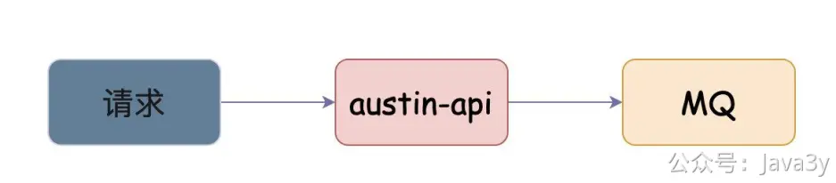

# 4.18 xx公司问题

**如果消息推送这个项目不用mq只用redis，可以吗，应该怎么设计**

对于现在austin项目的设计，目前是有**MQ**的，也**应当有**MQ。

austin-api接收到请求之后，是会把消息发到MQ的

这样做有什么好处呢？假设某消息的服务超时，austin-api如果是直接调用下发接口服务，那可能会存在**超时**风险，拖垮整个接口性能。MQ在这是为了做异步和解耦，并且在一定程度上抗住业务流量。

对于**绝大多数**发送的消息而言，业务方也不太关心是不是能**在接口调用时**就知道发送结果，并且**某些渠道在发送的时候**也不知道发送的结果（**最后的结果是异步告知的，比如短信和PUSH推送**）

基于以上的原因，引入MQ来承载接口的流量以及做异步，是非常合理的事。

如果不用MQ，只用Redis的话，**技术上肯定是可行的**。

面试官，**你是想用Redis来替代MQ，是吧**？

**Redis Stream** 是 Redis 5.0 版本中引入的一种新的数据结构，用于实现消息传递的功能（它的设计跟Kafka非常像，**消费者组，消费进度偏移量** 这些它都有）

我们可以使用 **Redis Stream **来替代MQ的功能，但是，这有缺点。Redis本身是**内存**数据库，它不具备消息堆积功能，比如如果有大批量邮件下发，它就不太合适了。

因为邮件的QPS能力很低，大概1秒才能发几封，全堆在Redis里是不合适的。

另外，Redis的**高可用方案可能存在丢失数据**的问题（Redis持久化机制/主从复制 这种，默认都是异步执行的）。

如果要求不高，在业务上本身也没有消息堆积的场景，还是可以使用的。
**如果现在让你完善这个项目，你该怎么做**
思路：把还没在简历写的设计亮点或还没聊的，跟面试官聊。

比如说，很多同学是没有把flink写在简历上的，可能就是说用**另外单独一个普通java程序**去消费kafka的日志，这时候你就可以说后面可以上**实时流处理平台**（flink），提高我们消费日志的横向扩展能力，消费的语义等等问题。让全链路追踪功能变得更加稳定可靠易扩展

又或许你没有把xxl-job分布式配置中心写简历，就可以说后面可以开发个**定时任务**的功能给到用户直接在消息推送后台使用，你就说调研相关的技术栈（比如xxl-job），去动态的配置定时任务等等。

又或许你上面没提到动态线程池，你也可以说后续会引入，来更方便地去修改其消费能力（核心线程数）等等

我再补充几点吧：
1、现在austin是没有保证消息不丢失的问题的（**4.12章节**）。在面试的时候就说后续可以把它给实现了，在项目上做到真正的消息不丢失（至少一次消费语义+幂等来实现）。
2、目前发送消息都是通过**接口**调用（现在是http接口，有的人可能说是RPC接口），但还有一种方式就是**通过MQ交互**来发送接口调用，在业务方侧肯定都是需要写代码的，但是**MQ交互**就可能不用。
比如，用户**在app上点了加购**，此时我要给用户做弹窗（弹窗实际上是IM消息的一种类型，也是发送消息）。这类的消息类型，以往开发流程可能是：客户端告诉业务后端，用户点了加购，业务后端调用消息推送平台去下发一条消息。
但如果实现了MQ交互，则是：消息推送平台在后台新增配置，让技术业务方可以在模板上填写MQ的topic，消息推送平台保存模板后，去订阅该topic（比如这个topic的所有的消息都是用户加购）。那后续只要用户点击了加购，消息推送平台就能给该用户发消息了。
这时候，全程不需要业务方去写代码。（这种**适合逻辑简单的**消息）
3、去重方案使用**滑动窗口**（前提是本身使用的是Redis过期时间，但是这个时间判断是不严谨的会有问题）。

若有收获，就点个赞吧

 

> 原文: <https://www.yuque.com/u37247843/dg9569/chg4ouo8lrr3xksz>