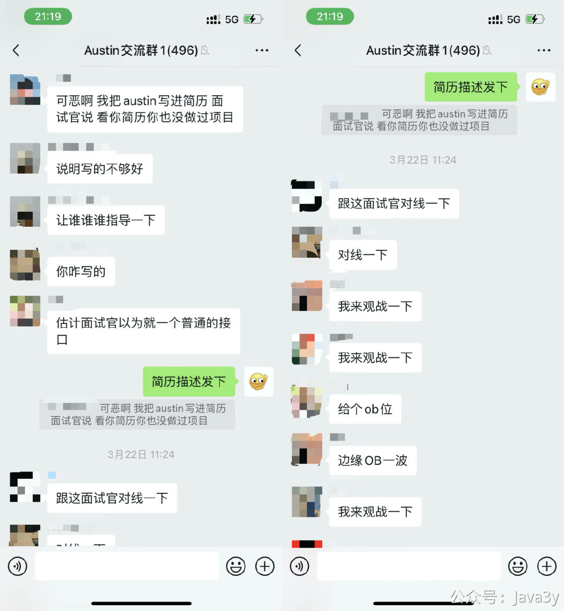
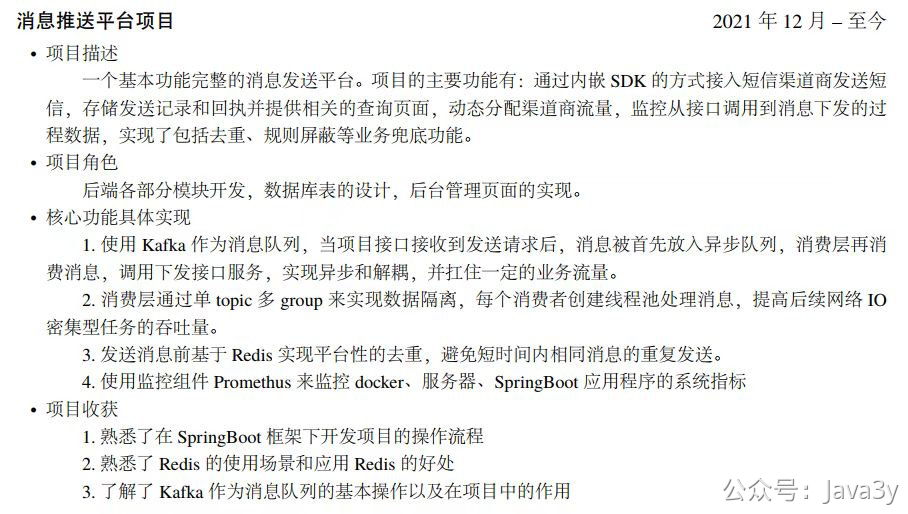
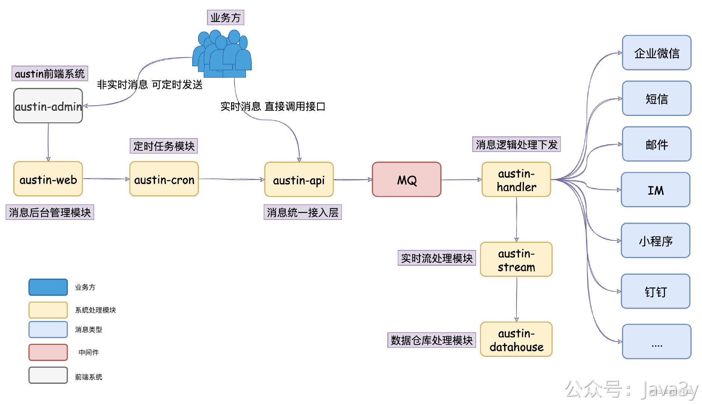

# 4.1 简历如何描述Austin项目

前阵子我看到`austin`交流群里已经有小伙伴把项目写在简历上了，但是他给出的说面试官看了简历后，觉得他没做过项目。

他没在群上公开发简历中项目的描述，但私发了给我，大家可以看看。

我认为**整体的排版**和所描述的**相关基础栈**都是没有大问题的，面试官说没有做过项目，我认为还是有点严格了。

要是我作为面试官，我只会认为候选者可能**不太会写简历**（不够自信，太年轻），倒不会质疑没有做过项目。

但这不能怪那小伙，毕竟我作为`austin`项目的负责人，也未曾好好地讲应该如何在简历或面试中介绍项目。

> 至于还还还不了解`austin`项目的同学，我建议先看看我的GitHub仓库README文档。

## 01、项目描述

**消息推送平台承接着站内对各种类型渠道的消息下发，每天承载亿级流量推送。项目主要对用户侧的召回（营销）以及通知消息触达，也同时负责对内网的告警和通知消息发送**。

在真正面试的过程中，当面试官让你项目介绍的时候，你就可以这样答：

**1**、消息推送平台它承接着各种消息类型的推送，比如短信、邮件、小程序、微信公众号、通知栏PUSH、企业微信、钉钉等等。你可以简单理解为：只要发送消息的，就跟它脱不了关系。

**2**、发送的消息主要给两部分用户，一部分是我们站内的真实用户（比如我们给用户发短信验证码），另一部分是我们内网的消息（比如钉钉的工作提醒、群消息助手）

如果这时候面试官不打断你，你就继续跟面试官说：**要不我来给你讲下系统的架构？**

如果面试官打断了，问了别的问题，那在这就先结束了，不过，你总会**遇到机会**把你的项目架构跟面试官描述描述。

这个过程中，你可以拿上你的笔和纸给面试官**画画**，交流交流，其实就是我GitHub仓库中`README`的这个图：

这个过程可以这样跟面试官描述：

**1**、在消息推送平台里，我们有个接入层`austin-api`，它是**消息的统一入口**，所有的消息推送都会经过该接入层进行处理。

**2**、使用消息推送平台的业务方可以简单分为两种角色：运营和技术。如果是技术，他会调用我在接入层暴露的接口。如果是运营，他会使用我的消息推送后台去设置定时任务推送，所以我们会有个推送后台`austin-admin`以及定时任务模块`austin-cron`

**3**、接入层干的事情比较简单，简单概括就是消息做简单的校验以及参数拼装后就写入到了消息队列

**4**、写到了消息队列之后，自然就有个逻辑层对消息队列的消息进行消费，在我这边叫做`austin-handler`模块，它主要对消息做去重、夜间屏蔽等逻辑，最后就分到不同的消息类型Handler进行消息发送

**5**、消息推送平台跟普通消息下发最大的不同是我们是实现对**消息全链路追踪**的，业务方可以通过推送后台实时查看消息下发的情况，针对消息模板和用户都是OK的（比如这个用户是否接收到消息，如果没接收到，那可能是因为什么被过滤了）

**6**、所以消息推送平台会有个实时流的模块，用Flink实现的。我在消息处理的过程中**对多个关键的位置进行埋点**，在Flink对这些信息做清洗处理，实时的会写进Redis、离线的会落到Hive中

基于这个描述，以及你画的图，面试官一般就能有个比较简单的认知了，至少这个过程中你证明了你这系统是有设计的。有可能听到一半就会被打断问细节的，也可能会听你说完全程，**但至少你要有类似这种描述**。

不要上来就讲各种的实现细节，各种如何实现去重、夜间屏蔽的功能。**面试官如果感兴趣，他肯定会在后面问你的**，在这里先把系统的整体架构跟他聊一遍。

## 02、项目角色

**项目主要负责人**

不要慌，别说自己负责数据库表的设计这种，**如果你是新人，数据库表还轮不到你设计**。`austin`有完整的从零搭建文档，只要你用心研究了，就应该写项目负责人。

如果你只看了几天，并且你认为你几天就能完全搞懂，那我还是劝你不要把austin写在你的项目上。

## 03、项目技术栈

**SpringBoot、Flink、Redis、Apollo等**

这里把自己熟悉的技术栈拎出来讲讲，不熟悉的就隐藏起来（比如`Spring Data JPA`，你就用过，只知道它的底层实现是Hibernate，那就不要在这里了）。但如果你对`Mybatis`又很了解，你就可以把`Mybatis`加上（反正面试官又看不到代码，你说`Mybatis` 那就是`Mybatis` ，OK？）

注意的是：这里写的技术栈，自己是要**有点墨水**的（很容易就被问到），为什么使用XXX而不使用XXX啊？当时是怎么考量的。

## 04、系统设计亮点

**1**、全类型渠道消息的生命周期链路追踪：在每个关键处理的阶段上进行埋点，将点位收集到Kafka，Flink统一清洗处理。实时数据写入Redis，离线数据写入Hive，固化出实时和离线的统一推送基础模型

**2**、消息资源隔离：不同的渠道不同的消息类型互不影响并且利用动态线程池可配置化地对消费能力进行调控

**3**、拥有完备的消息管理平台基础建设：对系统和应用资源有完整的监控和告警体系、消息模板工单审核、各种消息模板的素材管理等等

作为一个平台，我理解下应该关注的是着**可用性**、**可扩展性**以及**平台能力**。

这里写出的项目亮点可能**后续还会增改**，但这以上几点我感觉都是可以拉出来跟面试官聊聊这其中的实现过程的（特别是第一点和第二点）

在简历上我建议不要写太多技术上的细节，这个系统核心功能简单可能面试官能get到，但如果是业务系统，面试官就不知道你在写什么了。如果面试官感兴趣，是会问你技术细节的，到时候再好好吹就行啦。

## 05、austin项目简历描述（总结）

**项目描述**：消息推送平台承接着站内对各种类型渠道的消息下发，每天承载亿级流量推送。项目主要对用户侧的召回（营销）以及通知消息触达，也同时负责对内网的告警和通知消息发送。

**项目角色**：项目主要负责人

**项目技术栈**：SpringBoot、Flink、Redis、Apollo等

**系统设计亮点**：

- 全类型渠道消息的生命周期链路追踪：在每个关键处理的阶段上进行埋点，将点位收集到Kafka，Flink统一清洗处理。实时数据写入Redis，离线数据写入Hive，固化出实时和离线的统一推送基础模型
- 消息资源隔离：不同的渠道不同的消息类型互不影响并且利用动态线程池可配置化地对消费能力进行调控
- 拥有完备的消息管理平台基础建设：对系统和应用资源有完整的监控和告警体系、消息模板工单审核、各种消息模板的素材管理、规则引擎快速接入短信渠道消息等等功能

## 06、关于简历常见的问题

**Q：感觉文档里的项目描述有点偏社招啊，不敢写。**
**A：**其实不会的，社招和校招的描述没有本质的区别的。你要写得简单了，面试官就认为项目太容易了(虽然做的东西都是一样的，只是你描述变简单了，面试官就觉得简单了)。**简历就是得用这些话术包装的**。

**Q：hive和flink那块我都没学过，要写吗？**
**A：**flink和hive没时间可以不写，**但是全链路追踪这个功能最好写下**，你就说你是用普通程序消费kafka，然后写到redis，就不说用flink就可以了。如果说是公司里的项目，而flink那块，你可以说是**其他大数据的同学**做的。如果是实验室的项目，你就可以说是**其他同学**做的。

> 原文: <https://www.yuque.com/u37247843/dg9569/zuk3xytbwxhgw5ng>