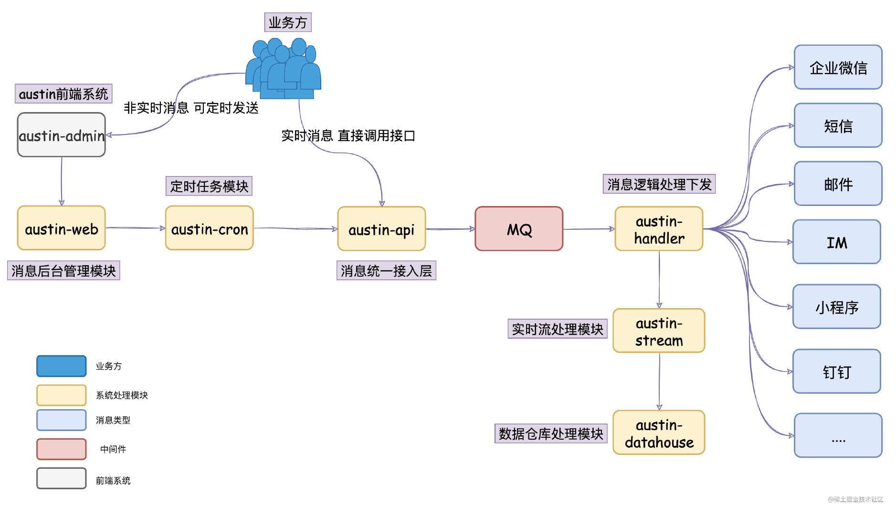
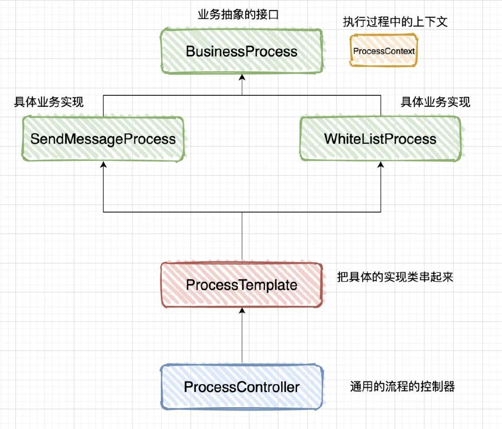
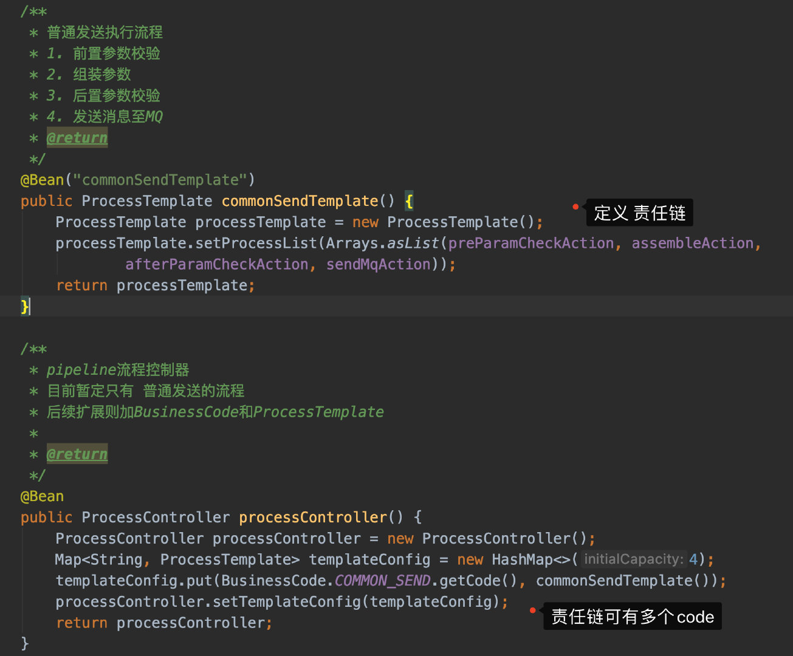
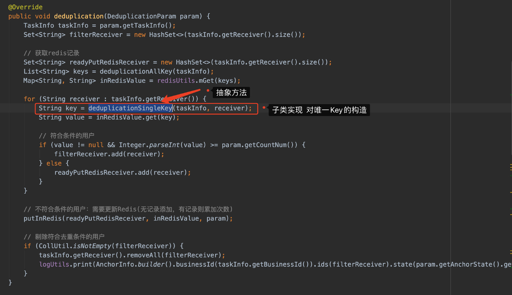
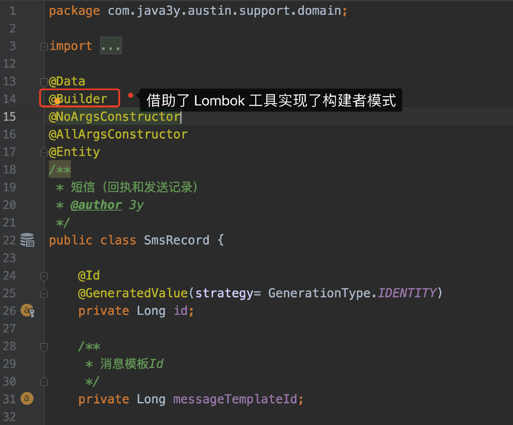
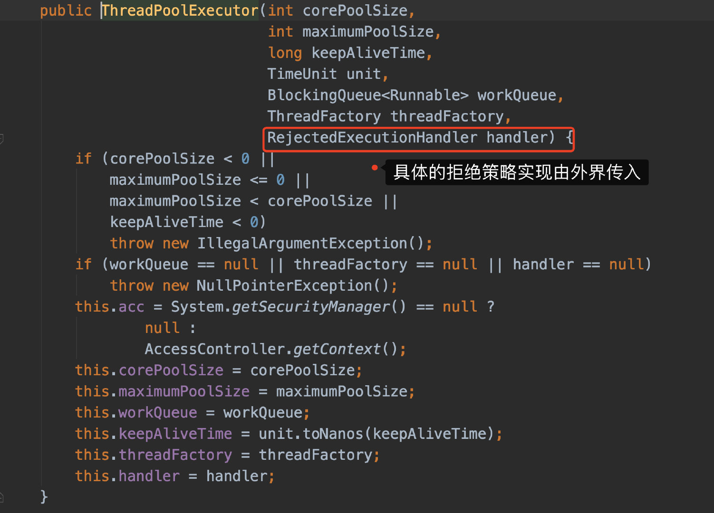
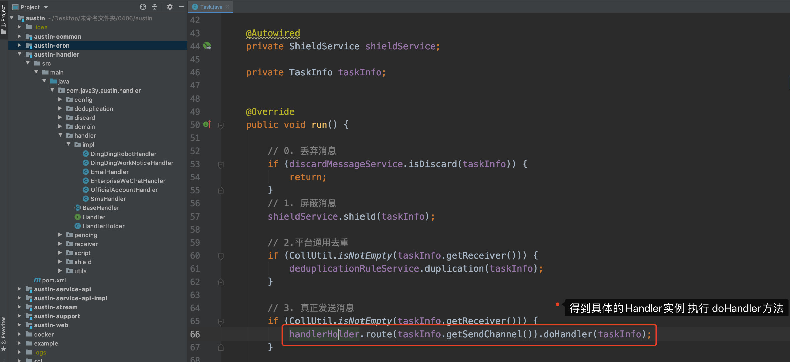
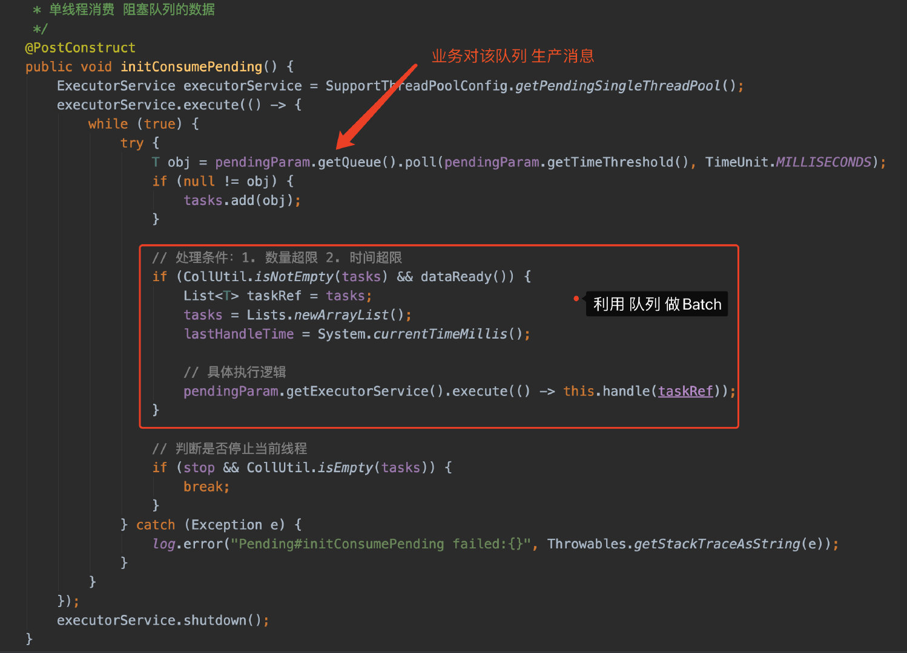
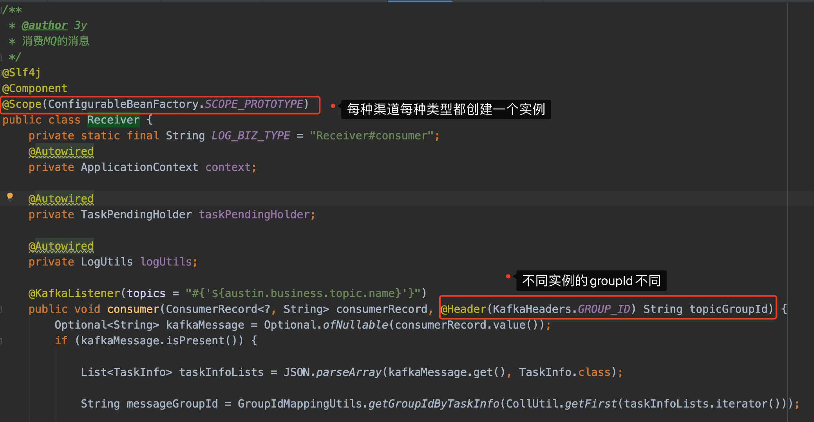
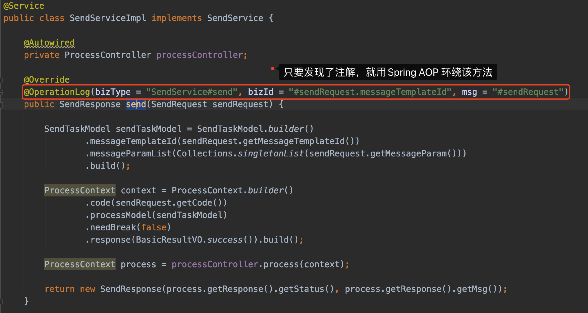

# 4.2 项目用了什么设计模式？

不多BB了，来吧。

**01、责任链模式**

我在「消息统一接入层」那里使用了**责任链模式**，用责任链模式的好处就是**分工明确、解耦、易维护**。

**1**、将多个条件判定分散到各个的处理类上，相对于if else耦合性相对较低。

**2**、增加一个具体的Handler处理类，不会影响到BaseHandler的代码

责任链模式的缺点：

**1**、项目里边会有多个具体Handler类（因为每种处理都抽象为一个类，所以会有多个类）

**2**、初看代码时不太好阅读（对外只是一个doChain方法，而里边由多个处理类来组成，还得看相应的调用顺序）

责任链**配置**入口：com.java3y.austin.service.api.impl.config.PipelineConfig

责任链**处理**入口：com.java3y.austin.service.api.impl.service.SendServiceImpl#send

**02、模板方法模式**

在austin项目代码上用到模板方法的地方还是蛮多的，比较有代表性的就是**去重**的功能。老读者可能都知道，我认为去重的功能的核心无非是**唯一Key+存储**

模板方法模式要点：

1、把公共的代码抽取出来，如果该功能是不确定的，那我们将其修饰成抽象方法。

2、将几个固定步骤的功能封装到一个方法中，对外暴露这个方法，就可以非常方便调用了。

模板方法模式优点：**封装不变的部分，扩展可变的部分**。把认为是不变的部分的算法封装到父类，可变部分的交由子类来实现。

模板方法模式缺点：抽象类定义了部分抽象方法，这些抽象的方法由子类来实现，子类执行的结果影响了父类的结果(**子类对父类产生了影响**)，会带来阅读代码的难度！

我们在实际写代码的时候，一般存储和和步骤都已经确认下来了，唯一Key则可以由子类实现

模板方法模式的代码1：com.java3y.austin.handler.deduplication.service.AbstractDeduplicationService#deduplication

模板方法模式的代码2：com.java3y.austin.handler.handler.BaseHandler#doHandler

**03、构建者模式**

建造者模式更多的是**写法上**的不同，从代码结构层面上其实没有很大的区别，只是看起来会更清爽一些。我借助了**Lombok**，在类上加上一个注解@Builder就可以使用建造者模式的代码了，非常方便

在austin里就随处可见了，各种builder**链式调用**。

**04、策略模式**

严格意义上的策略模式是基本没什么人用的（策略模式有一个**Context上下文对象**），但如果我们说JDK线程池的设计也是**策略模式**

那我可以认为的是：只要我们是面向接口编程的，那多多少少都有「策略模式」的影子

所以，austin项目使用了策略模式还是有不少的

策略模式代码入口：com.java3y.austin.handler.pending.Task#run

**05、生产者消费者模式**

生产者消费者模式这种「设计模式」我还看到过在面试上让手写的，像JDK线程池的实现我认为就是典型的生产者和消费者模式（将消息丢入工作队列，然后从工作队列里消费）。

我在实现延迟消费做批量的时候也实现了生产者和消费者模式，场景主要就是**我读取文件的每一行记录，积攒到一定的程度才进行消费**。

生产者入口：com.java3y.austin.cron.service.impl.TaskHandlerImpl#handle

消费者入口：com.java3y.austin.support.pending.AbstractLazyPending#initConsumePending

**06、单例模式**

单例模式和代理模式几乎都是依赖Spring环境下去玩的了，基本都不用手写。

在Spring下普通创建的对象**默认**都是单例模式，在项目里也有部分的对象是需要多例的。

比如com.java3y.austin.handler.receiver.Receiver（不同的渠道不同的类型开不同的消费者组）和com.java3y.austin.cron.pending.CrowdBatchTaskPending（数据需各自维护，线程安全问题）

**07、代理模式**

代理模式在austin下倒是没自己写过，用的小组件几乎都是基于代理模式去搞的。之前提及过的**优雅打印日志注解**，只要你去看源码，就会发现他们用的都是Spring的动态代理去实现的。

看懂了，**就说这组件是你自己优化写的**。

若有收获，就点个赞吧

 

> 原文: <https://www.yuque.com/u37247843/dg9569/gonks6bmngyco7m6>