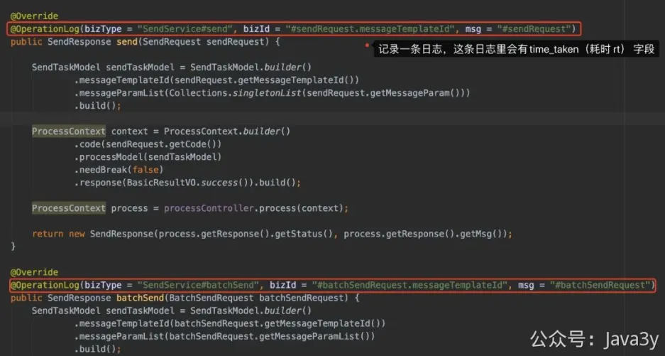
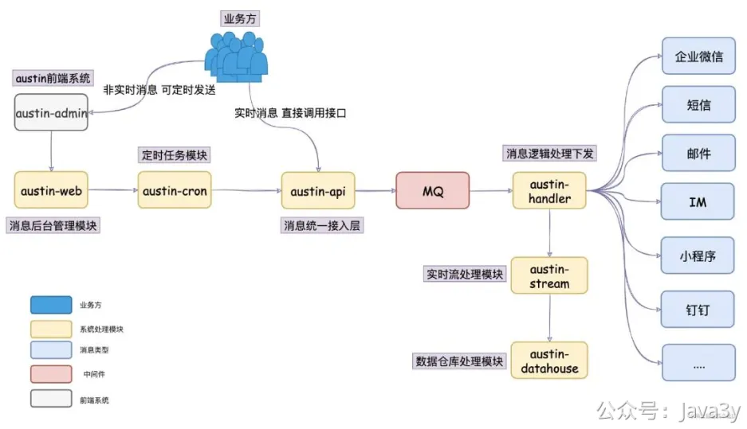
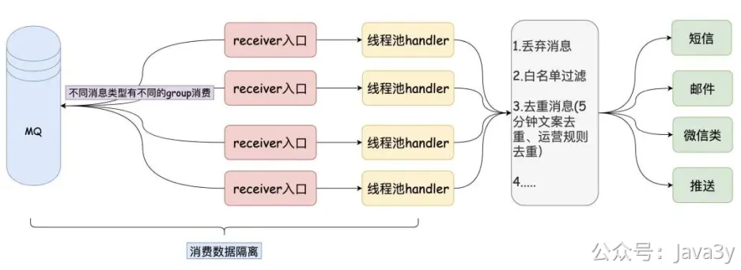

# 4.3 你的接口性能怎么样？

消息推送平台提会供接口给业务方进行调用，一般面试官看到了也会想问：「**你这接口有多少的QPS？RT是多少？有压测过吗？业务增长，调用接口的量也在增长，这时候你会怎么办？**」

对于这个问题，我提供下思路哈，你们可以根据自身技术栈的情况做一些简单修整。
**聊些指标和系统业务/架构**

我们的QPS和RT的指标都来源于日志，我们在接口被调用时打印出了**耗时**（RT）以及记录了**一条日志**（QPS）。有了这日志，我们通过GrayLog就能配置出QPS和RT的监控了。所以，我们的接口对QPS和RT都是有监控的哈

在接入层部署了4台**4C8G**的机器，通过监控可以看到，日常的QPS大概百级（200左右），大促时记录的峰值是2000，RT大概在20ms。

发送接口是提供了**单发**和**批量**接口的。如果有批量推送消息的需求，我们这边是建议业务走批量接口的，这样就能一定程度上减少网络的IO，我这边所承接的QPS并不会太大。

但话又说回来，在**接口层面的压力并不大**。回到我们的系统架构上，我们有**接入层-**>**MQ**->**发送逻辑层**，接入层做的工作仅仅是组装参数，然后把消息发给MQ了。

至于压测的话，我这边没有操作过，一般是提给测试去搞的，这块我就不太清楚了。不过系统成型了以后，发送消息这种确实不太好压，**压接入层**并没有什么太大的意义（只要MQ能顶得住，那接入层就不是问题）。

发送消息的速率瓶颈一般在**下游渠道侧**，我们调用短信/邮件等渠道都会限制速度，不同的渠道还不一样。

有大概几个指标：
**●腾讯云短信3000QPS（不过我们会负载到几个短信渠道方）**
**●腾讯企业邮箱大概只支持百级以下QPS（当时调高了，就会限制发送失败了，没公布出具体的QPS）**
**●个推PUSH我们按发送人数（8000人/QPS）进行限制**
**●而IM是我们自研的（通知类的都需要进MySQL和过风控），限制人数在600人/QPS**
**●...**

在消费MQ的时候，我们是每个消息渠道的每种类型都会有对应的线程池进行消费，而且这个是**动态的线程池**（不用重启发布就能调整线程池的参数）

随着业务增长，当QPS真的上来了（连接数变多），我们只要**横向扩容**就好了，对于接入层来说就是无状态的。

当我们负责一个系统时，对外需要提供接口给业务方调用，我们**是需要了解这个接口的指标以及对应的上下游**。这样在出现的问题的时候，就可以根据历史的指标去找问题，去找上下游提醒有什么风险。

面试官问到接口的性能/QPS或者压测主要是想看你**是不是真的了解你所负责的内容**，如果是搜索/推荐/流量的接口还比较好压测，但发送消息/订单/支付类似这类接口就不太好压测了。

我们能表达出对接口的指标以及相关业务的细节，那么一般面试官也不会纠着你啦（除非这个面试官也刚好做这块业务）

若有收获，就点个赞吧

 

> 原文: <https://www.yuque.com/u37247843/dg9569/lt5qel6n11oxb18w>