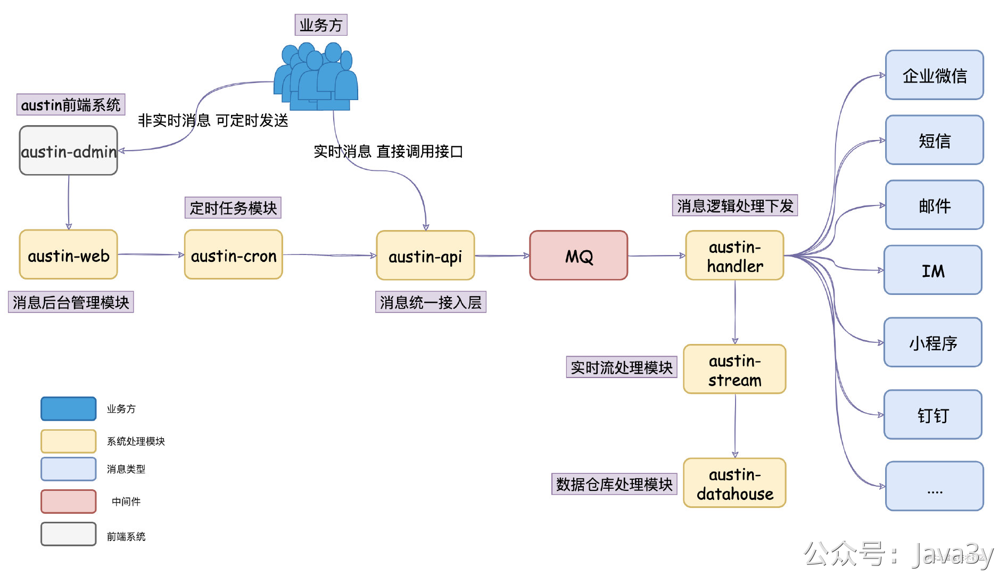

# 4.5 xx科技二面

## 介绍一下你的消息推送平台吧，讲一下这个项目的一个需求背景，消息推送的话指的是什么，渠道有多少
**业务的角度**：项目背景可以根据自身的情况来聊聊，说明为什么会产生出这个项目，只要能说得通就没问题。
**技术的角度**：由于下发消息的需求太常见了，邮件/短信/微信服务号/小程序/钉钉/企业微信/push等等这些消息在生产环境下都是有需求去下发的。所以，建设一个**消息推送平台**去下发消息是很正常又很合理的（不然每种消息分布在各个系统里，就很难维护了）

**1**、消息推送平台它承接着各种消息类型的推送，比如短信、邮件、小程序、微信公众号、通知栏PUSH、企业微信、钉钉等等。你可以简单理解为：只要发送消息的，就跟它脱不了关系。
**2**、发送的消息主要给两部分用户，一部分是我们站内的真实用户（比如我们给用户发短信验证码），另一部分是我们内网的消息（比如钉钉的工作提醒、群消息助手）

## 项目技术方案？你这个架构是怎么设计的
技术方案主要就是把系统的架构给它讲讲：
这个过程中，你可以拿上你的笔和纸给面试官**画画**，交流交流，其实就是我GitHub仓库中`README`的这个图：

这个过程可以这样跟面试官描述：
**1**、在消息推送平台里，我们有个接入层`austin-api`，它是**消息的统一入口**，所有的消息推送都会经过该接入层进行处理。
**2**、使用消息推送平台的业务方可以简单分为两种角色：运营和技术。如果是技术，他会调用我在接入层暴露的接口。如果是运营，他会使用我的消息推送后台去设置定时任务推送，所以我们会有个推送后台`austin-admin`以及定时任务模块`austin-cron`
**3**、接入层干的事情比较简单，简单概括就是消息做简单的校验以及参数拼装后就写入到了消息队列
**4**、写到了消息队列之后，自然就有个逻辑层对消息队列的消息进行消费，在我这边叫做`austin-handler`模块，它主要对消息做去重、夜间屏蔽等逻辑，最后就分到不同的消息类型Handler进行消息发送
**5**、消息推送平台跟普通消息下发最大的不同是我们是实现对**消息全链路追踪**的，业务方可以通过推送后台实时查看消息下发的情况，针对消息模板和用户都是OK的（比如这个用户是否接收到消息，如果没接收到，那可能是因为什么被过滤了）
**6**、所以消息推送平台会有个实时流的模块，用Flink实现的。我在消息处理的过程中**对多个关键的位置进行埋点**，在Flink对这些信息做清洗处理，实时的会写进Redis、离线的会落到Hive中
基于这个描述，以及你画的图，面试官一般就能有个比较简单的认知了，至少这个过程中你证明了你这系统是有设计的。有可能听到一半就会被打断问细节的，也可能会听你说完全程，**但至少你要有类似这种描述**。

## 项目你的一个角色，以及这个项目上线以后你的个人的一些收获
核心开发成员之一/项目主要负责人，这个就看你怎么写了，自圆其说就行。

而项目的收获可以从很多方面去聊，比如说**项目的稳定性**（以前没有的监控，后来加了graylog/prometheus的监控)，比如说项目的**平台能力**，以前没有动态线程池的，后来增加了动态线程池。比如**某个具体的功能改造**，接入层从原始的各种if else 改造成责任链模式 易于后续的扩展。

只要你觉得austin有令你学到东西的，你就可以搬上去说，就说是自己发现了这个问题，然后改造了一把，使得效率提高啊，更加灵活可扩展，稳定性提高啊 等等。

## 那不同渠道之间的不同消息模板是怎么管理的，怎么做这个模板的统一管理（我一直没听明白他想什么），你说的不同消息模板的参数是指什么参数

模板是对消息的抽象，我们会把所有的**发送消息的元信息**固化到一个模板里（这里就列举下我们模板里会定义什么数据，比如**渠道**只是其中一个字段，还有接收者的Id类型啊，还有文案啊，还有创建者等等信息）

## 你们做的这个是消息推送平台，跟链路追踪有什么关系
作为一个平台，我们是需要知道每一条发送的消息的生命周期的，因为前面提到，我们下发一条消息会经过很多个系统（从接口触发，接入层，下发层逻辑层，再到调用下游的发送接口)，每一步都有可能导致消息下发失败。

那么当业务方问起为什么某条消息没有下发到某个用户手上时，我们怎么去给业务方去解释了？翻看Log是一方面，我们基于Log做了全链路追踪，可以在后台就能直接看到某条消息的整个下发情况（现在可以基于用户维度和模板维度去查看）

## 每发一条消息，怎么记录这个日志的？难道你们是打日志，然后存DB里面？
在**关键的位置**上记录日志，所谓的关键位置就是有可能导致这条消息下发失败的位置，或者下发成功的位置。（比如消费MQ/经过去重/夜间屏蔽/下发成功)这些都是关键位置。

我们打的日志会写到Kafka，由Flink去消费Kafka的日志，明细的日志会进Hive，实时经过ETL的数据会写到Redis

## 为什么这个日志不存DB，是基于什么考虑的（我自己理解错了，后来想想其实是发送埋点信息给kafka，我一直说成发日志信息给kafka）
因为量很大，每一条消息下发一次可能会有3~4条消息，某些渠道可能还会更多。明细我们直接落到Hive就行了，在我们公司Hive的数据一般20分钟就能跟上消费速度，而实时可供业务查看的的链路数据我们会进到Redis，由消息推送后台提供对应的功能 进行查询Redis。

## 那这个消息发送的一个过程打的日志跟kafka和redis有什么关系呢(关键点位的埋点信息发到kafka，前者作为flink的数据源，由flink清洗，写入Redis和hive）
该问题在上面的描述应该回答清楚了，不再追溯。

## 那Redis的内存满了呢？数据是不是被挤掉了？那为什么要存Redis，我存DB行不行
我们的Redis在公司是有专门的人员维护的，而每个具体的业务场景都是用专门的实例去存储的，也是有监控的。如果内存快满了，我们会有监控告知，可以及时地去做扩容。

如果真的满了，因为有Redis内存淘汰机制，那数据当然是会被挤掉的。假设业务真的发展到一定的程度下，认为内存真的消耗很大，我们可以考虑换**HBase**这种存储，或者基于磁盘的“Redis”**Pika**进行存储，这些都是OK的。

DB不太合适，我们存进Redis并不是明细数据，是经过聚合的，而Redis本身就是带有数据结构的存储，比如我们就用到了Hash和List结构，在检索的时候就非常方便了，不用再做调整直接透出给前台。

再说了，DB一般的IUD（增删改）并不会很快，像我们公司一般的配置下也就1300，而且存入DB是永久的，而像HBase和Pika这种都是会有过期的机制，不用我们自己去管理数据的有效期（因为这种链路数据我们也没必要存永久，万一真的要追溯以前的数据，我们还有Hive呢）

## 你不是用到了Apollo吗，你为什么要用Apollo

Apollo是分布式配置中心的一个实现，至于什么要用Apollo原因也很简单，我们消息推送平台需要**有动态配置**的能力。现在对消息的限流值/去重的配置/动态线程池都是依赖Apollo的

## Apollo他的一个原理是什么，客户端是怎么感知到这个配置变化的呢，客户端怎么去更新这些配置
本质上就是用**长连接**实现的，客户端维护与Apollo服务端的长连接，只要有配置变更了，就告知客户端去更新。

## 一条消息从生产者产生到被消费者消费，怎么保证这个幂等性

在消息推送平台里，我是没有**实现生产者不重复发送消息的**，因为没啥必要。

在Kafka里，我印象中生产者会有幂等的姿势，同时比较高版本的Kafka也提供了事务的支持，这或许能一定程度上去避免重复发送消息。但无论是哪种实现，肯定会带来性能的损耗。

消费者不重复消费消息这就得在**消费端自己做幂等的处理**，而在消息推送平台里，我是实现是用Redis做的消息去重功能的。

我理解下的幂等（去重），由两部分组成：**Key+存储**

像我处理过的业务（订单类），用的是Redis+MySQL唯一索引的方式去做的。唯一key就是**订单Id号+订单状态**。Redis主要做前置的判断，而MySQL做最后的判断（反正最后订单的数据还是会落到数据库里）

消息推送平台里，我们是平台类的去重，为了性能，用的是Redis存储，会根**据不同的业务对Key进行构建**
1、**五分钟相同的文案发送相同的人去重**，key就是 **md5（发送模板ID+接收人+文案内容）。**这里md5主要就是为了减小key的长度
2、**一天内一个用户只能收到某个渠道的消息 N 次**。key就是  **发送人+发送渠道。**这里的key其实并不唯一，因为要根据**次数**进行判断。

## 有没有可能出现这条消息被处理了，但是写Redis失败了？
有可能，如果被处理了，写Redis失败了，那大概率说明Redis集群有问题（不稳定），那此时系统的去重功能会受到一定的影响（**但其实甚少**）

消息推送平台里的去重逻辑可以理解为就是**兜底逻辑**，正常的业务强一致去重都是让业务自身去保证的，而不是依赖平台的能力。

## 那写入redis成功了，消息被处理失败了呢？
也会有这种情况，但是目前消息推送平台下**没有程序上的重试的功能**，所以现状是不需要处理的。如果回答有重试的功能，那得想办法绕开这次的重试。比如使用（retry=1）标识是重试的逻辑，无需走去重的判断。

> 原文: <https://www.yuque.com/u37247843/dg9569/lbgretet6r2bxu1u>